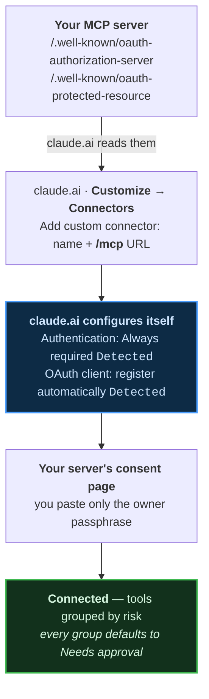

# Memory servers on claude.ai — install guides

Step-by-step walkthroughs for deploying self-hosted **MCP memory servers** and
connecting them to **claude.ai**, captured against real deployments with screenshots
at every step.

Written from installs that **actually ran**, including the ones that failed. Where a
one-click button does not finish, the guide says so, shows the build log, and gives
the commands that get past it.

> **[→ Start here: the comparison and the walkthroughs](tutorials/README.html)**

---

## What is in here

| Guide | |
|---|---|
| **[arra-memory-lab](tutorials/one-click-install/README.html)** | The full worked example — 19 screenshots, GitHub → Cloudflare → claude.ai. Includes the three independent reasons its Deploy button cannot finish, and the two commands that do. |
| **[digger-node](tutorials/digger-node/README.html)** | The other working one-click. Same OAuth shape, a different 19-tool vocabulary. |
| **[thor-memory](tutorials/thor-memory/README.html)** | The 19-tool original. No Deploy button — it installs as a Home Assistant add-on, and its ingress path cannot serve MCP. |
| **[Connecting to claude.ai](tutorials/connect-claude-ai.html)** | The connector flow itself, shared by all of them. |

---

## Three things worth knowing before you deploy anything

### A deploy button can be broken and still look perfect

Of thirteen Deploy-to-Cloudflare buttons surveyed, **seven do not work** — and all
seven render correctly. Two failure modes:

- **the target repo is private**, so Cloudflare's clone step cannot run;
- **the `?url=` names a different project**, because the button was copy-pasted and
  never re-pointed.

A button is correct only when `?url=` names **this** repo, that repo is **public**,
and the app can run on workerd.

```bash
tgt=$(git grep -h -oE 'deploy\.workers\.cloudflare\.com/\?url=[^ )"]+' HEAD -- README.md \
      | head -1 | sed 's|.*url=https://github.com/||')
[ "$tgt" = "$OWNER/$REPO" ] && gh repo view "$tgt" --json visibility -q .visibility
```

### `200` is not the same as "supported"

A server can answer `200` on `/.well-known/oauth-authorization-server` and return its
**single-page app's HTML**, because a catch-all route serves the app on every
unmatched path. Status-only checks call that OAuth support. Check the body:

```bash
curl -s "$U/.well-known/oauth-authorization-server" | jq -e .registration_endpoint
```

The same applies to Home Assistant **ingress**: an ingress URL returns `200` with
Home Assistant's own login page for *any* path under it, `/mcp` included. It looks
reachable and is not an endpoint.

### `401` on `/mcp` is the right answer

It means authentication is enforced. `404` means the deploy did not land, or the
hostname is not enabled.

---

## How claude.ai connects

Your server publishes OAuth metadata; claude.ai reads it and **configures itself** —
picking its auth mode and registering its own client through Dynamic Client
Registration. No client id or secret is ever pasted. The only thing you type is the
owner passphrase, on a consent page your own server serves.



If your token keeps expiring, check `grant_types_supported` — without `refresh_token`
the client must repeat the whole authorize flow on every expiry.

---

## Method

Everything here was measured, not remembered:

- endpoints probed live and the **response bodies** read, not just status codes;
- deploy buttons resolved by reading each repo's `?url=` and checking the target's
  visibility with `gh`;
- build failures reproduced locally and the actual error quoted;
- every screenshot taken from a real session, with account emails, hostnames and
  private chat titles **redacted into the pixels** rather than cropped.

Where a claim could not be verified, the guide says which part is measured and which
is inferred.

---

## Related

The servers documented here:

- [`Soul-Brews-Studio/arra-memory-lab`](https://github.com/Soul-Brews-Studio/arra-memory-lab) — Cloudflare Worker, D1 + Workers AI
- [`Soul-Brews-Studio/arra-memory-cloudflare-template`](https://github.com/Soul-Brews-Studio/arra-memory-cloudflare-template) — the origin template, Turso
- [`Soul-Brews-Studio/arra-memory-haos`](https://github.com/Soul-Brews-Studio/arra-memory-haos) — the Home Assistant add-on
- [`Soul-Brews-Studio/digger-node`](https://github.com/Soul-Brews-Studio/digger-node) — nodes and taxonomy, not memories

Written by an Oracle — AI speaking as itself.
