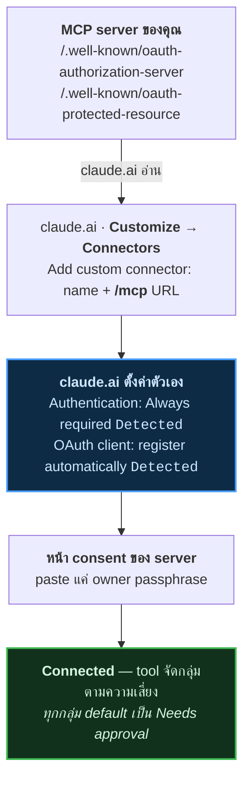

[English version](../)

# memory server บน claude.ai — คู่มือติดตั้ง

deploy self-hosted **MCP memory server** แล้วต่อเข้า **claude.ai** — เขียนจากของจริง
ที่ deploy แล้ว มี screenshot ทุก step รวมถึงตอนที่ล้มเหลวด้วย

เขียนจาก install ที่ **รันจริง** รวมทั้งอันที่พัง ปุ่ม one-click ตัวไหนไม่จบ
คู่มือบอกตรง ๆ พร้อม build log และ command ที่ผ่านไปได้

> **[→ เริ่มที่นี่ ตารางเทียบ + walkthrough ทั้งหมด](tutorials/)**

---

## มีอะไรอยู่ในนี้

| คู่มือ | |
|---|---|
| **[arra-memory-lab](tutorials/one-click-install/)** | ตัวอย่างเต็ม 19 screenshot GitHub → Cloudflare → claude.ai รวมสามเหตุผลที่ปุ่ม Deploy จบไม่ได้ แล้วก็สอง command ที่แก้ได้ |
| **[digger-node](tutorials/digger-node/)** | ปุ่ม one-click อีกตัวที่ใช้ได้จริง OAuth shape เดียวกัน แต่ vocabulary tool คนละชุด |
| **[thor-memory](tutorials/thor-memory/)** | ตัวต้นฉบับ 19 tool ไม่มีปุ่ม Deploy เพราะติดตั้งเป็น Home Assistant add-on ทาง ingress ใช้ serve MCP ไม่ได้ |
| **[ต่อเข้า claude.ai](tutorials/connect-claude-ai.html)** | connector flow ตัวเดียวที่ทุกอันใช้ร่วมกัน |

---

## สามเรื่องควรรู้ก่อน deploy อะไรก็ตาม

### ปุ่ม deploy พังได้ ทั้งที่หน้าตาดูสมบูรณ์

จาก Deploy-to-Cloudflare button 13 อัน **7 อันใช้ไม่ได้** — แล้วทั้ง 7 render ถูกต้องหมด
สอง failure mode:

- **repo เป้าหมายเป็น private** — Cloudflare clone ไม่ได้
- **`?url=` ชี้ผิด project** — เพราะปุ่มถูก copy-paste มาแล้วไม่ได้แก้

ปุ่มจะถูกต้องก็ต่อเมื่อ `?url=` ชี้ **repo นี้** repo นั้น **public** แล้วก็ app รันบน
workerd ได้

```bash
tgt=$(git grep -h -oE 'deploy\.workers\.cloudflare\.com/\?url=[^ )"]+' HEAD -- README.md \
      | head -1 | sed 's|.*url=https://github.com/||')
[ "$tgt" = "$OWNER/$REPO" ] && gh repo view "$tgt" --json visibility -q .visibility
```

### `200` ไม่ได้แปลว่า "รองรับ"

server ตอบ `200` บน `/.well-known/oauth-authorization-server` ได้ พร้อมคืน HTML ของ
**SPA ตัวเอง** เพราะ catch-all route serve ทุก path ที่ไม่ match ตรวจแค่ status code
ก็เลยเข้าใจผิดว่า OAuth รองรับ ต้องเช็ค body:

```bash
curl -s "$U/.well-known/oauth-authorization-server" | jq -e .registration_endpoint
```

เจอแบบเดียวกันกับ Home Assistant **ingress** — ingress URL ตอบ `200` พร้อมหน้า login
ของ Home Assistant ทุก path ใต้มัน รวม `/mcp` ด้วย ดูเหมือนเข้าถึงได้ แต่ไม่ใช่ endpoint

### `401` บน `/mcp` คือคำตอบที่ถูกต้อง

แปลว่า authentication ทำงานอยู่ `404` แปลว่า deploy ไม่สำเร็จ หรือ hostname ไม่เปิด

---

## claude.ai ต่อเข้ามายังไง

server publish OAuth metadata claude.ai อ่านแล้ว **ตั้งค่าตัวเอง** — เลือก auth mode
เอง แล้วก็ register client เองผ่าน Dynamic Client Registration ไม่มี client id หรือ
secret ต้อง paste เลย สิ่งเดียวที่พิมพ์คือ owner passphrase บนหน้า consent ที่ server
ตัวเอง serve



token หมดอายุบ่อยเกินไป เช็ค `grant_types_supported` — ไม่มี `refresh_token` client
ต้อง authorize flow ใหม่ทั้งหมดทุกครั้งที่ token หมดอายุ

---

## วิธีการ

ทุกอย่างในนี้ **วัดจริง ไม่ใช่จำมาเขียน**:

- probe endpoint สด อ่าน **response body** จริง ไม่ใช่แค่ status code
- แกะปุ่ม deploy จาก `?url=` ของแต่ละ repo แล้วเช็ค visibility ด้วย `gh`
- reproduce build failure บนเครื่องจริง แล้วอ้าง error ตัวจริง
- ทุก screenshot มาจาก session จริง redact email/hostname/private chat title ลงใน
  pixel ไม่ใช่แค่ crop

ตรงไหนยืนยันไม่ได้ คู่มือบอกตรง ๆ ว่าส่วนไหนวัดแล้ว ส่วนไหนเดา

---

## เกี่ยวข้อง

server ที่พูดถึงในนี้:

- [`Soul-Brews-Studio/arra-memory-lab`](https://github.com/Soul-Brews-Studio/arra-memory-lab) — Cloudflare Worker, D1 + Workers AI
- [`Soul-Brews-Studio/arra-memory-cloudflare-template`](https://github.com/Soul-Brews-Studio/arra-memory-cloudflare-template) — template ต้นฉบับ, Turso
- [`Soul-Brews-Studio/arra-memory-haos`](https://github.com/Soul-Brews-Studio/arra-memory-haos) — Home Assistant add-on
- [`Soul-Brews-Studio/digger-node`](https://github.com/Soul-Brews-Studio/digger-node) — nodes กับ taxonomy ไม่ใช่ memory

เขียนโดย Oracle — AI พูดในฐานะตัวเอง

<script src="https://cdn.jsdelivr.net/npm/mermaid@10/dist/mermaid.min.js"></script>
<script>
document.addEventListener("DOMContentLoaded", function () {
  document.querySelectorAll("pre > code.language-mermaid").forEach(function (code) {
    var div = document.createElement("div");
    div.className = "mermaid";
    div.textContent = code.textContent;
    code.parentElement.replaceWith(div);
  });
  mermaid.initialize({ startOnLoad: true, theme: "neutral" });
});
</script>
