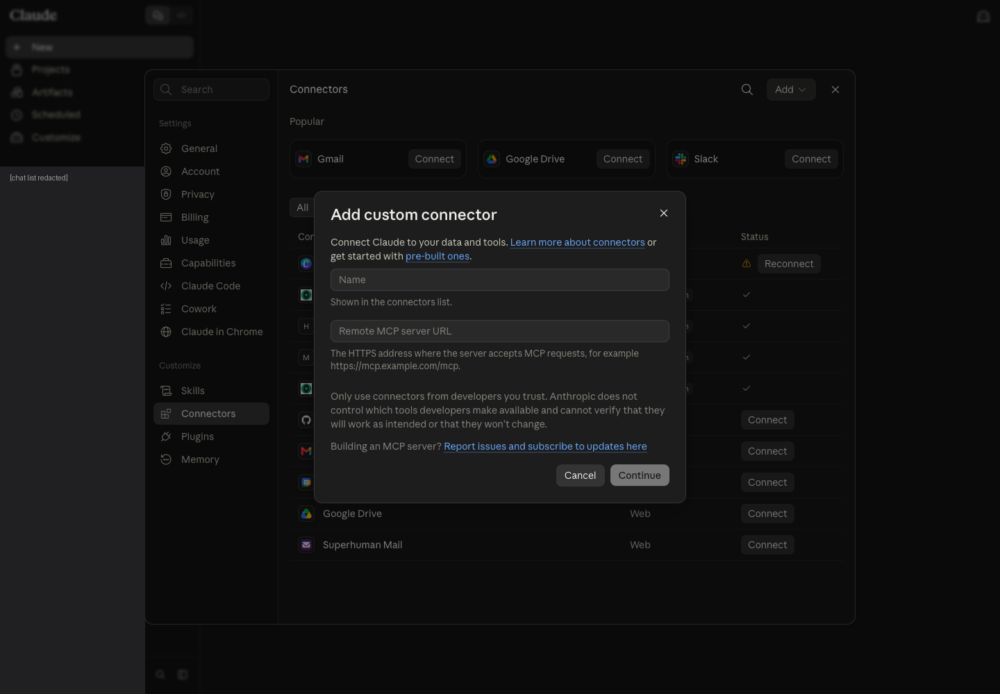
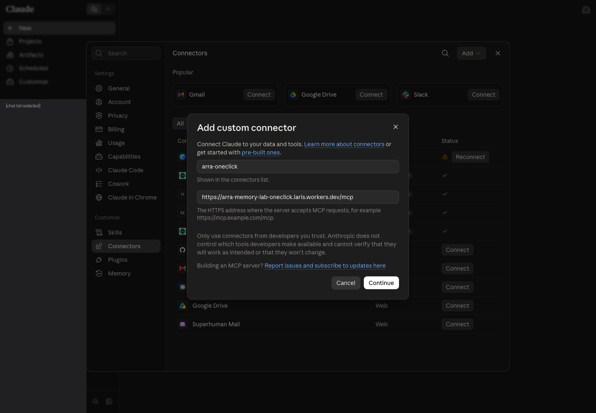
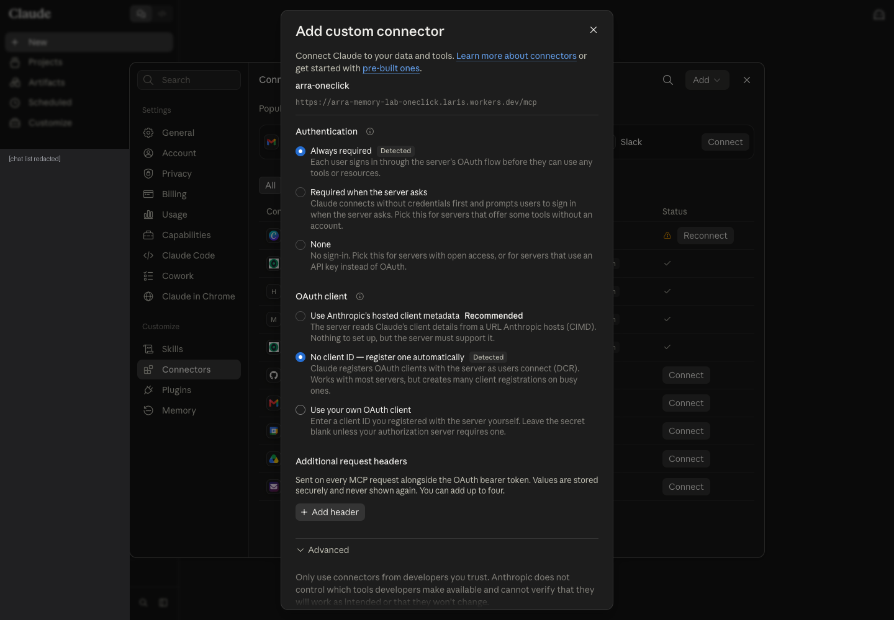
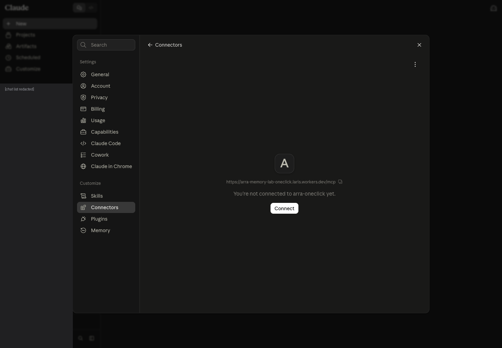
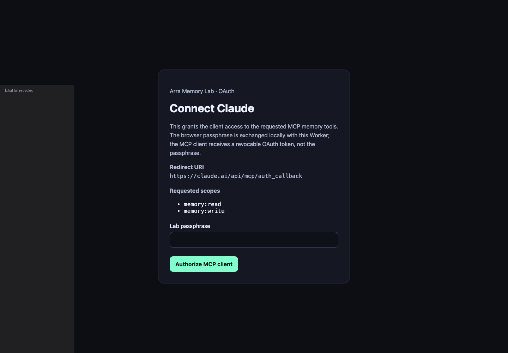

[English version](../../tutorials/connect-claude-ai.html) · [← memory บน claude.ai](./) · [arra-memory-lab](one-click-install/) · [digger-node](digger-node/) · [thor-memory](thor-memory/)

# ต่อ memory server เข้า claude.ai

connector flow ครั้งเดียว พร้อม screenshot memory server ทุกตัวใน fleet ใช้มัน —
`arra-memory-lab`, `thor-memory`, `arra-memory`, `memory-lab-2sep`, `digger-node`
หน้า per-app link มาที่นี่แทนที่จะเขียนซ้ำ

จับวันที่ 2026-09-10 กับ connection จริง

---

## ก่อนเริ่ม

server ต้องตอบพวกนี้ ถ้าไม่ตอบ แก้ก่อน — connector จะพังแบบที่ dialog ไม่อธิบาย
ให้

```bash
U=https://your-server.example.com

curl -s -o /dev/null -w 'root      %{http_code}\n' "$U/"
curl -s -o /dev/null -w 'mcp       %{http_code}\n' -X POST -H 'content-type: application/json' \
     -d '{"jsonrpc":"2.0","id":1,"method":"tools/list"}' "$U/mcp"
curl -s "$U/.well-known/oauth-authorization-server" | jq -e .registration_endpoint
```

| | คาดหวัง |
|---|---|
| `/` | `200` |
| `POST /mcp` ไม่มี token | **`401`** — ถูกต้อง แปลว่า auth ทำงานอยู่ |
| `.well-known/oauth-authorization-server` | `200` **แล้วก็ JSON จริงมี `registration_endpoint`** |

> [!CAUTION]
> **`jq -e` ไม่ใช่ status code** server ตอบ `200` บน path นั้นได้ พร้อมคืน HTML
> ของ **SPA** เพราะ catch-all route ตอบทุก path ที่ไม่ match เช็คแค่ status
> เลยรายงาน OAuth support ที่ไม่มีจริง `jq -e` exit ไม่เป็นศูนย์บน HTML — นั่นคือ
> ประเด็นของการใช้มัน

---

## Step 1 — เปิด Connectors

> [!NOTE]
> **ย้ายที่แล้ว** `claude.ai/settings/connectors` ตอนนี้บอกแค่ *"Connectors have
> moved to Customize."* เส้นจริงคือ **Customize → Connectors**
> (`claude.ai/new#settings/customize-connectors`)

connector custom ที่มีอยู่แล้วโผล่เป็น type `Web` badge `Custom`:


## Step 2 — เพิ่ม custom connector

**Add** (บนขวา) → **Add custom connector**:




สอง field: display name แล้วก็ MCP endpoint



> [!TIP]
> URL ต้องเป็น path **`/mcp`** ไม่ใช่ root ของ server hint ของ dialog บอกไว้เอง
> ว่า *"The HTTPS address where the server accepts MCP requests, for example
> `https://mcp.example.com/mcp`."*

## Step 3 — claude.ai ตั้งค่าตัวเอง

กด **Continue** ตรงนี้แหละที่ document `.well-known` คุ้มค่า:



ทั้งสอง setting มาแบบ pre-select พร้อม badge **`Detected`**:

| Setting | เลือกให้ | อ่านมาจาก |
|---|---|---|
| **Authentication: Always required** | `Detected` | protected-resource document |
| **OAuth client: No client ID — register one automatically** | `Detected` | `registration_endpoint` ใน AS metadata |

อันที่สองคือ **Dynamic Client Registration** — *"Claude registers OAuth clients
with the server as users connect."* **ไม่ต้อง paste client id หรือ secret เลย**
server ที่ไม่มี DCR จะบังคับให้เลือก "Use your own OAuth client" register ด้วยมือ

option ที่สาม **Authentication: None** สำหรับ server ที่เปิด access อยู่แล้ว
*หรือ* ตัวที่รับ API key — ใช้ **Additional request headers** แทน ที่ claude.ai
เก็บได้ถึงสี่ค่า *"securely and never shown again."* ไม่มี memory server ตัวไหนใน
fleet นี้ต้องใช้ทางนั้น แล้ว `arra-memory-haos` บอกเหตุผลไว้ในคอมเมนต์ config
ของตัวเอง:

> *"claude.ai connectors CANNOT send a static header and must use the OAuth flow
> instead — that is why both exist."*

นั่นคือเหตุผลที่ server พวกนี้มีสอง secret: **static token** สำหรับ CLI client
ที่อ่าน config file แล้วก็ **owner passphrase** สำหรับหน้า OAuth consent

กด **Add**

## Step 4 — Authorize

connector มีแล้วแต่ยังไม่ authorize:



กด **Connect** **server ของคุณเอง** serve หน้า consent — `client_id` ใน URL
มินต์จาก DCR วินาทีก่อนหน้า:



กรอก **owner passphrase** แล้วกด **Authorize MCP client** หน้านั้นบอก model
ตรง ๆ:

> *"The browser passphrase is exchanged locally with this Worker; the MCP client
> receives a revocable OAuth token, not the passphrase."*

passphrase ไม่เคยหลุดจาก browser แล้วสิ่งที่ claude.ai เก็บคือ token ที่ revoke
เองได้

| Server | Passphrase คือ |
|---|---|
| `arra-memory-lab` แล้วก็ one-click copy ของมัน | `LAB_ACCESS_TOKEN` |
| `thor-memory` / `arra-memory` | option **`owner_passphrase`** ของ add-on — *ไม่ใช่* `api_token` |
| `digger-node` | `OWNER_PASSPHRASE` |

## Step 5 — Connected

ปุ่มเปลี่ยนเป็น **Disconnect** claude.ai enumerate tool แล้วจัดกลุ่มตามความเสี่ยง:


สำหรับ `arra-memory-lab` เก้าตัว:

| กลุ่ม | Tool |
|---|---|
| Read-only (2) | `Trace get`, `Trace list` |
| Write/delete (2) | `Forget`, `Rebuild index` |
| Other (5) | `Lab info`, `Memory stats`, `Observe`, `Recall`, `Remember` |

ทุกกลุ่ม default เป็น **Needs approval** แต่ละ tool ตั้งเองได้ ปล่อย write/delete
ไว้ที่ approval ถ้าไม่มีเหตุผลจะเปลี่ยน

---

## CLI

OAuth flow เดียวกัน แต่ **flag ต่างกัน** — จุดนี้ทำคนพลาดบ่อย:

```bash
# Claude Code — ใช้ --transport
claude mcp add --transport http <name> https://your-server/mcp
claude mcp login <name>

# Codex — ใช้ --url ไม่ใช่ --transport
codex mcp add <name> --url https://your-server/mcp
codex mcp login <name>
```

ระหว่าง `add` กับ `login` ทั้งสองจะรายงานว่า server register แล้ว unauthorized —
คือสิ่งที่ควรเห็น:

```
claude:  <name>: https://…/mcp (HTTP) - ! Needs authentication
codex:   <name>  https://…/mcp   enabled   Not logged in
```

> [!WARNING]
> `codex mcp login` **เปิด default browser จริง** แล้ว block รอ redirect
> `http://127.0.0.1:<port>/callback/…` ช้าเกินไปมัน give up ด้วย
> `Caused by: deadline has elapsed` เตรียม passphrase ไว้ใน clipboard ก่อน

---

## ถ้า token หมดอายุบ่อยเกินไป

เช็คว่า server รองรับ `refresh_token` หรือเปล่า:

```bash
curl -s "$U/.well-known/oauth-authorization-server" | jq .grant_types_supported
```

```json
["authorization_code", "refresh_token"]   ← claude.ai refresh เงียบ ๆ ได้
["authorization_code"]                    ← authorize flow เต็มใหม่ทุกครั้งที่หมดอายุ
```

ใน fleet นี้มีแค่สาย `arra-memory-lab` ที่มี grant ตัวที่สอง `thor-memory`,
`arra-memory`, `memory-lab-2sep` กับ `digger-node` ไม่มี — ดู
[ตารางเทียบ](./#the-three-differences)

<script src="https://cdn.jsdelivr.net/npm/mermaid@10/dist/mermaid.min.js"></script>
<script>
document.addEventListener("DOMContentLoaded", function () {
  document.querySelectorAll("pre > code.language-mermaid").forEach(function (code) {
    var div = document.createElement("div");
    div.className = "mermaid";
    div.textContent = code.textContent;
    code.parentElement.replaceWith(div);
  });
  mermaid.initialize({ startOnLoad: true, theme: "neutral" });
});
</script>

<script src="{{ '/assets/lightbox.js' | relative_url }}"></script>
