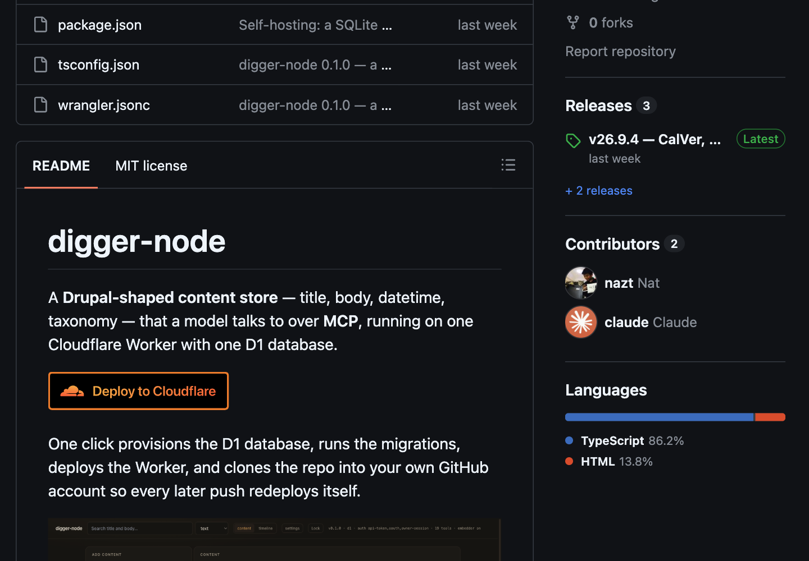
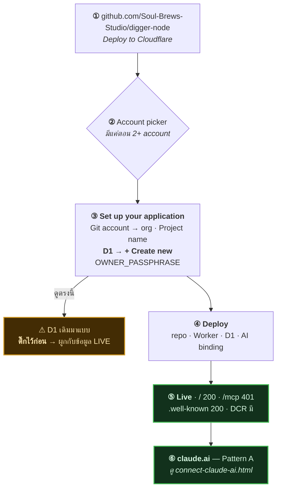
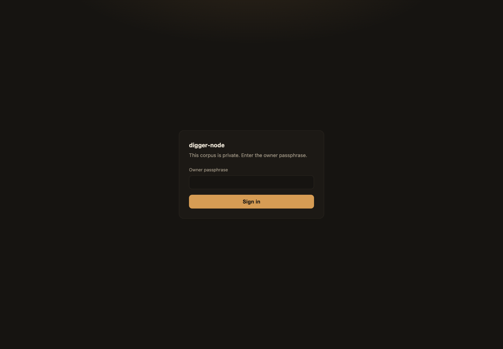

[English version](../../../tutorials/digger-node/) · [← memory บน claude.ai](../) · [connector flow](../connect-claude-ai.html) · [arra-memory-lab](../one-click-install/) · [thor-memory](../thor-memory/)

# digger-node — one-click install & claude.ai

ปุ่ม Deploy to Cloudflare อีกตัวที่ **ใช้ได้จริง** ใน fleet OAuth shape เดียวกับ
`arra-memory-lab` แต่ tool vocabulary คนละชุดเลย แล้ว — ต่างจาก `arra-memory-lab` —
ปุ่มจบเองได้

```
https://deploy.workers.cloudflare.com/?url=https://github.com/Soul-Brews-Studio/digger-node
```



---

## มันคืออะไร แล้วก็ไม่ใช่อะไร

`digger-node` **ไม่ใช่** memory server เก็บ **node กับ taxonomy** — content แบบ
Drupal: node, vocabulary, term แล้วก็ join ระหว่างกัน มี FTS5 trigram search กับ
embedding แบบ optional

นั่นคือเหตุผลที่ scope เป็น `nodes:read` / `nodes:write` ไม่ใช่ `memory:*` แล้วก็
ทำไมไม่มี tool ตัวไหนใน 19 ตัวชื่อ `remember`

| | `arra-memory-lab` | `digger-node` |
|---|---|---|
| Domain | memory, chunk, observation | node, vocabulary, term |
| Scope | `memory:read` `memory:write` | `nodes:read` `nodes:write` |
| Tool | 9 | **19** |
| Storage | D1 + Workers AI | D1 + Workers AI |
| Refresh token | ✅ | ❌ |

### 19 tool

| กลุ่ม | Tool |
|---|---|
| Node | `node_create` · `node_get` · `node_update` · `node_delete` · `node_list` · `node_types` · `node_search` · `node_embed` · `node_tag` · `node_untag` |
| Taxonomy | `vocabulary_create` · `vocabulary_list` · `vocabulary_delete` · `term_create` · `term_list` · `term_weight` |
| Introspection | `call_log` · `call_stats` · `status` |

---

## Install



form เป็นตัวเดียวกับที่อธิบายละเอียดใน
[arra-memory-lab walkthrough](../one-click-install/) — dialog ของ Cloudflare
เดียวกัน กับดักเดียวกัน:

- **Project name** กลายเป็นชื่อ Worker, `*.workers.dev` hostname, **แล้วก็
  GitHub repo ใหม่ใน org ของคุณ** เลือกชื่อที่ว่างอยู่
- **D1 → + Create new** dropdown มา database เดิมติ๊กไว้ได้ deploy แบบนั้นผูก
  Worker ใหม่เข้ากับข้อมูล live ยืนยันติ๊กก่อน

### สอง secret สองประตู

`wrangler.jsonc` เขียนไว้ในคอมเมนต์ทั้งคู่:

```
wrangler secret put OWNER_PASSPHRASE   OAuth (claude.ai) + web login
wrangler secret put API_TOKEN          static bearer (curl, MCP clients)
```

พอตั้ง `OWNER_PASSPHRASE` แล้ว Worker ล็อก:



> [!IMPORTANT]
> **ไม่ตั้งทั้งคู่ Worker เปิดอยู่** — จงใจ ให้ deploy one-click ลงเอยในสถานะที่
> ใช้งานได้ ตั้ง `OWNER_PASSPHRASE` ก่อนใส่ของจริงลงไป `wrangler.jsonc` เรียกนี่ว่า
> *"the deliberate first-run state for a one-click deploy."*

---

## Verify

```bash
U=https://<your-worker>.workers.dev
curl -s -o /dev/null -w '%{http_code}\n' "$U/"                    # 200
curl -s -o /dev/null -w '%{http_code}\n' -X POST "$U/mcp"         # 401 พอล็อกแล้ว
curl -s "$U/.well-known/oauth-authorization-server" | jq -e .registration_endpoint
```

instance อ้างอิงจริง:

```
https://digger-node.laris.workers.dev
  /                                            200
  POST /mcp                                    401
  /.well-known/oauth-authorization-server      200   S256 · DCR · nodes:read nodes:write
  /.well-known/oauth-protected-resource        200
```

---

## Connect

Pattern A เหมือน memory server ทุกตัว —
**[connect-claude-ai.html](../connect-claude-ai.html)**

passphrase ที่หน้า consent คือ **`OWNER_PASSPHRASE`**

```bash
claude mcp add --transport http digger-node https://<your-worker>/mcp
claude mcp login digger-node

codex mcp add digger-node --url https://<your-worker>/mcp
```

> [!WARNING]
> **ไม่มี `refresh_token`** `grant_types_supported` มีแค่
> `["authorization_code"]` claude.ai ต้อง authorize flow เต็มใหม่ทุกครั้งที่
> access token หมดอายุ `arra-memory-lab` มี refresh ตัวนี้ไม่มี ห่างแค่ grant type
> เดียว

---

## ปุ่มที่ copy อันนี้ไป

`nat-build-with-oracle/trace-node` ถูกสร้างวันที่ 2026-09-07 สามวันหลัง
`digger-node` แล้วมี **ปุ่ม deploy ของ digger-node เป๊ะ** — `?url=` ยังชี้ไปที่
`Soul-Brews-Studio/digger-node` ใครตามปุ่มนั้นไปติดตั้งได้ content/taxonomy store
ทั้งที่อยากได้ trace store

ถ้ามาจาก `trace-node` นี่คือเหตุผล

<script src="https://cdn.jsdelivr.net/npm/mermaid@10/dist/mermaid.min.js"></script>
<script>
document.addEventListener("DOMContentLoaded", function () {
  document.querySelectorAll("pre > code.language-mermaid").forEach(function (code) {
    var div = document.createElement("div");
    div.className = "mermaid";
    div.textContent = code.textContent;
    code.parentElement.replaceWith(div);
  });
  mermaid.initialize({ startOnLoad: true, theme: "neutral" });
});
</script>

<script src="{{ '/assets/lightbox.js' | relative_url }}"></script>
