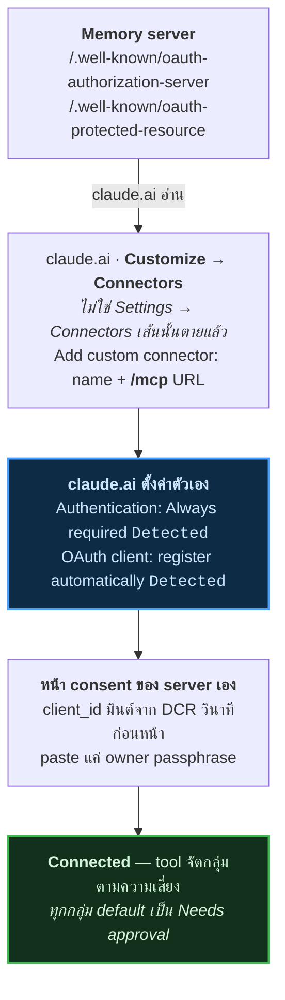

[English version](../../tutorials/) · [หน้าแรก](../)

# memory บน claude.ai — ทุก server ทุกเส้นทางติดตั้ง

fleet รัน **memory server หกตัว** ทั้งหกตัว live ทั้งหกตัวพูด MCP แล้วก็ต่อเข้า
claude.ai แบบเดียวกัน ต่างกันสามเรื่องที่สำคัญ แล้วเรื่องหนึ่งจะปลุกคุณตอนตีสาม

วัด 2026-09-10 ด้วยการ probe endpoint จริงทุกตัว ไม่ใช่จำมาเขียน

---

## หกตัว เทียบกัน

| Server | รันที่ไหน | One-click | Refresh | Scope | Tool |
|---|---|---|---|---|---|
| **[arra-memory-lab](../../tutorials/one-click-install/)** | ☁️ CF Worker · D1 + Workers AI | ✅ **ใช้ได้** | ✅ **มี** | `memory:read` `memory:write` | 9 |
| **arra-memory-lab-oneclick** | ☁️ CF Worker · D1 ใหม่ | ✅ *(walkthrough นี้)* | ✅ **มี** | `memory:read` `memory:write` | 9 |
| **[thor-memory](../../tutorials/thor-memory/)** | 🏠 HAOS add-on · libSQL + Turso | ❌ add-on store | ❌ ไม่มี | `memory:read` `memory:write` | **19** |
| **arra-memory** *(memory-vm)* | 🖥 VM หลัง tunnel | ❌ | ❌ ไม่มี | `memory:read` `memory:write` | 19+ |
| **memory-lab-2sep** | ☁️ CF Worker · D1 | ❌ *(source หาย)* | ❌ ไม่มี | ⚠️ `memory:rw` | 9 |
| **[digger-node](../../tutorials/digger-node/)** | ☁️ CF Worker · D1 + Workers AI | ✅ **ใช้ได้** | ❌ ไม่มี | ⚠️ `nodes:read` `nodes:write` | **19** |

ทุกตัว: `/` → `200`, `POST /mcp` → `401`, ทั้งสอง `.well-known` → `200`, **DCR มี**
`401` บน `/mcp` คือคำตอบที่ถูกต้อง — แปลว่า auth ทำงานอยู่

---

## สามข้อต่าง

### 1. มีแค่สาย `arra-memory-lab` เท่านั้นที่ refresh token ได้

```
arra-memory-lab            grant_types: [authorization_code, refresh_token]  ✅
arra-memory-lab-oneclick   grant_types: [authorization_code, refresh_token]  ✅
thor-memory                grant_types: [authorization_code]
arra-memory (memory-vm)    grant_types: [authorization_code]
memory-lab-2sep            grant_types: [authorization_code]
digger-node                grant_types: [authorization_code]
```

> [!IMPORTANT]
> ไม่มี `refresh_token` claude.ai ต้องพาไป **authorize flow ใหม่ทั้งหมด** ทุกครั้งที่
> access token หมดอายุ มีแล้ว client refresh เงียบ ๆ ไม่รู้ตัวด้วยซ้ำ
>
> นี่คือ fix ที่คุ้มที่สุดในลิสต์ — server สี่ตัวห่างจาก grant type บวก refresh
> handling แค่นิดเดียว จะไม่ต้อง login ใหม่อีกเลย

### 2. ชื่อ scope เพี้ยนไปสามทาง

| Server | Scope |
|---|---|
| thor-memory · arra-memory · arra-memory-lab | `memory:read` `memory:write` |
| memory-lab-2sep | `memory:rw` |
| digger-node | `nodes:read` `nodes:write` |

client ที่เขียนตาม scope ตัวหนึ่ง ขอ scope ที่อีกตัวไม่รู้จัก `digger-node`
แก้ตัวได้เพราะมันเก็บ **node กับ taxonomy** ไม่ใช่ memory ส่วน `memory:rw` ของ
memory-lab-2sep คือ domain เดียวกัน แค่สะกดคนละแบบ

### 3. tool surface แยกเป็น 9 กับ 19

`arra-memory-cloudflare-template` วาง **6 verb** ไว้ `thor-memory` ขยายเป็น **19**
ฝั่ง Cloudflare ไม่เคยตามทัน วันนี้เลยเป็น:

| | |
|---|---|
| **9 tool** — สาย Worker | `remember` · `recall` · `observe` · `forget` · `rebuild_index` · `trace_list` · `trace_get` · `lab_info` · `memory_stats` |
| **19 tool** — thor / arra-memory | เก้าตัวข้างบน บวก `list_workspaces` · `list_agents` · `list_projects` · `list_tags` · `list_search_log` · `forget_search_log` · `digest` · `search_memories_between` · `list_tools` · `toggle_tool` · แล้วก็ federation trio `list_fleet` · `send_to_oracle` · `oracle_replies` |

> [!NOTE]
> **ไม่มีอะไรกัน port 19 ตัวไป Cloudflare** thor-memory รัน libSQL แล้ว
> `arra-memory-cloudflare-template` ก็รัน schema เดียวกันบน Workers ผ่าน Turso over
> HTTP อยู่แล้ว ต่างจาก LanceDB fork — native module ตัดสิทธิ์ Workers ทิ้งเลย —
> อันนี้เป็นแค่งาน mechanical ยังไม่มีใครทำเท่านั้นเอง

---

## ต่อกันยังไง

memory server ทุกตัวในนี้เป็น **Pattern A** — publish OAuth metadata claude.ai อ่าน
แล้วตั้งค่าตัวเอง



walkthrough เต็มพร้อม screenshot: **[connect-claude-ai.html](../../tutorials/connect-claude-ai.html)**

> [!CAUTION]
> **เช็ค body ไม่ใช่ status code** server ตอบ `200` บน
> `/.well-known/oauth-authorization-server` ได้ พร้อมคืน HTML ของ SPA เพราะ
> catch-all route ตอบทุก path ที่ไม่ match เช็คแค่ status เลยเข้าใจผิดว่า OAuth
> รองรับ ไม่จริง
>
> ```bash
> curl -s "$U/.well-known/oauth-authorization-server" | jq -e .registration_endpoint
> ```
> exit 0 แปลว่า metadata จริง memory server ทั้งหกตัวผ่าน อย่างน้อยหนึ่ง app ที่ไม่ใช่
> memory ใน fleet นี้ ไม่ผ่าน

---

## ปุ่ม one-click ตัวไหนใช้ได้จริง

repo ใน fleet 13 ตัวมีปุ่ม Deploy to Cloudflare **หกตัวชี้ถูกที่ตัวเองแล้วก็
public เจ็ดตัวพัง**

| | Repo |
|---|---|
| ✅ ถูกต้อง | `arra-memory-lab` · `digger-node` · `arra-memory-cloudflare-template` · `arra-oracle-v3` · `webhook-relay-oss` · `argus` |
| ❌ **target เป็น private** — clone ไม่ได้ | `webhook-relay-v3` · `webhook-proxy` · `laris-co/webhook-relay` |
| ⚠️ **target ค้าง** — deploy คนละ project | `trace-node`→`digger-node` · `claude-ai-mcp-poc`→`arra-memory-lab` · `higher-order-mcp-lab-oracle`→`higher-order-mcp` · `arthur-moltworker`→upstream |

ปุ่มจะถูกต้องต้องครบสาม: `?url=` ชี้ **repo นี้** repo นั้น **public** แล้วก็ app
รันบน workerd ได้

```bash
tgt=$(git grep -h -oE 'deploy\.workers\.cloudflare\.com/\?url=[^ )"]+' HEAD -- README.md \
      | head -1 | sed 's|.*url=https://github.com/||')
[ "$tgt" = "$OWNER/$REPO" ] && gh repo view "$tgt" --json visibility -q .visibility
```

---

## Walkthrough

| | |
|---|---|
| **[arra-memory-lab — ตัวอย่างเต็ม](../../tutorials/one-click-install/)** | 19 screenshot, GitHub → Cloudflare → claude.ai รวมสามเหตุผลที่ deploy script ตัวเองจบไม่ได้ แล้วก็สอง command ที่ผ่านไปได้ |
| **[digger-node](../../tutorials/digger-node/)** | ปุ่ม one-click อีกตัวที่ใช้ได้จริง OAuth shape เดียวกัน tool vocabulary คนละชุดล้วน ๆ |
| **[thor-memory](../../tutorials/thor-memory/)** | ตัวต้นฉบับ 19 tool ไม่มี one-click ติดตั้งเป็น Home Assistant add-on |
| **[connect-claude-ai](../../tutorials/connect-claude-ai.html)** | connector flow ตัวเดียวที่ทั้งหกตัวใช้ร่วมกัน |
| **[lanceglass](../../tutorials/lanceglass/)** | **ไม่ใช่ MCP server** — LanceDB local-first เหนือ session JSONL ของตัวเอง demo เป็น UI อย่างเดียว เพราะ `@lancedb/lancedb` เป็น native binding ที่ workerd โหลดไม่ได้ อ่านไว้เข้าใจ constraint ที่กำหนดทุก storage choice ข้างบน |

---

## ช่องว่างที่ยังไม่ปิด

> [!NOTE]
> - **สี่ในหกตัว refresh token ไม่ได้** ห่างแค่ grant type เดียว
> - **ชื่อ scope เพี้ยนสามทาง** ยังไม่มี mapping เขียนไว้ที่ไหน
> - **19-tool surface ยังไม่เคย port ไป Cloudflare** ทั้งที่ storage layer เป็น
>   Workers-native อยู่แล้ว
> - **`memory-lab-2sep` ไม่มี source** Worker live serve MCP อยู่ แต่ repo มีแค่
>   README กับ `.gitignore` ไม่มี repo ไหนใน fleet ประกาศ Worker ชื่อนี้ ตอนนี้
>   redeploy หรือแก้ไขไม่ได้เลย
> - **ไม่มีอะไร verify ปุ่ม deploy** เจ็ดในสิบสามพัง แล้วทั้งเจ็ด render ถูกต้องหมด

<script src="https://cdn.jsdelivr.net/npm/mermaid@10/dist/mermaid.min.js"></script>
<script>
document.addEventListener("DOMContentLoaded", function () {
  document.querySelectorAll("pre > code.language-mermaid").forEach(function (code) {
    var div = document.createElement("div");
    div.className = "mermaid";
    div.textContent = code.textContent;
    code.parentElement.replaceWith(div);
  });
  mermaid.initialize({ startOnLoad: true, theme: "neutral" });
});
</script>
