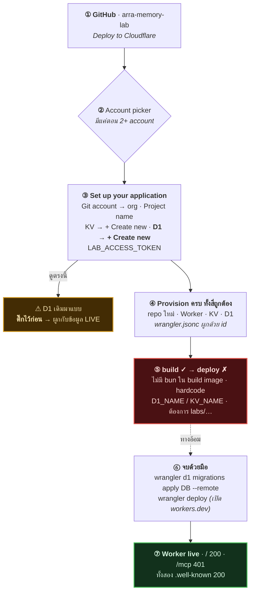
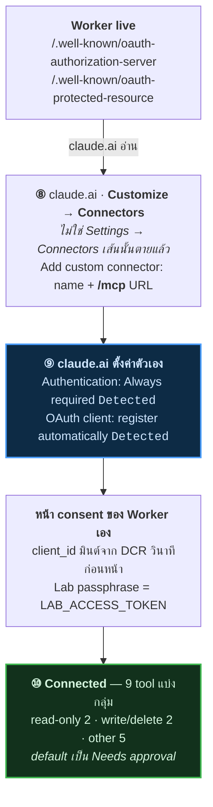

[English version](../../../tutorials/one-click-install/) · [← memory บน claude.ai](../) · [connector flow](../connect-claude-ai.html) · [digger-node](../digger-node/) · [thor-memory](../thor-memory/)

# One-click install — GitHub → Cloudflare → claude.ai

walkthrough deploy **arra-memory-lab** ด้วยปุ่ม Deploy to Cloudflare จับ step ต่อ
step วันที่ 2026-09-10 บน account จริง

ไปจนจบถึง claude.ai connector ที่ใช้งานได้ เขียนจาก install ที่ **พังกลางทาง** —
ไม่ปิดบัง ปุ่ม provision ทุกอย่างถูกต้อง แล้ว deploy step ก็ตายด้วยเหตุผลที่เดาจาก
README ไม่ได้ [ข้ามไปดูตรงนั้น](#step-8--deploy-พัง-แล้วก็ทำไม)

---

## ปุ่มนี้สร้างอะไรจริง ๆ

คลิกเดียว provision **สี่อย่าง** ไม่ใช่หนึ่ง:

| Resource | ชื่อใน walkthrough นี้ |
|---|---|
| **GitHub repo ใหม่** (copy ของ source ใน org) | `Soul-Brews-Studio/arra-memory-lab-oneclick` |
| **Worker** | `arra-memory-lab-oneclick` |
| **KV namespace** — OAuth client, grant, code, hashed token | `arra-memory-lab-oneclick` |
| **D1 database** — memory, chunk, observation, search trace | `arra-memory-lab-oneclick` |

บวก Workers AI binding สำหรับ embedding 768 มิติ

> [!IMPORTANT]
> deploy **สร้าง repository ใหม่ใน GitHub org ของคุณ** ไม่ได้ deploy repo ที่คุณ
> กำลังอ่านอยู่ ถ้ามี repo ชื่อนั้นอยู่แล้ว ตั้งชื่อ project ใหม่ — นั่นคือเหตุผลที่
> ทุกอย่างในนี้ต่อท้ายด้วย `-oneclick`

## ภาพรวมการติดตั้ง

สีแดงคือจุดที่คลิกผ่านเฉย ๆ จะหยุด เส้นประคือทางอ้อมผ่านมัน สีเหลืองคือ branch ที่
ไม่พัง — แค่เงียบ ๆ ผูกเข้ากับข้อมูลผิดตัว



---

## Step 1 — เริ่มที่ repo

เปิด <https://github.com/Soul-Brews-Studio/arra-memory-lab>


เลื่อนไปที่ส่วน **Deploy** link ของปุ่มควรอ่านก่อนคลิก — ต้องชี้ **repo นี้**:

```
https://deploy.workers.cloudflare.com/?url=https://github.com/Soul-Brews-Studio/arra-memory-lab
```


> [!TIP]
> เช็คว่า `?url=` ตรงกับ repo ที่คุณอยู่หรือเปล่า ปุ่ม deploy ถูก copy-paste ข้าม
> project มากกว่าบรรทัดไหนใน README แล้วปุ่มค้างก็ deploy app ของคนอื่นเงียบ ๆ
> ใน fleet นี้มีหลายตัวเป็นแบบนั้น

---

## Step 2 — เลือก Cloudflare account

login มีมากกว่าหนึ่ง account Cloudflare ถามก่อน deploy ไม่ไปต่อจนกว่าจะเลือก


เลือก account ที่จะเป็นเจ้าของ Worker, D1 database แล้วก็บิล

---

## Step 3 — form ตั้งค่า

มาถึง **Create an app → Create and deploy**


form ถามตามลำดับ:

1. **Git account** — repo ใหม่จะไปอยู่ที่ไหน
2. **Project name** — เป็นชื่อ Worker ด้วย แล้วก็ `*.workers.dev` hostname
3. **KV namespace** — สำหรับ OAuth state
4. **D1 database** — สำหรับ memory
5. **`LAB_ACCESS_TOKEN`** — owner secret
6. **`SEMANTIC_MAX_DISTANCE`** — vector search cutoff, default `0.7`

---

## Step 4 — ต่อ Git account

เปิด dropdown **Git account** ถ้าเคยต่อ GitHub มาก่อน org จะอยู่ในลิสต์ ไม่งั้นใช้
**+ New GitHub connection** แล้ว authorize Cloudflare


เลือก org ที่ repo ใหม่จะไปอยู่


---

## Step 5 — ตั้งชื่อ project

ตั้ง **Project name** มันจะกลายเป็น:

- ชื่อ Worker
- `*.workers.dev` hostname
- **แล้วก็ชื่อ GitHub repo ใหม่**

walkthrough นี้ใช้ `arra-memory-lab-oneclick` เพราะ `arra-memory-lab` มีอยู่แล้วทั้ง
ใน org แล้วก็ในลิสต์ D1 ของ account

---

## Step 6 — สร้าง D1 database **ใหม่**

step นี้พลาดง่ายที่สุด แบบเงียบ ๆ ด้วย

เปิด **Select D1 database** dropdown จะลิสต์ database ที่มีอยู่แล้วใน account —
แล้ว**หนึ่งในนั้นอาจติ๊กไว้แล้ว**:


ในภาพข้างบน `arra-memory-lab` ถูกติ๊ก deploy แบบนั้นจะผูก Worker ใหม่เข้ากับ
database **เดิม** แล้วเขียนทับข้อมูล live

เลื่อนขึ้นบนสุดของลิสต์ เลือก **+ Create new**:


field **Name your D1 database** จะโผล่มา ตั้งชื่อที่ยังไม่มี — ลิสต์ที่เพิ่งปิดไปคือ
ลิสต์ที่ต้องเช็ค

> [!WARNING]
> "+ Create new" เป็นแค่หนึ่งตัวเลือกใน dropdown ที่ search ได้ database เดิมมา
> pre-select ได้ ยืนยันว่าติ๊กอยู่ที่ **+ Create new** ก่อน deploy กฎเดียวกันใช้กับ
> KV namespace ข้างบนด้วย

---

## Step 7 — ตั้ง owner token แล้วก็ deploy

`LAB_ACCESS_TOKEN` มาพร้อม placeholder ตัวอักษร `replace-with-a-long-random-token`
แทนที่มัน generate 32 random byte:

```bash
openssl rand -hex 32
```

field เป็น password input render เป็นจุด screenshot ได้ปลอดภัย ปล่อยไว้บนจอก็ได้
**เก็บค่านี้ไว้ที่หาเจอ**: browser API ใช้เป็น bearer token แล้ว MCP OAuth approval
page รับเป็น owner passphrase กู้คืนจาก dashboard ทีหลังไม่ได้

form ที่กรอกครบ:


คลิก **Deploy**

---

## Step 8 — deploy พัง แล้วก็ทำไม

ทุกอย่าง provision build สำเร็จ **deploy step พัง**


สามอาการบนหน้านั้น:

- แดง **Latest build failed**
- **No URLs enabled** — `workers.dev` เป็น *Disabled* hostname เลย 404
- **Bindings 0**


build log บอกว่า build เองไม่มีปัญหา:

```
Detected the following tools from environment: npm@10.9.2, nodejs@24.18.0
added 264 packages in 9s
Executing user build command: npm run build
  > vite build
  ✓ 498 modules transformed.
  ✓ built in 357ms
```

แล้ว `npm run deploy` รัน มี **สามเหตุผลอิสระ** ที่มันสำเร็จไม่ได้บน repo ที่ปุ่มสร้าง
ทั้งสามข้อ verify ด้วยการรันจริงแล้ว

**1. `deploy` เช็ค test runner ที่ Cloudflare ไม่มี**

```json
"deploy": "npm run check && node scripts/deploy.mjs",
"check":  "… && bun test src/*.test.ts && …"
```

บรรทัดของ build log เองบอก `Detected the following tools from environment:
npm@10.9.2, nodejs@24.18.0` **ไม่มี `bun`** `check` เลยพังก่อน `deploy.mjs` จะถูก
เรียกด้วยซ้ำ

**2. `scripts/deploy.mjs` hardcode ชื่อของ project ต้นฉบับ**

```js
const D1_NAME      = "arra-memory-lab";
const KV_NAME      = "arra-memory-lab-oauth";
const BUILT_CONFIG = join("dist", "arra_memory_lab", "wrangler.json");
```

แล้วก็ assert กับมัน — `Built config Worker name must be arra-memory-lab` ต้องมี D1
ชื่อ `arra-memory-lab` เป๊ะ KV ชื่อ `arra-memory-lab-oauth` เป๊ะ form one-click ชวน
ตั้งชื่อ project เอง สร้าง resource ใหม่เอง **ชื่อไหนก็ตามที่เลือก assertion พวกนี้
พังหมด** แล้ว built config จริง ๆ ไปอยู่ที่ `dist/arra_memory_lab_oneclick/` ไม่ใช่
path ที่มันมองหา

**3. รันนอก monorepo ของคนเขียนไม่ได้** รันตรง ๆ มี `bun` แล้ว build ครบ ได้:

```
$ node scripts/deploy.mjs
[release] Run this command from the labs/arra-memory-lab directory
```

`deploy.mjs` เขียนสำหรับ subdirectory `labs/arra-memory-lab` ใน source monorepo —
ไม่ใช่สำหรับ repo standalone ที่ปุ่ม Deploy generate

> [!CAUTION]
> **ปุ่ม Deploy to Cloudflare บน repo นี้จบไม่ได้** ไม่ใช่เพราะ app แต่เพราะ deploy
> script ที่มันเรียก ไม่เคยถูกปรับให้เข้ากับ layout standalone ที่ปุ่มผลิตออกมา แก้
> แค่ `bun` ไม่พอ

**ส่วน provision โอเค** — ข่าวดี `wrangler.jsonc` ใน repo ที่ generate ถูกต้อง
database ใหม่ผูกด้วย id:

```jsonc
"d1_databases": [
  { "binding": "DB",
    "database_name": "arra-memory-lab-oneclick",
    "database_id": "604836b0-…",
    "migrations_dir": "migrations" }
],
"kv_namespaces": [ { "binding": "OAUTH_KV", "id": "acf4bd3a…" } ],
"ai": { "binding": "AI" }
```

จบ install เองได้ด้วยสอง command

### จบด้วย wrangler

clone repo ที่ปุ่มสร้าง แล้ว:

```bash
export CLOUDFLARE_ACCOUNT_ID=<your account id>
npm ci && npm run build

# 1. migrate database ใหม่
npx wrangler d1 migrations apply DB --remote

# 2. deploy ข้าม deploy script ที่พัง
npx wrangler deploy
```

output จริง:

```
🚣 Executed 7 commands in 2.59ms
┌───────────────────────────────────┬────────┐
│ 0001_init.sql                     │ ✅     │
│ 0002_memory_provenance.sql        │ ✅     │
│ 0003_trace_links_supersession.sql │ ✅     │
└───────────────────────────────────┴────────┘

Uploaded arra-memory-lab-oneclick (6.72 sec)
Deployed arra-memory-lab-oneclick triggers (1.58 sec)
  https://arra-memory-lab-oneclick.laris.workers.dev
```

`wrangler deploy` เปิด `workers.dev` เป็น default ด้วย เคลียร์ 404 ไปในตัว —
dashboard ปล่อยไว้ **Disabled** บน Worker ใหม่

> [!NOTE]
> `LAB_ACCESS_TOKEN` ที่ตั้งใน deploy form เก็บเป็น **Worker secret** รอด redeploy
> นี้ ยืนยันด้วย `npx wrangler secret list --name <worker>`

---

## Step 9 — verify ก่อนต่ออะไรเข้ามัน

```bash
U=https://<project-name>.<subdomain>.workers.dev
curl -s -o /dev/null -w '%{http_code}\n' "$U/"
curl -s -o /dev/null -w '%{http_code}\n' "$U/mcp"
curl -s "$U/.well-known/oauth-authorization-server" | jq
```

วัดกับ deploy ที่จบแล้ว:

| Path | Result |
|---|---|
| `GET /` | **200** |
| `GET /mcp` | **401** |
| `POST /mcp` (ไม่มี token) | **401** |
| `GET /.well-known/oauth-authorization-server` | **200** |
| `GET /.well-known/oauth-protected-resource` | **200** |

`401` บน `/mcp` คือคำตอบ **ถูกต้อง** ไม่ใช่ failure — แปลว่า auth ทำงานอยู่ `404`
ทุกที่แปลว่า deploy ไม่สำเร็จ หรือ `workers.dev` ยัง disable อยู่

authorization-server document ที่ fetch สด ๆ คือสิ่งที่ claude.ai ต้องการเป๊ะ:

```json
{
  "issuer":                           "https://<worker>/",
  "authorization_endpoint":           "https://<worker>/authorize",
  "token_endpoint":                   "https://<worker>/oauth/token",
  "registration_endpoint":            "https://<worker>/oauth/register",
  "code_challenge_methods_supported": ["S256"],
  "grant_types_supported":            ["authorization_code", "refresh_token"],
  "scopes_supported":                 ["memory:read", "memory:write"]
}
```

สามอย่างต้องเช็คใน document นั้น:

- **`S256`** — PKCE ที่ claude.ai ต้องการ
- **`registration_endpoint`** — Dynamic Client Registration ไม่ต้อง paste client
  id หรือ secret ด้วยมือ
- **`refresh_token`** — ไม่มีแปลว่า client ต้องพา user ผ่าน authorize flow ใหม่
  ทั้งหมดทุกครั้งที่ token หมดอายุ

---

## Step 10 — ต่อเข้า claude.ai

ไม่มีอะไร paste ด้วยมือนอกจาก passphrase document `.well-known` สองตัวของ Worker
เป็นคนตั้งค่าให้:



> [!NOTE]
> **Connectors ย้ายที่แล้ว** `claude.ai/settings/connectors` ตอนนี้บอกแค่
> *"Connectors have moved to Customize"* ที่จริงอยู่ที่ **Customize → Connectors**
> (`claude.ai/new#settings/customize-connectors`)

เปิด **Customize → Connectors** connector custom ที่มีอยู่แล้วลิสต์เป็น type `Web`
badge `Custom`:


ใช้ **Add** (บนขวา) → **Add custom connector**:


กรอกสอง field — display name กับ MCP endpoint:


> [!TIP]
> URL ต้องเป็น path **`/mcp`** ไม่ใช่ root ของ Worker hint ของ dialog บอกไว้เอง ว่า
> *"The HTTPS address where the server accepts MCP requests, for example
> `https://mcp.example.com/mcp`."*

กด **Continue** ตรงนี้แหละที่งานจาก Step 9 คุ้มค่า:


claude.ai fetch document `.well-known` ของ Worker ไปแล้ว **detect ทั้งสองค่าให้เอง**
— สังเกต badge `Detected` สองอัน:

| Setting | เลือกให้อัตโนมัติ | เพราะ |
|---|---|---|
| **Authentication: Always required** | `Detected` | protected-resource document บอกว่าต้อง auth |
| **OAuth client: No client ID — register one automatically** | `Detected` | AS metadata มี `registration_endpoint` (DCR) |

นั่นคือประเด็นทั้งหมดของ Dynamic Client Registration: *"Claude registers OAuth
clients with the server as users connect."* **ไม่ต้อง paste client ID หรือ secret
เลย** ถ้า server ไม่มี DCR ต้องเลือก "Use your own OAuth client" register ด้วยมือ
เอง

กด **Add** connector ถูกสร้างแล้วแต่ยังไม่ authorize:


กด **Connect** Worker ของคุณ serve หน้า consent เอง — สังเกต client id ใน URL
ที่ DCR มินต์วินาทีก่อนหน้า:


กรอก **`LAB_ACCESS_TOKEN`** จาก Step 7 ใน **Lab passphrase** แล้วกด **Authorize
MCP client** หน้านั้นบอก security model ตรง ๆ:

> *"The browser passphrase is exchanged locally with this Worker; the MCP client
> receives a revocable OAuth token, not the passphrase."*

redirect กลับมา connector live แล้ว — ปุ่มเปลี่ยนเป็น **Disconnect** claude.ai
enumerate tool แล้วจัดกลุ่มตามความเสี่ยง:


| กลุ่ม | จำนวน | Tool |
|---|---|---|
| Read-only | 2 | `Trace get`, `Trace list` |
| Write/delete | 2 | `Forget`, `Rebuild index` |
| Other | 5 | `Lab info`, `Memory stats`, `Observe`, `Recall`, `Remember` |

ทุกกลุ่ม default เป็น **Needs approval** แต่ละ tool ตั้งเองได้ว่าจะ always-allow,
ask, หรือ never ปล่อย write/delete ไว้ที่ approval ถ้าไม่มีเหตุผลจะเปลี่ยน

### ต่อ CLI

CLI สองตัวใช้ flag **ต่างกัน** — จุดนี้ทำคนพลาดบ่อย:

```bash
# Claude Code — ใช้ --transport
claude mcp add --transport http arra-oneclick https://<your-worker>/mcp
claude mcp login arra-oneclick

# Codex — ใช้ --url ไม่ใช่ --transport
codex mcp add arra-oneclick --url https://<your-worker>/mcp
codex mcp login arra-oneclick
```

หลัง `add` ก่อน `login` ทั้งสองจะรายงานว่า server register แล้ว unauthorized — คือ
สิ่งที่ควรเห็น:

```
claude:  arra-oneclick: https://…/mcp (HTTP) - ! Needs authentication
codex:   arra-oneclick  https://…/mcp   enabled   Not logged in
```

> [!WARNING]
> `codex mcp login` **เปิด default browser จริง** แล้ว block รอ
> `http://127.0.0.1:<port>/callback/...` redirect ไม่กรอก form ให้ทันมันจะ give up
> ด้วย `Caused by: deadline has elapsed` เตรียม passphrase ไว้ใน clipboard ก่อนเริ่ม

หน้า consent serve จาก Worker ของคุณเอง บอก **Connect Codex** (หรือ **Connect
Claude**) ลิสต์ redirect URI แล้วก็ scope ที่ขอ `memory:read` กับ `memory:write`
มี field **Lab passphrase** เดียวกับปุ่ม **Authorize MCP client** ตัวมันบอกเหตุผล
ของการแยกเอง:

> *"The browser passphrase is exchanged locally with this Worker; the MCP client
> receives a revocable OAuth token, not the passphrase."*

passphrase คือ `LAB_ACCESS_TOKEN` จาก Step 7 ไม่เคยหลุดออกจาก browser แล้วสิ่งที่
client เก็บคือ token ที่ revoke แยกได้เอง

repo ยังมี `npm run mcp:connect` (`scripts/connect-mcp.sh`) ห่อขั้นตอนนี้ไว้ให้ด้วย

---

## Checklist

- [ ] `?url=` ของปุ่ม Deploy ชี้ repo นี้
- [ ] เลือก Cloudflare account ถูก
- [ ] ต่อ Git account แล้ว project name ว่างใน org นั้น
- [ ] **D1 ตั้งเป็น "+ Create new"** ไม่ใช่ database เดิมที่ pre-select
- [ ] KV ตั้งเป็น "+ Create new"
- [ ] `LAB_ACCESS_TOKEN` แทนที่แล้วเก็บไว้
- [ ] Deploy จบผ่าน `npx wrangler deploy` (deploy script ของปุ่มเองรันไม่ได้ — Step 8)
- [ ] `workers.dev` เปิดแล้ว (`wrangler deploy` ทำให้ dashboard ไม่ทำ)
- [ ] migration D1 apply ด้วย `wrangler d1 migrations apply DB --remote`
- [ ] `/mcp` ตอบ `401` ไม่ใช่ `404`
- [ ] ทั้งสอง `.well-known` document ตอบ `200`
- [ ] claude.ai แสดง **Authentication: Always required** กับ **register one
      automatically** ทั้งคู่ `Detected`
- [ ] Connector แสดง **Disconnect** แล้วลิสต์ tool ตาม permission group

---

*จับด้วย `/browser-tutorial` วันที่ 2026-09-10 screenshot มาจาก deploy จริง
token field เป็น password input มาสก์ไว้ตอน capture*

<script src="https://cdn.jsdelivr.net/npm/mermaid@10/dist/mermaid.min.js"></script>
<script>
document.addEventListener("DOMContentLoaded", function () {
  document.querySelectorAll("pre > code.language-mermaid").forEach(function (code) {
    var div = document.createElement("div");
    div.className = "mermaid";
    div.textContent = code.textContent;
    code.parentElement.replaceWith(div);
  });
  mermaid.initialize({ startOnLoad: true, theme: "neutral" });
});
</script>
