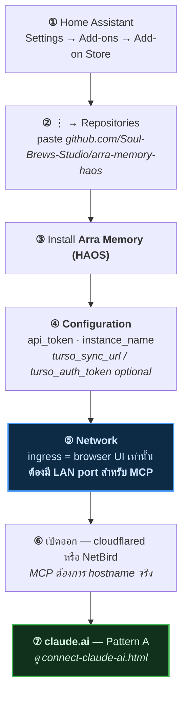

[English version](../../../tutorials/thor-memory/) · [← memory บน claude.ai](../) · [connector flow](../connect-claude-ai.html) · [arra-memory-lab](../one-click-install/) · [digger-node](../digger-node/)

# thor-memory — Home Assistant add-on & claude.ai

ตัวต้นฉบับ **19 tool** ทุกอย่างที่ memory server บน Cloudflare ทำ บวกอีกสิบตัวที่
ฝั่งนั้นไม่เคยได้ — แล้วไม่มีปุ่ม Deploy เพราะมันไม่ใช่ Worker

`thor-memory` ไม่ใช่ repo มันคือ **`Soul-Brews-Studio/arra-memory-haos`** รันภายใต้
`instance_name` add-on ตัวเดียวกันติดตั้งสองครั้งคนละชื่อ ได้ `thor-memory` กับ
`arra-memory`

---

## ทำไมไม่มี one-click

| | |
|---|---|
| Runtime | **Bun + s6-overlay** ใน container ไม่ใช่ workerd |
| Packaging | Home Assistant **add-on**, `slug: arra_memory`, version `0.27.1` |
| Storage | embedded **libSQL** file ที่ `/data/` มี Turso replica แบบ optional |
| Install | เพิ่ม **repository URL** เข้า add-on store ของ Supervisor |

ปุ่ม Cloudflare deploy clone repo เข้า Worker อันนี้เป็น container ที่มี database
file local ทางนี้เลยใช้ไม่ได้

> [!NOTE]
> Home Assistant **มี** one-click สำหรับ add-on store:
> `https://my.home-assistant.io/redirect/supervisor_add_addon_repository/?repository_url=<url>`
>
> **ไม่มี repo ไหนใน fleet นี้ใช้มัน** — รวมทั้ง add-on store ที่ serve 22 add-on
> เพิ่มบรรทัดนั้นเข้า README ของ `arra-memory-haos` จะทำให้ install นี้เหลือแค่
> คลิกเดียว แทนที่จะต้อง paste

---

## Install



> [!NOTE]
> hostname เขียนเป็น `<ha-host>` กับ `<memory-host>` ตลอด แทนด้วยของคุณเอง:
> `<ha-host>` คือที่ Home Assistant ตอบ `<memory-host>` คือ tunnel หรือ LAN address
> ที่ไปถึง port ของ add-on **ไม่ใช่ host เดียวกัน** นั่นแหละคือประเด็นทั้งหมดของ
> section ถัดไป

### กับดัก: ingress serve MCP ไม่ได้

`config.yaml` เขียนไว้ในคอมเมนต์เอง — *"A LAN port in addition to ingress,
because ingress alone cannot serve MCP."*

> [!CAUTION]
> **Home Assistant ingress เป็น tunnel สำหรับ browser เท่านั้น** ล็อกด้วย HA
> session cookie ingress URL ตอบ `200` พร้อม **HTML ของ Home Assistant frontend**
> ทุก path ใต้มัน — รวม `/mcp` ด้วย ดูเหมือนเข้าถึงได้ แต่ไม่ใช่ MCP endpoint
>
> ```
> <ha-host>/<hash>_arra_memory/mcp   → 200  <title>Home Assistant</title>
> <memory-host>/mcp                  → 401  ← ประตูจริง
> ```
>
> claude.ai ต่อผ่าน ingress path ไม่ได้ เปิด LAN port ผ่าน tunnel แล้วให้ hostname
> นั้นกับ claude.ai
>
> **ให้ตรง:** ingress ใช้ได้ดีสำหรับ *browser ที่มี Home Assistant session* —
> proxy ตรงเข้า UI ของ add-on เอง สิ่งที่มัน serve ไม่ได้คือ client ที่ไม่มี HA
> cookie ซึ่งก็คือ MCP client ทุกตัว `200` ที่ได้โดยไม่มี session คือหน้า login
> ของ HA ไม่ใช่ add-on

หลักฐานคือ title ของหน้า ทั้งสอง URL ตอบ `200` แต่มีแค่อันเดียวที่เป็น add-on
จริง:

การขอ path **ingress** `/mcp` ใน browser จะไปจบที่หน้า login ของ Home Assistant
เอง serve เป็น HTML:


MCP client ที่ขอ `tools/list` จาก URL นั้นได้หน้านี้กลับมา ไม่ใช่ error ไม่ใช่ JSON
— form login พร้อม `200 OK` นั่นคือ failure mode ทั้งหมด — ดูเหมือนเข้าถึงได้
แต่ไม่ใช่ endpoint

| URL | `<title>` |
|---|---|
| `<ha-host>/<hash>_arra_memory/mcp` — path **ingress** | **Home Assistant** |
| `<memory-host>` — **tunnel** ไปที่ LAN port ของ add-on | **thor-memory** |

อีกสองเรื่องจาก `config.yaml` ควรรู้ก่อนจะไปแจ้ง bug:

- `ingress_panel` เป็น **`false`** บน fresh install ใน Supervisor บางเวอร์ชัน —
  ถ้า icon ใน sidebar ไม่โผล่ นี่คือเหตุผล เป็น per-install state ตั้งด้วย
  `POST /addons/<slug>/options`
- `ports:` ตั้งเป็น `null` ใน tab **Network** ได้ เพื่อปิด LAN port เหลือแค่
  ingress ทำแบบนั้น MCP หยุดทำงาน โดยการออกแบบ

---

## 19 tool

verb หลักหกตัว บวกอีกสิบตัวที่สายนี้มี แต่ Cloudflare server ไม่เคยได้ บวก
federation trio

| กลุ่ม | Tool |
|---|---|
| Core | `remember` · `recall_memories` · `read_memory` · `revise_memory` · `forget_memory` · `memory_stats` |
| Corpus | `list_workspaces` · `list_agents` · `list_projects` · `list_tags` |
| Search log | `list_search_log` · `forget_search_log` |
| Time / digest | `digest` · `search_memories_between` |
| Tool control | `list_tools` · `toggle_tool` |
| **Federation** | `list_fleet` · `send_to_oracle` · `oracle_replies` |

> [!TIP]
> federation trio คือเหตุผลที่เลือกอันนี้เหนือสาย Worker — oracle ตัวหนึ่งส่ง
> message ให้อีกตัวผ่าน memory server ได้เลย ฝั่ง Cloudflare ไม่มีเลย

---

## Verify

```bash
U=https://<memory-host>          # tunnel ไปที่ LAN port ไม่ใช่ path ingress
curl -s -o /dev/null -w '%{http_code}\n' "$U/"                     # 200
curl -s -o /dev/null -w '%{http_code}\n' -X POST "$U/mcp"          # 401
curl -s "$U/.well-known/oauth-authorization-server" | jq -e .registration_endpoint
```

วัดวันที่ 2026-09-10 — `/` 200, `POST /mcp` 401, ทั้งสอง `.well-known` 200, DCR มี,
scope `memory:read memory:write`

---

## Connect

Pattern A — **[connect-claude-ai.html](../connect-claude-ai.html)**

passphrase ที่หน้า consent คือ option **`owner_passphrase`** ของ add-on —
**ไม่ใช่** `api_token` สองตัวนี้สำหรับ client คนละแบบ `config.yaml` บอกไว้เอง:

| Option | สำหรับ |
|---|---|
| **`owner_passphrase`** | web UI **แล้วก็ approve MCP client** — นี่คือสิ่งที่หน้า consent ของ claude.ai ต้องการ |
| `api_token` | *"static bearer token for scripts, curl, and MCP clients that read a config file (Claude Code, Codex). **claude.ai connectors CANNOT send a static header and must use the OAuth flow instead — that is why both exist.**"* |

`owner_passphrase` ว่างเปล่า add-on **ปฏิเสธจะ start** *"rather than serving your
memories to anyone who finds the URL."*

หน้าล็อกของมัน บน hostname จริง:


> [!WARNING]
> **ไม่มี `refresh_token`** `grant_types_supported` มีแค่
> `["authorization_code"]` claude.ai ต้อง authorize flow เต็มใหม่ทุกครั้งที่ token
> หมดอายุ สาย `arra-memory-lab` บน Cloudflare มี refresh — ตัวนี้ มี tool
> เยอะเป็นสองเท่า แต่ไม่มี

---

## มัน down ได้ แล้วก็ควรรู้ว่าทำไม

`thor` เป็น **KVM guest** ตั้ง `autostart: disable` มันดับอยู่หลัง Cloudflare
`1033` ตั้งแต่ **2026-09-04 18:27 จนถึง `virsh start` ด้วยมือวันที่ 09-09**
crash-restart แปดครั้งขึ้นไปในระหว่างนั้น tunnel กับ OAuth metadata กลับมาภายใน
~75 วินาทีหลัง guest boot

ถ้า endpoint ข้างบนตอบ `1033` ทุกตัว add-on ปกติดี — guest แค่ปิดอยู่

---

## ยืนยันว่ารันอยู่ 2026-09-11

add-on ติดตั้งแล้ว start อยู่บนเครื่อง `thor` ingress panel อยู่ใน sidebar เปิดขึ้น
มา serve **หน้าล็อกของ add-on เอง** ไม่ใช่ของ Home Assistant:


สองเรื่องที่ screenshot นั้นยืนยัน:

- **`Memory · Lance` เป็น panel ที่ live อยู่** Supervisor register ingress panel
  ตอน add-on **start** แล้วก็ถอดตอน stop panel เลยเป็นหลักฐานที่ดีกว่า HTTP
  status ตัวไหน
- **instance เรียกตัวเองว่า `THOR-MEMORY-LANCE`** — option `instance_name` แยก
  จาก `thor-memory` ที่รัน libSQL ต้นฉบับอยู่ข้าง ๆ กัน

### เช็คโดยไม่ผ่าน Supervisor UI

เส้นทางปกติ — Settings → Add-ons — **ใช้ไม่ได้บน deployment นี้** วัดแล้ว:

| probe | result |
|---|---|
| `/hassio/dashboard` | `404` |
| `/config/addons` | shell render **content ไม่โผล่มาเลย** (รอ 32 วิ ไม่มี error โชว์) |
| `/api/hassio/addons` | `401` |
| `/api/hassio/<nonsense>` | `401` — ทั้ง subtree ถูกกันไว้ ไม่ใช่แค่ endpoint เดียว |
| `/api/` กับ `/api/config` | `200` — token ปกติดี |

`hassio` **อยู่ใน** `components` (HA 2026.9.0) แล้ว account ก็ **เป็น** `is_admin`
เพราะงั้นนี่ไม่ใช่ Supervisor หาย หรือปัญหา permission — REST proxy ถูกกันไว้บน
deployment นี้ ทั้งที่ frontend ยังเข้าถึง Supervisor ผ่าน channel ของตัวเองได้


**state ของ frontend เองตอบแทนได้** ใน browser console หน้า HA ไหนก็ได้:

```js
Object.values(document.querySelector('home-assistant').hass.panels)
  .filter(p => /^[0-9a-f]{8}_/.test(p.url_path))
  .map(p => `${p.url_path}  ${p.title}`)
```

```
f2b73050_oracle_registry        Oracle Registry
cd2339cc_arra_memory            Memory
a313c108_arra_studio            Studio
03926c4d_arra_memory_lancedb    Memory · Lance
a313c108_arra_oracle            Oracle
```

แต่ละ hash ถอดด้วย `haos-ingress-whois` — `cd2339cc` → `arra-memory-haos`,
`03926c4d` → LanceDB Python fork, `a313c108` → `arra-oracle-v3-haos`, `f2b73050`
→ `oracle-registry-haos` ระบบที่รันอยู่กับตาราง hash ตรงกัน

> [!CAUTION]
> **สองเครื่อง Home Assistant กันไว้เหมือนกัน** ทำซ้ำบนเครื่องที่สอง แยกกันเลย
> login เป็น admin คนละคน:
>
> | probe | thor | kvmlab1 |
> |---|---|---|
> | `/api/config` | `200` | `200` |
> | `/api/hassio/addons` | `401` | `401` |
> | `/api/hassio/<nonsense>` | `401` | `401` |
> | Settings → Add-ons UI | ว่างเปล่า | ว่างเปล่า |
>
> ทั้งคู่ admin ทั้งคู่มี `hassio` ใน `components` ทั้งคู่เข้าถึง Core ได้ปกติ
>
> **ไม่ใช่ tunnel** ทดสอบด้วย access token **เดียวกัน** ผ่านสองเส้นทางอิสระ —
> cloudflared tunnel กับ NetBird address ตรงเข้าเครื่องข้าม tunnel ไปเลย:
>
> | route | `/api/config` | `/api/hassio/addons` |
> |---|---|---|
> | cloudflared tunnel | `200` | **`401`** |
> | NetBird ตรงเข้าเครื่อง | `200` | **`401`** |
>
> เหมือนกันเป๊ะ การปฏิเสธมาจาก **Home Assistant เอง** ไม่ใช่จากอะไรที่อยู่ข้างหน้า
> มัน `/api/hassio/<nonsense>` ก็ตอบ `401` เหมือนกัน ไม่ใช่ `404` การอ่านที่น่าจะ
> เป็นไปได้มากที่สุดคือ Supervisor REST proxy ไม่ใช่ authenticated REST route บน
> version นี้แล้ว (HA **2026.9.0**) แล้ว frontend เข้าถึง Supervisor ผ่านช่องทาง
> อื่นแทน — แต่นั่นคือการอนุมาน ไม่ใช่การวัด
>
> เพราะงั้น **จับ walkthrough add-on store บนเครื่องไหนก็ไม่ได้** dialog
> repositories, หน้า install, tab Configuration/Network ทั้งหมดอยู่หลัง panel
> ที่ว่างนั้น step ติดตั้งใน diagram ยังถูกต้องอยู่ แค่ไม่มีภาพประกอบ นี่คือ
> เหตุผล

> [!WARNING] panel trick บอกอะไรได้บ้าง บอกไม่ได้บ้าง
> อ่าน `hass.panels` พิสูจน์ว่า add-on **มีอยู่จริงและ start แล้ว** — Supervisor
> register panel ตอน start มันไม่ได้ enumerate add-on ที่ติดตั้งทั้งหมด
>
> มีแค่ add-on ที่ `ingress: true` **และ** มี sidebar panel เท่านั้นที่โผล่มา
> `kvmlab1` คืนมาแค่ **หนึ่งตัว** (`a0d7b954_ssh` — Terminal add-on ทางการ) ทั้งที่
> [[app-urls]] นับได้ 22 add-on บนเครื่องนั้น — ไม่ขัดแย้งกัน เพราะ add-on ส่วนใหญ่
> ไม่มี UI จะไปวางใน sidebar
>
> **panel คือหลักฐานว่ามีอยู่ การไม่มี panel ไม่ได้พิสูจน์อะไรเลย**

<script src="https://cdn.jsdelivr.net/npm/mermaid@10/dist/mermaid.min.js"></script>
<script>
document.addEventListener("DOMContentLoaded", function () {
  document.querySelectorAll("pre > code.language-mermaid").forEach(function (code) {
    var div = document.createElement("div");
    div.className = "mermaid";
    div.textContent = code.textContent;
    code.parentElement.replaceWith(div);
  });
  mermaid.initialize({ startOnLoad: true, theme: "neutral" });
});
</script>

<script src="{{ '/assets/lightbox.js' | relative_url }}"></script>
