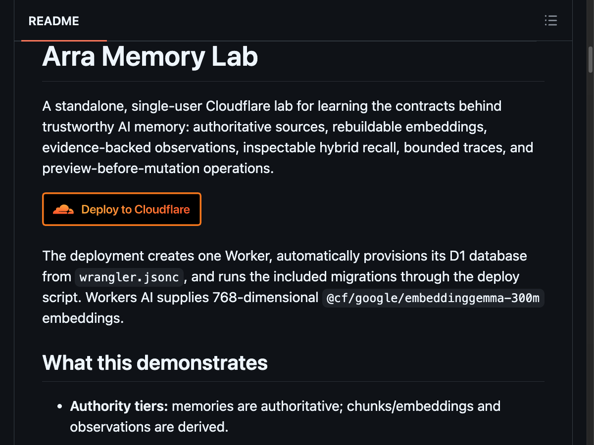
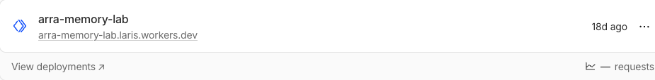
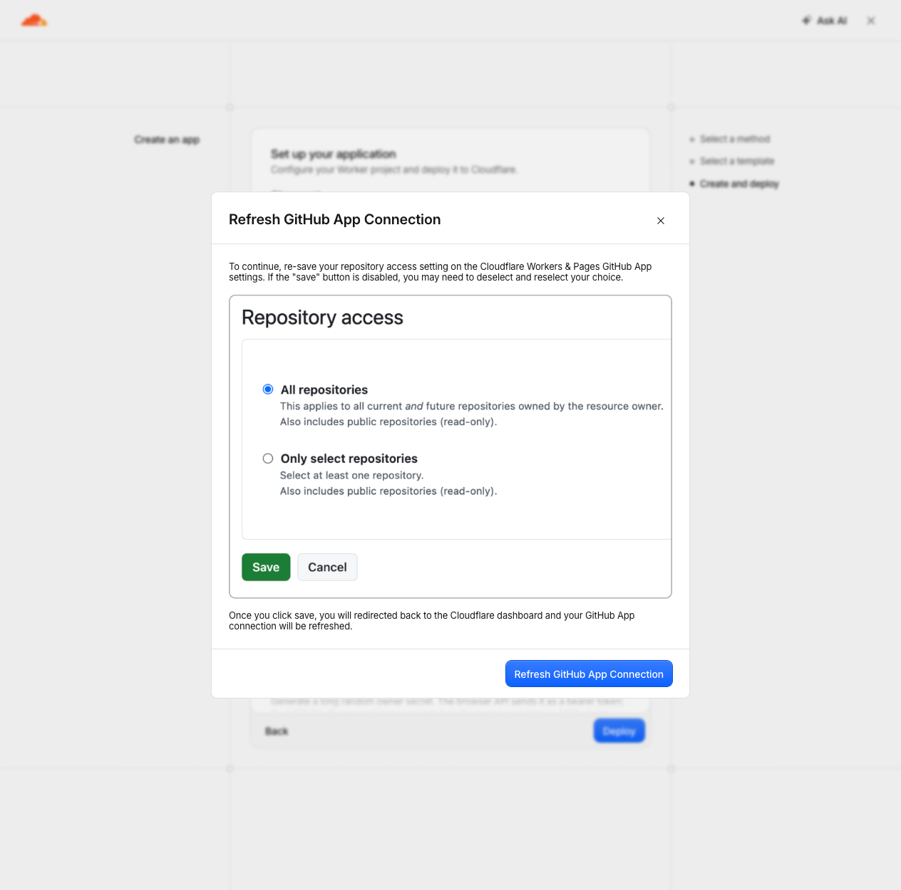
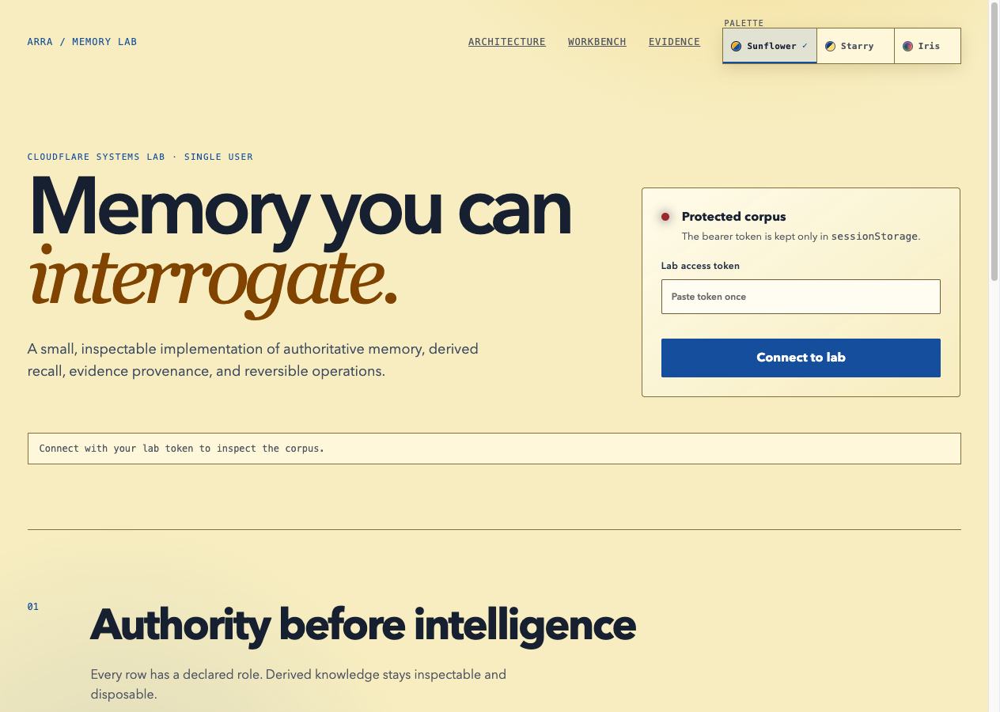
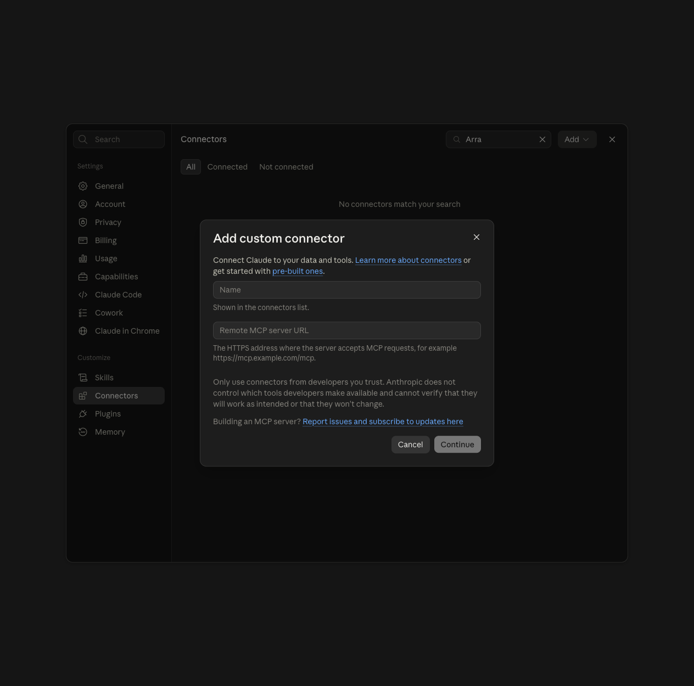

# Arra Memory Lab: GitHub to Cloudflare to Claude.ai — detailed walkthrough

Deploy a **separate Arra Memory Lab with a fresh database**, connect its remote MCP endpoint to Claude.ai, and verify a real tool call without changing the existing lab.

> **This is an in-progress walkthrough, not a completed installation report.** It contains 45 numbered steps, five real screenshots, and an [expanded screenshot checklist](arra-memory-lab-capture-checklist.html). The browser was handed to the owner at GitHub sign-in. No fresh Worker, database, or connector has been created by this run.

## How to read this guide

- **Observed:** the action or screen was seen during this session. Only an embedded image counts as a screenshot; an observation can be text-only.
- **Planned:** the instruction describes the next work. Its result has not been verified.
- **Owner only:** sign-in, MFA, secret entry, or consent is completed privately. Credential entry is not photographed.
- **Stop check:** a condition that must be resolved before an action can affect cloud resources.

“One-click” means starting from the repository's deployment button. It does **not** eliminate account selection, resource choices, credentials, build time, or OAuth approval. In this repository, the default deployment helper also needs special treatment for a second installation.

### Contents

- [Part A: Preflight](#part-a-preflight)
- [Part B: GitHub connection](#part-b-github-connection)
- [Part C: Fresh resource configuration](#part-c-fresh-resource-configuration)
- [Part D: Deployment and isolation verification](#part-d-deployment-and-isolation-verification)
- [Part E: Public app checks](#part-e-public-app-checks)
- [Part F: Claude.ai and OAuth](#part-f-claudeai-and-oauth)
- [Part G: Real MCP verification](#part-g-real-mcp-verification)
- [Troubleshooting](#troubleshooting)
- [Completion evidence](#completion-evidence)
- [Screenshot-by-screenshot capture checklist](arra-memory-lab-capture-checklist.html)

## Before you begin

You need access to the intended Cloudflare account, a GitHub account permitted to connect a repository, and a Claude.ai account exposing custom connectors. Cloudflare Workers, D1, KV, and Workers AI are used by this lab. Usage may incur charges under your account's plan; no plan upgrade or purchase has been performed here.

Keep these two installations distinct:

| Item | Existing installation — leave untouched | Fresh installation — planned |
| --- | --- | --- |
| Worker/project | `arra-memory-lab` | `arra-memory-lab-fresh-10sep2026` |
| D1 database bound as `DB` | Existing `arra-memory-lab` | New `arra-memory-lab-fresh-10sep2026` |
| KV bound as `OAUTH_KV` | Do not reuse the old binding | New `arra-memory-lab-fresh-10sep2026-oauth` |
| Owner secret | Do not retrieve or reuse it | A newly generated private value |
| Claude connector name | Not a substitute for the fresh lab | `Arra Memory Lab — Fresh` |
| Worker URL | Existing URL is preflight evidence only | Record the actual successful deployment URL |

The fresh names are proposed, not reserved. Check availability before using them. If a name conflicts, choose a unique suffix consistently; never delete an existing resource to free its name.

## Part A: Preflight

### 01. Open the source repository — observed

**Action:** Open [Soul-Brews-Studio/arra-memory-lab](https://github.com/Soul-Brews-Studio/arra-memory-lab) and scroll to the README heading **Arra Memory Lab**.

**Check:** The owner/repository matches exactly. The README contains an orange **Deploy to Cloudflare** button.



*Real capture of the repository, revisited during this session. This is not a successful deployment screen.*

### 02. Understand what the installation will create — source inspected

Read the README's **Deploy**, **MCP**, and privacy sections. The application uses a Worker, D1 storage, OAuth state in KV, and Workers AI for embeddings.

Two names are **bindings**, not resource names:

- `DB` is the name application code uses to reach its selected D1 database.
- `OAUTH_KV` is the binding for its selected OAuth KV namespace.

A resource can have a new unique name while retaining those binding names. The new deployment must point both bindings at **new resources**, not merely give the Worker a new display name.

### 03. Confirm the Cloudflare account — observed, no screenshot yet

**Action:** Open [Cloudflare Dashboard](https://dash.cloudflare.com/). If the **Accounts** picker appears, select the intended account. Complete Cloudflare sign-in privately if necessary.

**Check:** Read the account selector before configuring resources. This session selected the account requested by the owner; emails and account IDs are intentionally omitted from the tutorial.

**Stop check:** If the account is wrong, change the account before proceeding. Being signed in does not identify which account will own the deployment.

### 04. Check for an existing installation — observed

**Action:** Open **Workers & Pages**, enter `arra-memory-lab` in **Search applications**, and inspect the matching entry.

**Observed result:** A Worker named `arra-memory-lab` already exists. Its card showed **18d ago** when captured.



**Stop check:** Do not redeploy over this Worker, delete its database, or rotate its owner secret. The user explicitly requested a fresh database.

## Part B: GitHub connection

### 05. Start the official one-click flow — observed

**Action:** Click the README's **Deploy to Cloudflare** button, or use [the official deployment link](https://deploy.workers.cloudflare.com/?url=https://github.com/Soul-Brews-Studio/arra-memory-lab).

**Check:** The destination is Cloudflare and the template repository is still `Soul-Brews-Studio/arra-memory-lab`.

In this session, the initial click did not visibly advance the page. Opening the exact linked destination explicitly reached the Cloudflare account picker. Do not repeatedly click **Deploy** later if a submitted deployment is merely loading.

### 06. Select the deployment account — observed

**Action:** If Cloudflare asks **Select an account to continue**, select the same intended account from step 03.

**Observed result:** **Workers & Pages** opens **Set up your application**. The form includes **Git account**, **Project name**, KV/D1 controls, `LAB_ACCESS_TOKEN`, and build/deploy commands.

The form opening is not evidence that a repository or Worker has been created.

### 07. Choose the Git account — observed

**Action:** Open **Git account** and select the account that should receive the new repository.

**Observed result:** Existing Git connections were available, including the owner's personal connection. Selecting it did not require creating another connection, but it did trigger a refresh prompt.

Use **New GitHub connection** only if the required account is not already available. Do not choose an unrelated organization merely because it appears in the list.

### 08. Inspect the connection refresh prompt — observed

**Observed screen:** **Refresh GitHub App Connection** explains that repository access settings must be saved again in GitHub.



**Action:** Follow **Refresh GitHub App Connection** when this prompt appears.

The large **Repository access** panel inside this prompt is an explanatory image. Its example selection of **All repositories** is not proof of the owner's actual permissions and is not a recommendation to grant broader access.

### 09. Sign in to GitHub — owner only; current pause

**Observed result:** The refresh action opened `https://github.com/login` in another tab.

**Owner action:** Sign in using the normal GitHub method and complete any MFA. Do not paste credentials or recovery codes into the chat or tutorial.

**Return point:** After sign-in and the intended connection refresh, reply **continue** or explicitly return control to the agent. Browser control will not be taken back automatically.

### 10. Confirm the refreshed connection — planned

**Owner action:** Review the actual Cloudflare Workers & Pages GitHub App permission screen, if shown, and save the intended repository access.

**Check after return:** The Cloudflare form retains the correct Git account and no longer requires the refresh. The exact post-login screen and its control labels have not yet been observed.

**Stop check:** If completing this requires broader organization/repository access than intended, resolve that permission choice instead of expanding access to get past the prompt.

## Part C: Fresh resource configuration

> **All entries in this part are planned.** The form's original values were observed, but the fresh values have not been submitted. Capture each non-secret configuration state as it is filled.

### 11. Set a unique project name

**Action:** In **Project name**, replace `arra-memory-lab` with:

```text
arra-memory-lab-fresh-10sep2026
```

**Check:** No conflict/validation error appears. The resulting Worker and connected repository must be distinct from the existing installation.

### 12. Review repository visibility

**Action:** Review **Create private Git repository** before proceeding. It was unchecked in the observed form. For a private personal copy, enable it.

**Check:** The intended Git account, new repository name, and chosen visibility are clear. Repository privacy does not replace the lab's API authentication, and secrets must not be committed even to a private repository.

### 13. Select a new OAuth KV namespace

**Action:** Open **Select KV namespace** and choose **+ Create new** rather than an existing namespace.

**Check:** The form exposes the new namespace naming field. Its binding remains `OAUTH_KV`.

**Why:** Reusing the old OAuth namespace would share client/grant/token state between installations.

### 14. Name the new KV namespace

**Action:** In **Name your KV namespace**, use:

```text
arra-memory-lab-fresh-10sep2026-oauth
```

**Check:** This is a new namespace selection, not the old namespace with a renamed label. Later, verify the Worker's actual KV binding, not just this input value.

### 15. Change the D1 selection to a new database

**Action:** Open **Select D1 database** and choose the new-database option, rather than the preselected `arra-memory-lab` database.

**Observed risk:** The initial form selected an **existing D1 database**, even though a small **new** badge also appeared beside the field. The badge alone is not proof of a fresh database.

**Stop check:** If the field still resolves to the old database, do not deploy.

### 16. Name the fresh D1 database

**Action:** In the new-database name field that appears, enter:

```text
arra-memory-lab-fresh-10sep2026
```

The exact label of this newly revealed field remains to be captured; it was not present while the existing database was selected.

**Check:** The application binding stays `DB`, and the selected database is new. Keep the old database intact.

### 17. Generate and enter a new owner secret — owner only

**Action:** Generate a long random value using a trusted password manager or a private terminal. The repository gives this example:

```sh
openssl rand -hex 32
```

Save the result privately and enter it in **LAB_ACCESS_TOKEN**. Do not capture the command's output, the actual field value, clipboard contents, or a secret-bearing URL.

**Check:** The placeholder `replace-with-a-long-random-token` is gone. Record only “new secret supplied,” never its value. The same fresh secret will be needed on this lab's OAuth approval page.

### 18. Review the semantic threshold

**Action:** Leave **SEMANTIC_MAX_DISTANCE** at the observed default `0.7` for this walkthrough unless the task explicitly calls for tuning.

**Check:** A valid numeric value remains. This configuration step does not test Workers AI availability or embedding quality.

### 19. Review the build command

**Action:** Retain:

```sh
npm run build
```

**Check:** This matches the repository's build script. A successful build is still not proof that migrations ran or that the Worker is live.

### 20. Replace the fixed-name deploy helper

**Action:** Replace the form's default **Deploy command** `npm run deploy` with:

```sh
npx wrangler d1 migrations apply DB --remote && npx wrangler deploy
```

**Why this change matters:** The repository's custom `scripts/deploy.mjs` requires Worker/D1 name `arra-memory-lab` and looks up KV namespace `arra-memory-lab-oauth`. Renaming the project alone does not make that helper safe for a second installation. It rejects a renamed Worker; retaining the old names can target the old resources. [Inspected deployment script](https://github.com/Soul-Brews-Studio/arra-memory-lab/blob/6251a6309937bd9038a46d149fb8d1f6827afc73/scripts/deploy.mjs).

Cloudflare documents migration by **binding name** followed by deployment, so customized database names are respected. The Deploy Button customizes the copied repository's resource configuration; the Vite integration creates deployment configuration that Wrangler can locate. This replacement is documented guidance, **not a command already executed in this run**. [Deploy Button best practices](https://developers.cloudflare.com/workers/platform/deploy-buttons/#best-practices), [Vite deployment configuration](https://developers.cloudflare.com/workers/vite-plugin/reference/migrating-from-wrangler-dev/).

**Validation gap:** This override bypasses the original `npm run deploy` wrapper's `npm run check`. Do not report upstream tests as passed merely because this build/deploy succeeds.

### 21. Review the entire form before submission

Capture a non-secret review image and check every item:

- Correct Cloudflare and Git accounts.
- Unique new project/repository name and intended repository visibility.
- `DB` selects a newly created D1 database.
- `OAUTH_KV` selects a newly created KV namespace.
- A fresh owner secret is supplied; its value is hidden from captures.
- The build/deploy commands match steps 19–20.
- Existing resources are not selected.

The observed form also exposes **Builds for non-production branches**, **Protect with Cloudflare Access**, and **Advanced settings**. Do not toggle unrelated settings casually. In particular, adding another access gate would change the connection flow being documented.

**Stop check:** Any unresolved resource collision, payment/plan change, permission expansion, or unexpected setting prevents submission.

## Part D: Deployment and isolation verification

> **Planned:** there are no deployment logs or success screenshots for the new installation yet. The steps below state what to inspect, not what has happened.

### 22. Submit the fresh deployment once

**Action:** After step 21 passes, select **Deploy** once.

**Expected result:** A deployment/build progress screen appears for the **new** project. Record the application name and start time without recording account IDs or tokens.

If navigation is slow, observe the same job instead of creating another application.

### 23. Inspect the build phase

**Action:** Follow the deployment's build output.

**Check:** Dependencies install and `npm run build` completes. Preserve the relevant success line or failure excerpt after redaction.

**Stop check:** A build failure is not a reason to change the target back to the existing Worker. Diagnose the new build in place.

### 24. Verify migrations target the fresh database

**Action:** Inspect the migration phase for the `DB` binding and confirm it corresponds to the fresh database created in the form.

**Expected result:** Migrations complete successfully before publishing. Compare resource identities privately if needed; publish only names and an isolation verdict, not raw identifiers.

**Stop check:** If logs or configuration point to the old database, stop further work. Do not repeatedly run migrations against an uncertain target.

### 25. Record the successful deployment URL

**Action:** After Cloudflare reports deployment success, open the resulting Worker URL.

**Check:** Copy the **actual** fresh URL into the final tutorial. Do not construct a URL from the planned name and assume it exists.

A generated URL, repository, or partially provisioned database alone does not prove the build succeeded.

### 26. Verify the deployed resource bindings

**Action:** Inspect the new Worker's deployed bindings in Cloudflare; capture the current interface labels when doing so.

**Check:** `DB` points to the fresh D1 database, `OAUTH_KV` points to the fresh KV namespace, and the expected Workers AI binding is present. The new secret must exist without exposing its value.

This is the post-deployment proof that matters. The pre-deployment form screenshot is not enough.

### 27. Check that the original installation was not replaced

**Action:** Revisit the original `arra-memory-lab` entry and compare its deployment identity/time with the preflight evidence. Review the new Worker's target bindings again.

**Check:** The new installation is a separate Worker with separate storage. No step should have submitted a migration, deployment, deletion, or secret rotation against the old installation.

A public HTTP response from the old app is useful but, by itself, is not proof that its database was untouched.

## Part E: Public app checks

### 28. Open the fresh app

**Action:** Visit the fresh Worker URL from step 25.

**Expected result:** Arra Memory Lab loads and offers its protected-corpus connection interface.

The image below shows the **existing** lab's unauthenticated UI, captured during preflight. It is a visual reference, **not a screenshot of the fresh installation**. Replace/supplement it with a fresh-instance image after deployment.



**Important:** Zero counters while disconnected are not proof of an empty database. The public UI can render before it has access to corpus data.

### 29. Check the fresh public capability endpoint

**Action:** Open the fresh Worker's `/api/info` endpoint.

**Check:** Record the HTTP status, app name, version, and advertised MCP endpoint. The expected MCP path is `/mcp`.

**Existing-only evidence:** The [preflight response summary](evidence/arra-memory-lab/public-info.json) records HTTP **200** from the old lab at `2026-09-10T13:09:22.336Z`, version **26.8.23-alpha.1432**. It advertises stateless Streamable HTTP and nine tools. It does not validate the new deployment or any OAuth login.

### 30. Distinguish browser authentication from MCP authentication

There are two separate credential paths:

| Surface | Credential | Where it belongs |
| --- | --- | --- |
| Protected browser/private API | Fresh `LAB_ACCESS_TOKEN` | Fresh lab's token field/private API authorization |
| Claude.ai remote MCP | OAuth access/refresh tokens | Managed by the connector's OAuth flow |
| OAuth approval page | Fresh owner passphrase | Entered privately on the fresh lab's verified domain |

Connecting the browser UI is not required merely to open the Claude connector form. Do not put the owner secret in the MCP URL or treat it as a static MCP bearer token. [Repository authentication instructions](https://github.com/Soul-Brews-Studio/arra-memory-lab#bearer-versus-oauth).

## Part F: Claude.ai and OAuth

### 31. Open Claude.ai Settings — observed

**Action:** Open [Claude.ai](https://claude.ai/), open the account menu, and choose **Settings**.

**Observed result:** Settings opens in a dialog. In this session, the browser remained on `/new`; a separate settings-page URL was not required.

Keep unrelated chat history, profile details, and personal instructions out of screenshots.

### 32. Open Connectors — observed

**Action:** In the settings sidebar, select **Connectors**.

**Observed result:** The panel exposes a connector search control, **Add**, and **All / Connected / Not connected** filters.

If this account does not expose custom connectors, stop and resolve access rather than purchasing or changing a subscription without authorization.

### 33. Check for a duplicate — observed search, repeat for the final name

**Action:** Search for `Arra`, then check the intended fresh connector name.

**Observed result:** The `Arra` search showed **No connectors match your search** in the current account.

A name search cannot prove that the same endpoint is absent under another name. Inspect relevant matches before creating duplicates; do not delete or disconnect an existing connector just to reuse a name.

### 34. Open Add custom connector — observed

**Action:** Select **Add**, then **Add custom connector**.

**Observed result:** The form exposes **Name**, **Remote MCP server URL**, **Cancel**, and **Continue**. Its semantic page structure identifies it as **Step 1 of 2**. The form was opened but not submitted.



### 35. Enter the fresh connector name — planned

**Action:** In **Name**, enter:

```text
Arra Memory Lab — Fresh
```

**Check:** The label clearly distinguishes the new connector from any previous lab integration. This name is not a credential.

### 36. Enter the fresh MCP URL — planned

**Action:** In **Remote MCP server URL**, enter the fresh Worker's actual HTTPS origin followed by `/mcp`:

```text
https://YOUR-VERIFIED-FRESH-WORKER-HOST/mcp
```

**Check:** Replace the placeholder with the deployed host from step 25. Use the fresh app, not the old preflight endpoint, the GitHub repository URL, `/api/info`, or a dashboard management URL. Do not append a token.

Capture the completed name/URL form only after confirming it contains no credentials.

### 37. Continue and inspect the next screen — planned

**Action:** Select **Continue**.

**Check:** Inspect the actual second screen and record its labels before taking its next connection action. This screen has not been observed, so the guide deliberately does not invent an **Add**, **Save**, or authentication dropdown that may not exist.

Follow the current interface to start the connection. The repository's instructions describe using **Connect** to begin OAuth; capture the live equivalent if the interface has changed.

### 38. Review the OAuth request — planned

**Action:** When authorization opens, verify that the page belongs to the **fresh lab's domain**.

**Check:** Review the displayed client and requested scopes. Capture only non-secret explanatory text, domain context, and scope labels; exclude authorization codes, state parameters, token-bearing URLs, and credential fields.

**Stop check:** Unexpected domains or broader-than-intended permissions require review before approval.

### 39. Enter the owner passphrase and approve — owner only; planned

**Owner action:** On the verified fresh lab approval page, privately enter the **fresh** `LAB_ACCESS_TOKEN` from step 17 and approve the intended client request.

**Expected result:** The browser returns to Claude.ai with OAuth authorization completed. Claude.ai receives OAuth tokens, not the owner passphrase. [Repository connection instructions](https://github.com/Soul-Brews-Studio/arra-memory-lab#connect-or-reload-an-mcp-client).

The approval page's exact controls and successful redirect still need live capture. Do not photograph the secret or ask the owner to paste it into the conversation.

### 40. Confirm the connector state — planned

**Action:** Return to **Settings → Connectors** and inspect the fresh connector.

**Check:** Record the actual connected/success state and inspect the advertised tools if the interface exposes them. Confirm the connector URL is the fresh endpoint.

This establishes connector configuration, but an actual tool call is still required. Seeing a connector name in the list is not enough.

## Part G: Real MCP verification

### 41. Start a new verification conversation — planned

**Action:** Start a new Claude conversation and enable the fresh connector using the current conversation controls. The observed new-chat interface has **Add files, connectors, and more**; capture the actual connector-selection route when used.

**Check:** The fresh connector is selected. Do not reuse or screenshot private prior conversations to create demonstration evidence.

### 42. Request a read-only lab_info call — planned

Send this prompt in the new verification conversation:

> Use the Arra Memory Lab — Fresh connector to call `lab_info`. Report the returned version and MCP endpoint. Do not create, search, modify, forget, or rebuild memories. If the tool is unavailable, say so instead of answering from general knowledge.

**Check:** Claude shows actual tool activity for the selected connector. Respond to any tool-permission prompt deliberately; approval should be limited to the requested verification.

### 43. Inspect the returned tool evidence — planned

**Action:** Expand the tool activity/result if available.

**Check:** The call succeeds through the fresh connector and returns metadata consistent with the fresh app's `/api/info` response. Capture the tool name and non-sensitive result.

A prose answer without tool activity does not establish MCP connectivity. Matching versions alone also cannot distinguish two deployments of the same release; verify the selected connector's endpoint as well.

### 44. Verify the fresh database through authenticated read-only access — planned

After `lab_info` succeeds, request:

> Using only Arra Memory Lab — Fresh, call `memory_stats` and report the returned counts. Do not create or change any data.

**Check:** The tool call succeeds against the fresh connector. Record the actual authoritative-memory counts and compare them with the expected new-install state. Unexpected existing content must be investigated before writing anything.

An empty result supports the fresh-database check only alongside the resource-identity evidence from step 26. Empty UI placeholders, an empty search, or a successful public endpoint are not substitutes.

### 45. Finish the evidence and close the task space — planned

Before reporting completion:

1. Insert the actual fresh app and MCP URLs into this guide.
2. Add the deployment, resource-binding, OAuth, connector, `lab_info`, and `memory_stats` captures.
3. Check every relative image link and inspect each image for readability and privacy.
4. State precisely whether upstream tests ran; preserve any validation gap.
5. Verify that no original Worker, database, OAuth state, or owner secret was changed.
6. Close the agent's task space only after the live verification is complete, unless the owner explicitly needs it kept open.

The tutorial is not complete until these results exist. Do not turn unchecked steps into success statements because the instructions are detailed.

## Troubleshooting

| Symptom | What it means / next safe action |
| --- | --- |
| Refreshing GitHub opens a sign-in page | Owner signs in and returns control; credentials remain private. |
| Cloudflare keeps asking for GitHub refresh | Check the intended GitHub App permission save/callback; do not grant all repositories just to dismiss the warning. |
| D1 field still names the old lab | Select a genuinely new database. The small **new** badge is insufficient. |
| New Worker name but default `npm run deploy` retained | The fixed-name release helper is still in use. Correct the command before submitting a second installation. |
| Build or migration failed | Inspect the same job and its sanitized error; do not create duplicates or fall back to the old database. |
| Form created resources but no successful build is shown | Treat it as partial provisioning, not a completed deployment. |
| Public UI shows zero records while disconnected | Counts are not authenticated evidence. Use fresh bindings plus a successful authorized stats call. |
| Claude connector form rejects a URL | Check HTTPS, the actual fresh deployment host, and `/mcp`; do not add the owner secret to the URL. |
| OAuth asks for a passphrase | Use the fresh owner secret privately on the fresh lab domain; the old secret is not a recovery method. |
| OAuth seems finished but no tools work | Check the connector's actual status, selected endpoint, tool permissions, and a real `lab_info` attempt. |
| Screenshot is blank or cuts off the important control | Re-observe the page and viewport, settle rendering, and recapture. Do not publish an unreadable capture as evidence. |
| User takes browser control | Stop browser actions until explicit return. Documentation work does not authorize retaking the browser. |

## Completion evidence

| Requirement | Current evidence | Complete? |
| --- | --- | --- |
| Official GitHub deployment entry | Screenshot 01 | Yes |
| Intended Cloudflare account reached | Observed account selection, identifiers omitted | Yes |
| Fresh installation requested | Owner explicitly requested a fresh database | Yes |
| GitHub sign-in/refresh completed | Sign-in page reached; no completed return observed | No |
| New Worker, D1, and KV created | Planned names only | No |
| New deployment successfully published | No new build/deployment result yet | No |
| Existing installation not overwritten by this run | No deployment or migration submitted by this run | No overwrite performed; final comparison pending |
| Fresh public app and `/api/info` verified | Only the existing app has HTTP evidence | No |
| Claude.ai form opened | Screenshot 05 | Yes |
| Fresh OAuth/connector configured | Form not submitted | No |
| Actual `lab_info` and fresh database stats calls | No tool calls yet | No |
| GitHub-renderable image references | Five existing relative image links | Present; additional captures pending |

## Notes and sources

- Interface observed on **2026-09-10**. Later interfaces may use different labels; update from live evidence rather than guessing.
- Five images are available today because the earlier run captured milestones, not every interaction. The [capture checklist](arra-memory-lab-capture-checklist.html) makes the missing intermediate states explicit.
- Screenshots are live captures, not mockups. Sensitive and unrelated page areas were hidden or excluded before capture; credential entry is omitted entirely.
- Relative image paths render on GitHub when this Markdown file and its image folder are committed together. The current files are local working-tree artifacts; no GitHub publication has been performed by this run.
- This lab sends certain memory/query text to Workers AI. Use synthetic/non-sensitive data unless your policy permits that processing. The verification prompts above use metadata-only tools.
- Primary references: [repository README](https://github.com/Soul-Brews-Studio/arra-memory-lab), [deployment helper](https://github.com/Soul-Brews-Studio/arra-memory-lab/blob/6251a6309937bd9038a46d149fb8d1f6827afc73/scripts/deploy.mjs), [Cloudflare Deploy Buttons](https://developers.cloudflare.com/workers/platform/deploy-buttons/), [Cloudflare Vite deployment](https://developers.cloudflare.com/workers/vite-plugin/reference/migrating-from-wrangler-dev/).

<script src="{{ '/assets/lightbox.js' | relative_url }}"></script>
