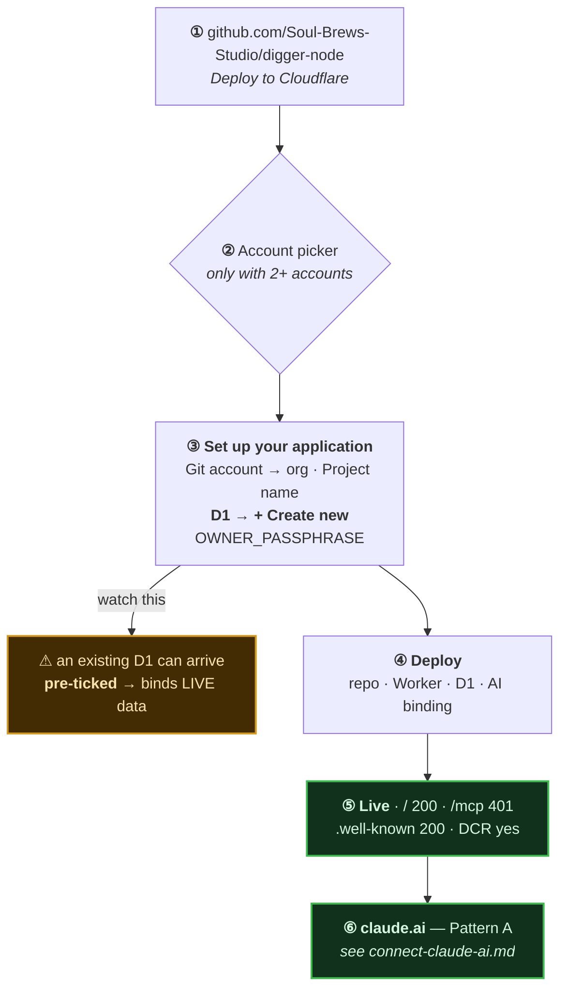

# digger-node — one-click install & claude.ai

[← Memory on claude.ai](../) · [Connector flow](../connect-claude-ai.html) · [arra-memory-lab](../one-click-install/) · [thor-memory](../thor-memory/)

The fleet's other **working** Deploy to Cloudflare button. Same OAuth shape as
`arra-memory-lab`, an entirely different tool vocabulary, and — unlike
`arra-memory-lab` — the button finishes on its own.

```
https://deploy.workers.cloudflare.com/?url=https://github.com/Soul-Brews-Studio/digger-node
```


---

## What it is, and what it is not

`digger-node` is **not** a memory server. It stores **nodes and taxonomy** —
Drupal-shaped content: a node, a vocabulary, terms, and the join between them, with
FTS5 trigram search and optional embeddings.

That is why its scopes read `nodes:read` / `nodes:write` rather than `memory:*`, and
why none of its 19 tools is called `remember`.

| | `arra-memory-lab` | `digger-node` |
|---|---|---|
| Domain | memories, chunks, observations | nodes, vocabularies, terms |
| Scopes | `memory:read` `memory:write` | `nodes:read` `nodes:write` |
| Tools | 9 | **19** |
| Storage | D1 + Workers AI | D1 + Workers AI |
| Refresh token | ✅ | ❌ |

### The 19 tools

| Group | Tools |
|---|---|
| Nodes | `node_create` · `node_get` · `node_update` · `node_delete` · `node_list` · `node_types` · `node_search` · `node_embed` · `node_tag` · `node_untag` |
| Taxonomy | `vocabulary_create` · `vocabulary_list` · `vocabulary_delete` · `term_create` · `term_list` · `term_weight` |
| Introspection | `call_log` · `call_stats` · `status` |

---

## Install



The form is the one documented in detail in the
[arra-memory-lab walkthrough](../one-click-install/) — the same Cloudflare
dialog, the same traps:

- **Project name** becomes the Worker name, the `*.workers.dev` hostname, **and a new
  GitHub repo in your org**. Pick one that is free.
- **D1 → + Create new.** The dropdown can arrive with an existing database ticked;
  deploying like that binds the new Worker to live data. Confirm the tick.

### Two secrets, two doors

`wrangler.jsonc` documents both in a comment:

```
wrangler secret put OWNER_PASSPHRASE   OAuth (claude.ai) + web login
wrangler secret put API_TOKEN          static bearer (curl, MCP clients)
```

Once `OWNER_PASSPHRASE` is set, the Worker locks:


> [!IMPORTANT]
> **With neither set, the Worker is open** — deliberately, so a one-click deploy
> lands in a usable state. Set `OWNER_PASSPHRASE` before you put anything real in it.
> `wrangler.jsonc` calls this *"the deliberate first-run state for a one-click
> deploy."*

---

## Verify

```bash
U=https://<your-worker>.workers.dev
curl -s -o /dev/null -w '%{http_code}\n' "$U/"                    # 200
curl -s -o /dev/null -w '%{http_code}\n' -X POST "$U/mcp"         # 401 once locked
curl -s "$U/.well-known/oauth-authorization-server" | jq -e .registration_endpoint
```

Live reference instance:

```
https://digger-node.laris.workers.dev
  /                                            200
  POST /mcp                                    401
  /.well-known/oauth-authorization-server      200   S256 · DCR · nodes:read nodes:write
  /.well-known/oauth-protected-resource        200
```

---

## Connect

Pattern A, identical to every memory server —
**[connect-claude-ai.md](../connect-claude-ai.html)**.

The passphrase at the consent page is **`OWNER_PASSPHRASE`**.

```bash
claude mcp add --transport http digger-node https://<your-worker>/mcp
claude mcp login digger-node

codex mcp add digger-node --url https://<your-worker>/mcp
```

> [!WARNING]
> **No `refresh_token`.** `grant_types_supported` is `["authorization_code"]` only, so
> claude.ai must repeat the full authorize flow whenever the access token expires.
> `arra-memory-lab` offers refresh; this does not. One grant type away.

---

## The button that copied this one

`nat-build-with-oracle/trace-node` was created 2026-09-07, three days after
`digger-node`, and carries **digger-node's deploy button verbatim** — its `?url=`
still names `Soul-Brews-Studio/digger-node`. Anyone following it installs a
content/taxonomy store when they wanted a trace store.

If you are here from `trace-node`, that is why.
