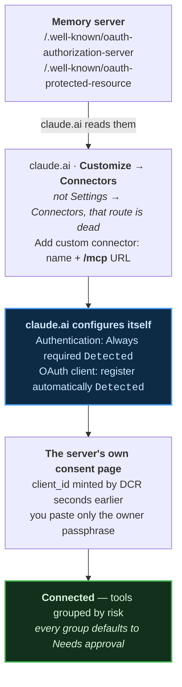

# Memory on claude.ai — every server, every install path

[ภาษาไทย](../th/tutorials/) · [← Home](../)

The fleet runs **six memory servers**. All six are live, all six speak MCP, and all
six connect to claude.ai the same way. They differ in three things that matter, and
one of them will wake you up at 3am.

Measured 2026-09-10 by probing every endpoint — not from memory.

---

## The six, side by side

| Server | Where it runs | One-click | Refresh | Scopes | Tools |
|---|---|---|---|---|---|
| **[arra-memory-lab](one-click-install/)** | ☁️ CF Worker · D1 + Workers AI | ✅ **works** | ✅ **yes** | `memory:read` `memory:write` | 9 |
| **arra-memory-lab-oneclick** | ☁️ CF Worker · fresh D1 | ✅ *(this walkthrough)* | ✅ **yes** | `memory:read` `memory:write` | 9 |
| **[thor-memory](thor-memory/)** | 🏠 HAOS add-on · libSQL + Turso | ❌ add-on store | ❌ no | `memory:read` `memory:write` | **19** |
| **arra-memory** *(memory-vm)* | 🖥 VM behind a tunnel | ❌ | ❌ no | `memory:read` `memory:write` | 19+ |
| **memory-lab-2sep** | ☁️ CF Worker · D1 | ❌ *(source missing)* | ❌ no | ⚠️ `memory:rw` | 9 |
| **[digger-node](digger-node/)** | ☁️ CF Worker · D1 + Workers AI | ✅ **works** | ❌ no | ⚠️ `nodes:read` `nodes:write` | **19** |

Every one: `/` → `200`, `POST /mcp` → `401`, both `.well-known` → `200`, **DCR yes.**
`401` on `/mcp` is the correct answer — it means auth is enforced.

---

## The three differences

### 1. Only the `arra-memory-lab` lineage can refresh a token

```
arra-memory-lab            grant_types: [authorization_code, refresh_token]  ✅
arra-memory-lab-oneclick   grant_types: [authorization_code, refresh_token]  ✅
thor-memory                grant_types: [authorization_code]
arra-memory (memory-vm)    grant_types: [authorization_code]
memory-lab-2sep            grant_types: [authorization_code]
digger-node                grant_types: [authorization_code]
```

> [!IMPORTANT]
> Without `refresh_token`, claude.ai must send you through the **entire authorize
> flow again** every time the access token expires. With it, the client refreshes
> silently and you never notice.
>
> This is the single highest-value fix on the list: four servers are one grant type
> plus refresh handling away from never asking you to log in again.

### 2. Scope names drifted three ways

| Server | Scopes |
|---|---|
| thor-memory · arra-memory · arra-memory-lab | `memory:read` `memory:write` |
| memory-lab-2sep | `memory:rw` |
| digger-node | `nodes:read` `nodes:write` |

A client written against one requests scopes another does not recognise.
`digger-node`'s is defensible — it stores *nodes and taxonomy*, not memories.
`memory-lab-2sep`'s `memory:rw` is the same domain spelled differently.

### 3. The tool surface splits 9 vs 19

`arra-memory-cloudflare-template` established **6 verbs**. `thor-memory` grew them to
**19**. The Cloudflare side never followed, so today:

| | |
|---|---|
| **9 tools** — the Worker line | `remember` · `recall` · `observe` · `forget` · `rebuild_index` · `trace_list` · `trace_get` · `lab_info` · `memory_stats` |
| **19 tools** — thor / arra-memory | the nine, plus `list_workspaces` · `list_agents` · `list_projects` · `list_tags` · `list_search_log` · `forget_search_log` · `digest` · `search_memories_between` · `list_tools` · `toggle_tool` · and the federation trio `list_fleet` · `send_to_oracle` · `oracle_replies` |

> [!NOTE]
> **Nothing blocks porting the 19 to Cloudflare.** thor-memory runs libSQL, and
> `arra-memory-cloudflare-template` already runs that same schema on Workers via
> Turso over HTTP. Unlike the LanceDB forks — whose native module rules Workers out
> entirely — this is mechanical. It just has not been done.

---

## How they connect

Every memory server here is **Pattern A**: it publishes OAuth metadata, claude.ai
reads it and configures itself.



Full walkthrough with screenshots: **[connect-claude-ai.md](connect-claude-ai.html)**.

> [!CAUTION]
> **Check the body, not the status code.** A server can answer `200` on
> `/.well-known/oauth-authorization-server` and return its SPA's HTML, because a
> catch-all route serves the app on every unmatched path. Status-only checks call
> that OAuth support. It is not.
>
> ```bash
> curl -s "$U/.well-known/oauth-authorization-server" | jq -e .registration_endpoint
> ```
> Exit 0 means real metadata. All six memory servers pass; at least one non-memory
> app in this fleet does not.

---

## Which one-click buttons actually work

Thirteen repos in the fleet carry a Deploy to Cloudflare button. **Six point at
themselves and are public. Seven are broken.**

| | Repos |
|---|---|
| ✅ correct | `arra-memory-lab` · `digger-node` · `arra-memory-cloudflare-template` · `arra-oracle-v3` · `webhook-relay-oss` · `argus` |
| ❌ **private target** — the clone step cannot run | `webhook-relay-v3` · `webhook-proxy` · `laris-co/webhook-relay` |
| ⚠️ **stale target** — deploys a different project | `trace-node`→`digger-node` · `claude-ai-mcp-poc`→`arra-memory-lab` · `higher-order-mcp-lab-oracle`→`higher-order-mcp` · `arthur-moltworker`→upstream |

A button is correct only when all three hold: `?url=` names **this** repo, that repo
is **public**, and the app can run on workerd.

```bash
tgt=$(git grep -h -oE 'deploy\.workers\.cloudflare\.com/\?url=[^ )"]+' HEAD -- README.md \
      | head -1 | sed 's|.*url=https://github.com/||')
[ "$tgt" = "$OWNER/$REPO" ] && gh repo view "$tgt" --json visibility -q .visibility
```

---

## Walkthroughs

| | |
|---|---|
| **[arra-memory-lab — the full worked example](one-click-install/)** | 19 screenshots, GitHub → Cloudflare → claude.ai, including the **three** reasons its own deploy script cannot finish and the two commands that get past them |
| **[digger-node](digger-node/)** | The other working one-click. Same OAuth shape, a completely different 19-tool vocabulary |
| **[thor-memory](thor-memory/)** | The 19-tool original. No one-click — it installs as a Home Assistant add-on |
| **[connect-claude-ai](connect-claude-ai.html)** | The connector flow itself, shared by all six |
| **[lanceglass](lanceglass/)** | **Not an MCP server** — a local-first LanceDB over your own session JSONL. Its live demo is UI only, because `@lancedb/lancedb` is a native binding workerd cannot load. Read it for the constraint that shaped every storage choice above |

---

## Gaps

> [!NOTE]
> - **Four of six cannot refresh a token.** One grant type away.
> - **Scope names drifted three ways** with no written mapping.
> - **The 19-tool surface has never been ported to Cloudflare**, though the storage
>   layer already has a Workers-native form.
> - **`memory-lab-2sep` has no source.** The Worker is live and serving MCP; its repo
>   holds a README and a `.gitignore`, and no repo in the fleet declares a Worker of
>   that name. It cannot currently be redeployed or fixed.
> - **Nothing verifies a deploy button.** Seven of thirteen are broken and all seven
>   render correctly.

<script src="https://cdn.jsdelivr.net/npm/mermaid@10/dist/mermaid.min.js"></script>
<script>
document.addEventListener("DOMContentLoaded", function () {
  document.querySelectorAll("pre > code.language-mermaid").forEach(function (code) {
    var div = document.createElement("div");
    div.className = "mermaid";
    div.textContent = code.textContent;
    code.parentElement.replaceWith(div);
  });
  mermaid.initialize({ startOnLoad: true, theme: "neutral" });
});
</script>

