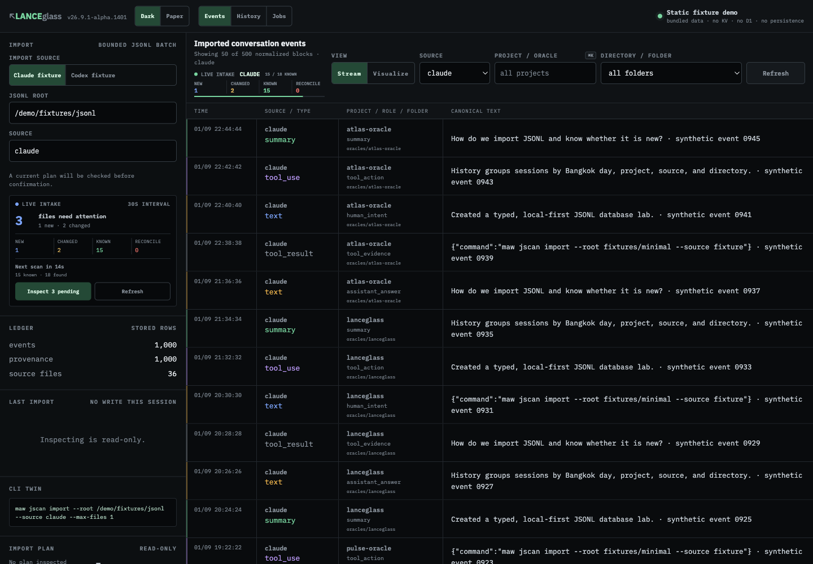
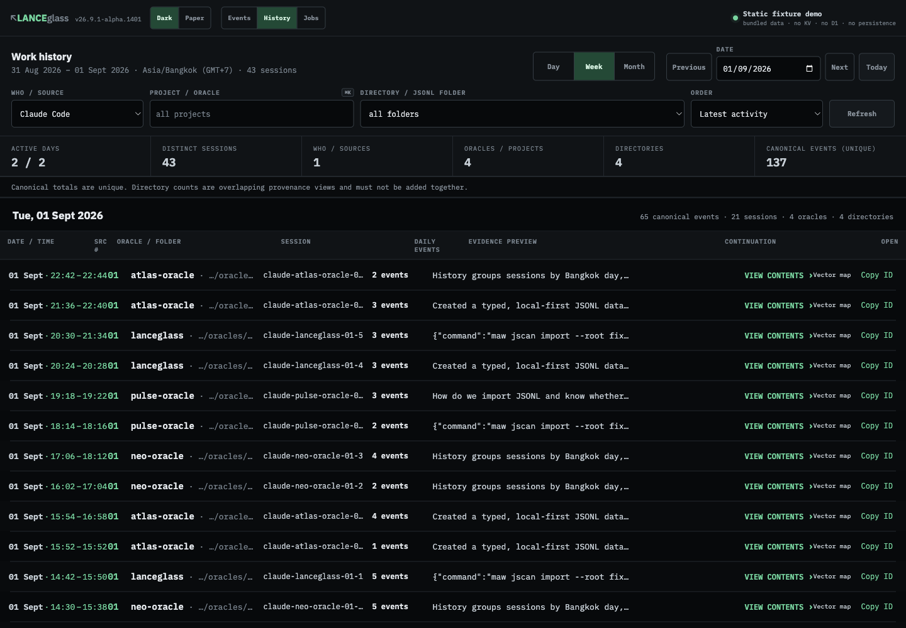
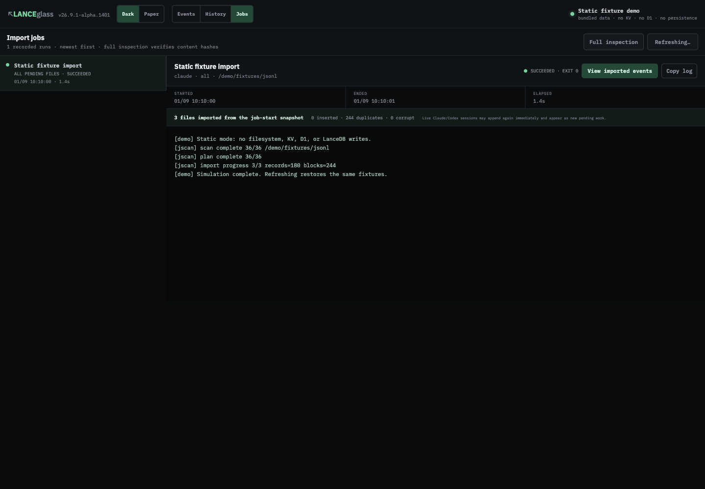
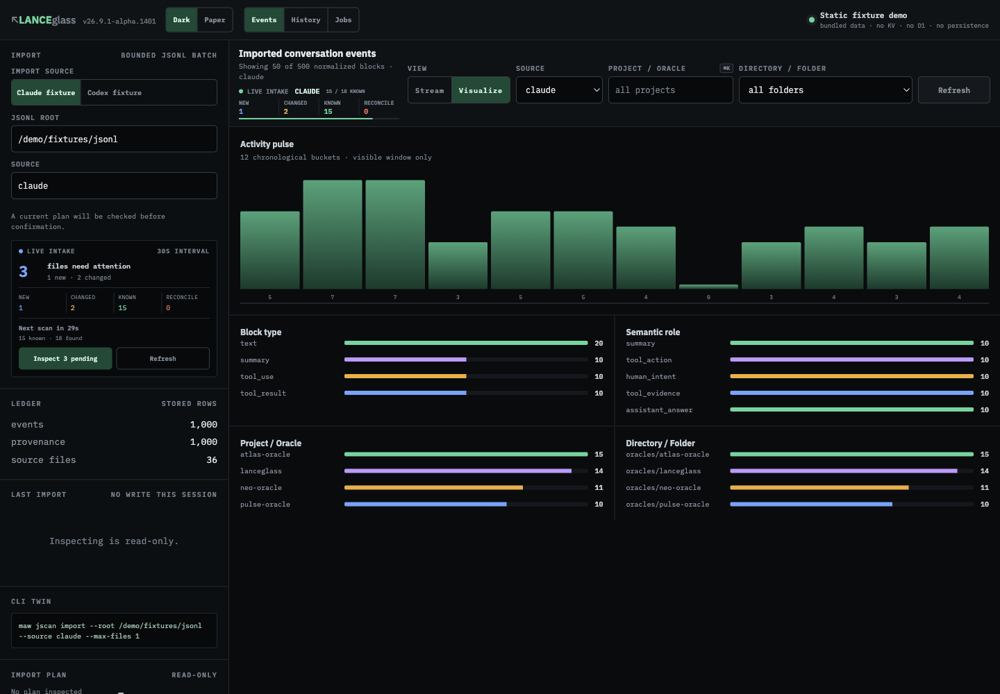
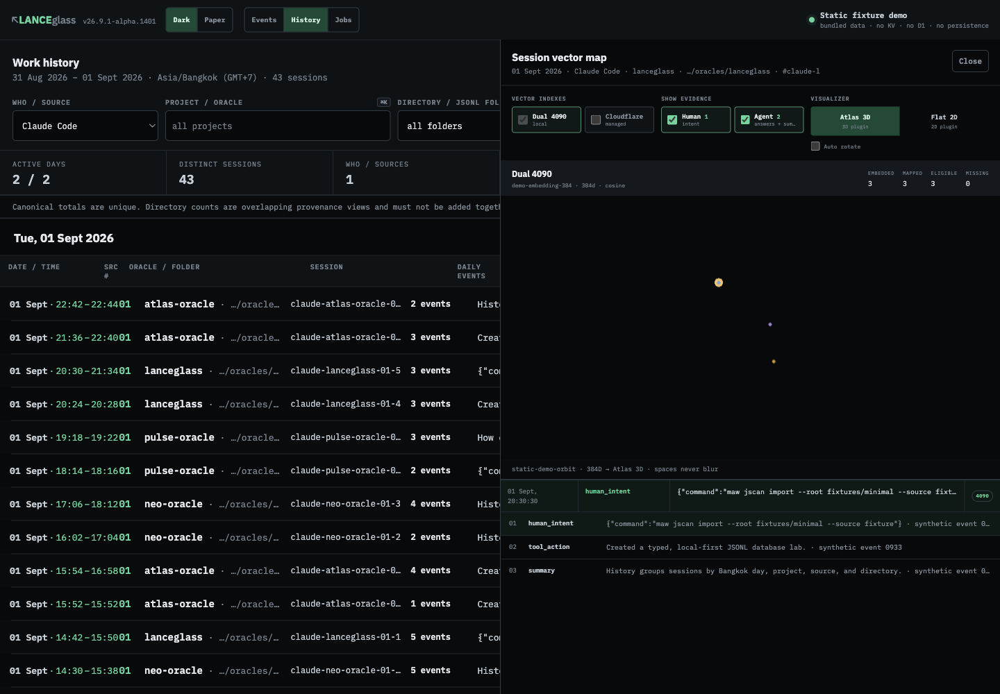
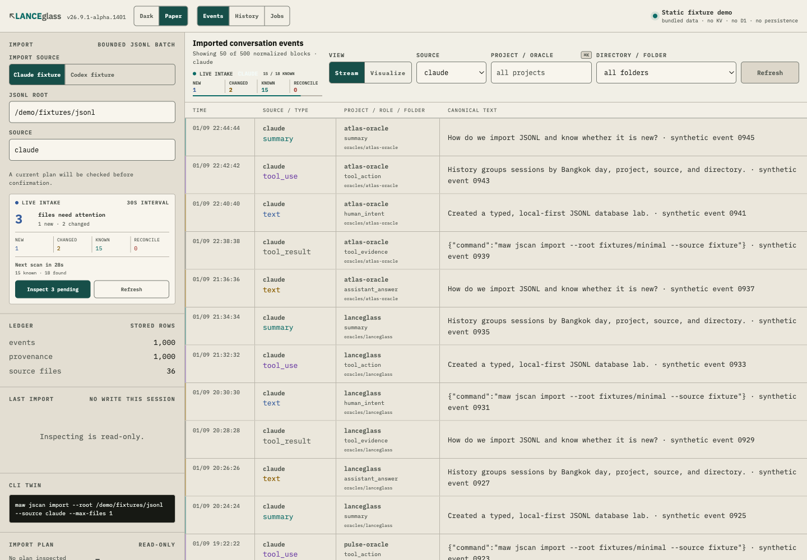

# lanceglass — the demo you can open, and the database you have to run

[ภาษาไทย](../../th/tutorials/lanceglass/) · [← Memory on claude.ai](../) · [arra-memory-lab](../one-click-install/) · [digger-node](../digger-node/) · [thor-memory](../thor-memory/)

Every other tutorial here ends with a **Deploy to Cloudflare** button and a server you
can talk to. This one does not, and the reason is the most useful thing on the page.

**Live demo:** <https://lanceglass-fixture-demo.laris.workers.dev/>
**Source:** <https://github.com/Soul-Brews-Studio/lanceglass> — public, MIT

```
Captured 2026-09-11 against the live deployment · build v26.9.1-alpha.1401
```

---

## What it is

`lanceglass` turns append-only agent session logs — Claude Code and Codex `.jsonl` —
into a typed, inspectable **LanceDB**. It detects new and changed files, imports
idempotently, keeps provenance, reconstructs work history, and can build optional
embedding spaces afterwards.

It runs on your machine, under Bun. The link above is a **demo of its interface**, not
an instance of the tool.

---

## Step 1 — open the demo



Three workspaces across the top — **Events**, **History**, **Jobs** — and two themes.
Down the left: the import source, a live-intake counter, and a ledger reading
`events 1,000 · provenance 1,000 · source files 36`.

Read the top right before anything else:

```
Static fixture demo
bundled data · no KV · no D1 · no persistence
```

And read one row's text to the end:

```
How do we import JSONL and know whether it is new?  ·  synthetic event 0945
```

**Every row is labelled synthetic, and the app tells you there is no database.** That is
unusually honest for a demo, and it is worth taking literally — see
[Step 5](#step-5--what-you-are-actually-looking-at).

---

## Step 2 — History: sessions, not rows



`Day / Week / Month` over `Asia/Bangkok`, grouped by day, then project, then source and
directory. Each row is a session with its event count and a preview of its first block.

One line under the totals is the part worth stealing:

> *Canonical totals are unique. Directory counts are overlapping provenance views and
> must not be added together.*

A UI that tells you which of its own numbers you are allowed to sum.

---

## Step 3 — Jobs: the import log, stated plainly



```
[demo] Static mode: no filesystem, KV, D1, or LanceDB writes.
[jscan] scan complete   36/36  /demo/fixtures/jsonl
[jscan] plan complete   36/36
[jscan] import progress 3/3  records=180  blocks=244
[demo] Simulation complete. Refreshing restores the same fixtures.
```

`0 inserted · 244 duplicates · 0 corrupt` — the demo replays the shape of an idempotent
re-import, where everything is already known. On a real corpus that is the normal
outcome of running import twice.

---

## Step 4 — the two visualisations

**Facets**, in Events → Visualize:



**The session vector map**, from any History row's `Vector map`:



Worth noticing in that panel:

| | |
|---|---|
| `demo-embedding-384 · 384d · cosine` | the space is named and dimensioned on screen |
| `Dual 4090 (local)` / `Cloudflare (managed)` | provider is a **choice**, and indexes are separate |
| *"spaces never blur"* | one provider per space — never mix dimensions |
| `Atlas 3D` / `Flat 2D` | the visualiser is a plugin, not a hardcoded view |
| `EMBEDDED 3 · MAPPED 3 · ELIGIBLE 3 · MISSING 0` | coverage is reported, not assumed |

> **Expect three dots.** Demo sessions hold 3–5 events, so the map is nearly empty. The
> point it makes is structural — the space, its provider and its coverage are all
> labelled — not visual.

And the **Paper** theme, if you prefer ink on cream:



---

## Step 5 — what you are actually looking at

The demo is a Cloudflare Worker. Its data comes from this, in `worker/index.ts`:

```ts
const events: DemoEvent[] = Array.from({ length: 1000 }, (_, index) => {
  const source  = SOURCES[index % SOURCES.length]!;
  const project = PROJECTS[Math.floor(index / 11) % PROJECTS.length]!;
  …
});
```

One thousand rows from modular arithmetic over four hardcoded project names. It does not
open a database, and it does not even read the `fixtures/minimal/` files in the repo —
"bundled" is the one word on the badge that overstates things.

**This is not a shortcut. It is a constraint.**

`@lancedb/lancedb` is a native Rust/N-API binding. **workerd cannot load native
modules**, so no amount of effort would put LanceDB behind that URL. A Cloudflare deploy
of lanceglass can only ever be a replay of its interface.

That is exactly why the other tools in this series look different:

| Tool | Storage | Runs on Cloudflare? |
|---|---|---|
| [`arra-memory-lab`](../one-click-install/) | D1 | yes — one-click |
| [`digger-node`](../digger-node/) | D1 + FTS5 | yes — one-click |
| [`thor-memory`](../thor-memory/) | LanceDB on a host | no — the add-on runs it |
| **`lanceglass`** | **LanceDB, local** | **interface only** |

Same fleet, same week, opposite constraint. If you want a memory server behind a URL,
start with one of the first two. If you want to see what a **typed, provenance-keeping,
embed-later** session database looks like, this is the one to read.

---

## Step 6 — run the real thing

The demo has no install button because the tool is local-first. It needs **Bun 1.3+**.

```bash
git clone https://github.com/Soul-Brews-Studio/lanceglass
cd lanceglass
bun install --frozen-lockfile

# prove the whole path before touching your own history —
# the repo ships fixtures for exactly this
bun run smoke                     # 9 stages, 163 tests

# dry run: what WOULD be imported, no writes
bun run cli -- plan   --source claude

# import for real
bun run cli -- import --source claude

# the UI you just clicked through, over your own data
bun run ui                        # http://127.0.0.1:4320
```

A recorded first run on a second machine, for reference:

```
bun install --frozen-lockfile     81 packages, 7.6s
bun run smoke                     SMOKE PASS · 163/163 · all 9 stages
plan   --source claude            103 found / 103 new / 0 changed / 0 shrunk
import --source claude            13,006 records → 6,145 events · 0 corrupt · 0 duplicates
import (re-run)                   102 unchanged · 85 duplicates rejected · 1 inserted
ui                                127.0.0.1:4320 · 6,146 events · 103 files
```

That `1 inserted` on the second run is the best idempotency proof the tool can offer:
the only file that had changed was **the session's own transcript**, still being written
to. It re-parsed, recognised 85 known blocks, and took only the new one.

---

## The one design rule to take away

From the project's own README:

> **Embed later.** Plain rows and vector indexes live in separate LanceDB stores.

It is not a guideline here — it is two classes. `src/database.plain.ts` connects when you
open it; `src/database.vector.ts` *declines to connect at all* when its directory is
absent. Import therefore **cannot** reach an embedding service, even by accident.

Why that matters: embedding is slow, costly, and fails in ways ingestion does not. Couple
them and one provider outage stops you recording anything. Keep them apart and import
stays a cheap, idempotent, offline operation — and vectors become a thing you add later,
to a copy, with a provider you name on screen.

If you want the long version, the repo carries an eight-part course in
[`lessons/`](https://github.com/Soul-Brews-Studio/lanceglass/tree/main/lessons), from
`01-choose-db` to `08-optional-embeddings`.

---

## Reference

| | |
|---|---|
| Repo | <https://github.com/Soul-Brews-Studio/lanceglass> · MIT |
| Demo | <https://lanceglass-fixture-demo.laris.workers.dev/> |
| Build shown | `v26.9.1-alpha.1401` |
| Runtime | Bun 1.3+ · `@lancedb/lancedb` 0.27.2 · `apache-arrow` 18.1.0 |
| UI | React 19 · Vite · `three` 0.185 for the 3D map |
| Course | `lessons/01-choose-db` … `08-optional-embeddings` |
| UI state gallery | [`docs/ui-state-gallery.md`](https://github.com/Soul-Brews-Studio/lanceglass/blob/main/docs/ui-state-gallery.html) — 19 more screenshots |

---

🤖 ตอบโดย digger จาก Nat → digger-oracle

<script src="{{ '/assets/lightbox.js' | relative_url }}"></script>
