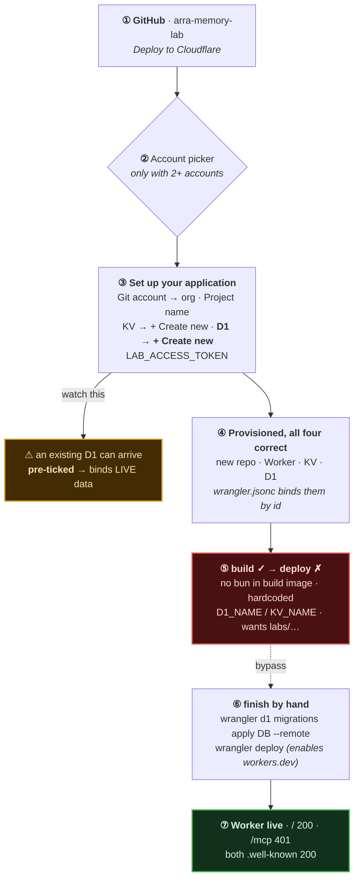
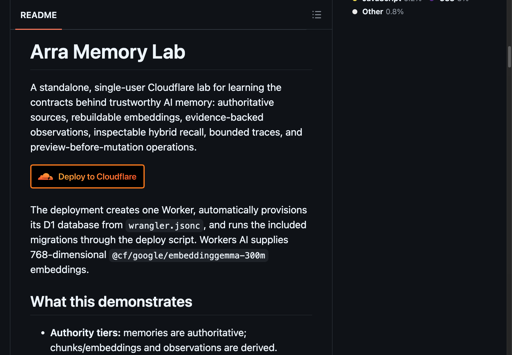
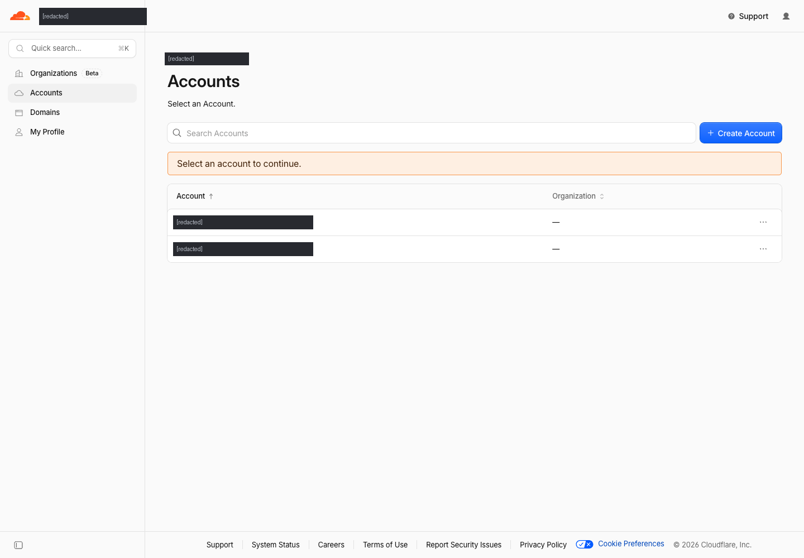
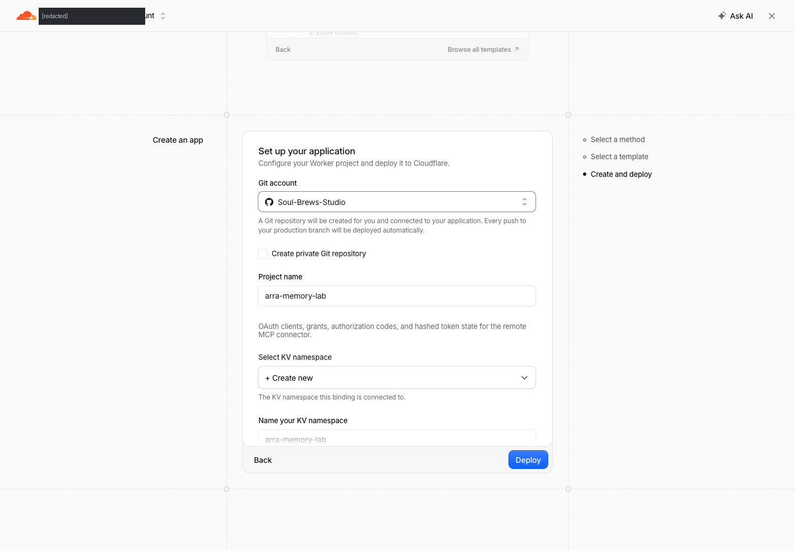
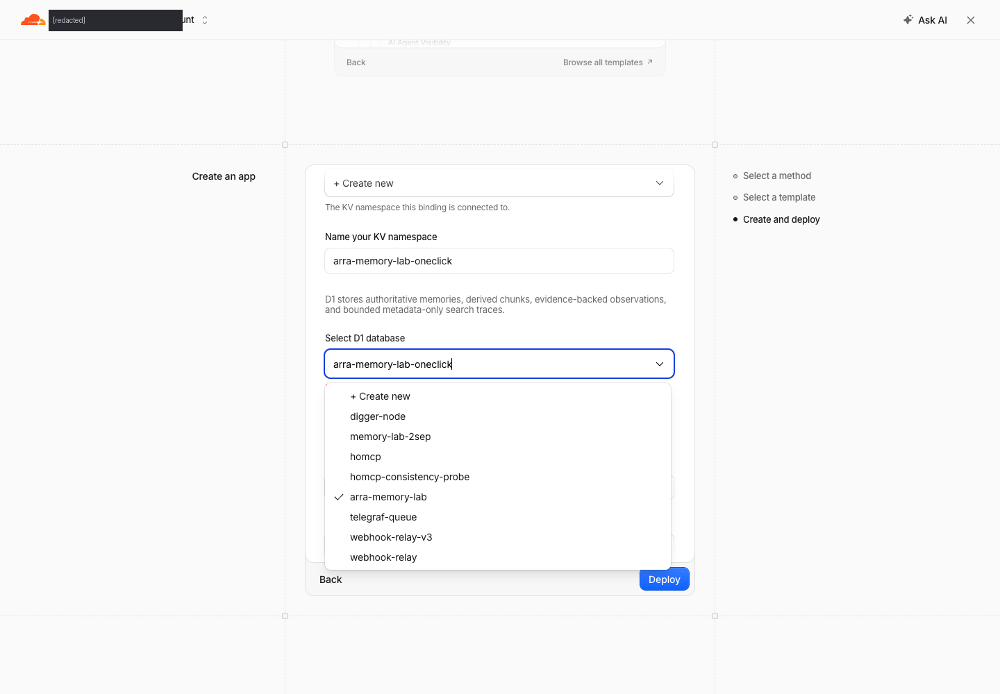
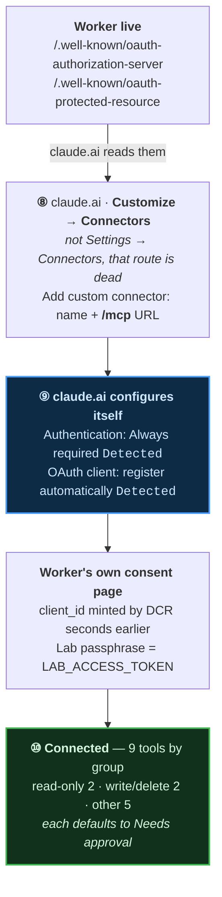
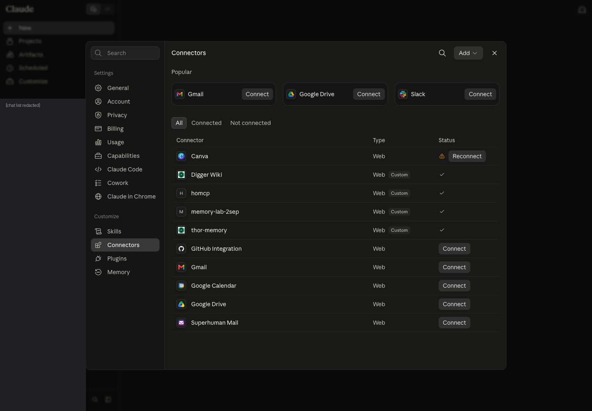
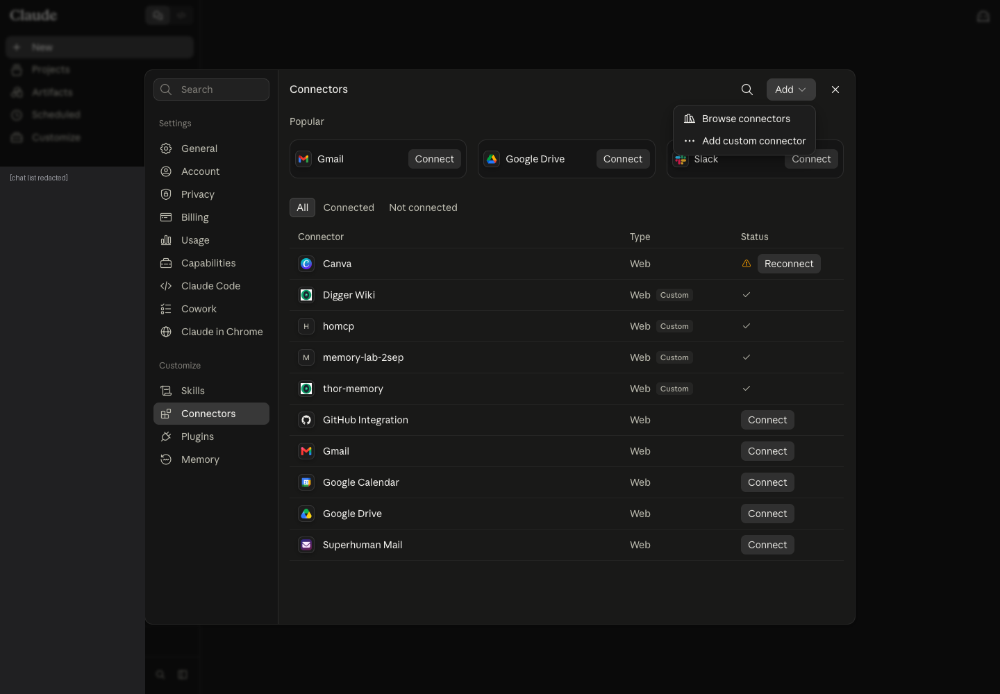
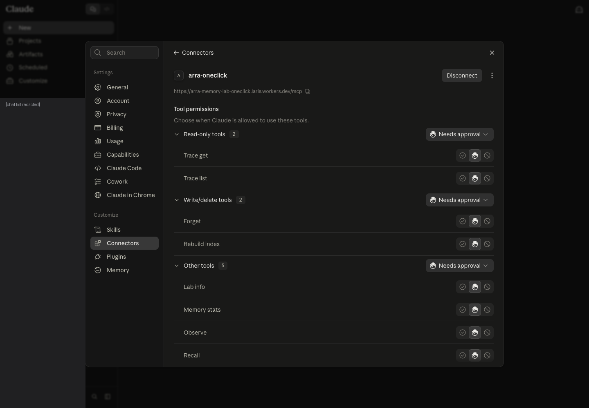

# One-click install — GitHub → Cloudflare → claude.ai

[ภาษาไทย](../../th/tutorials/one-click-install/) · [← Memory on claude.ai](../) · [Connector flow](../connect-claude-ai.html) · [digger-node](../digger-node/) · [thor-memory](../thor-memory/)

A walkthrough of deploying **arra-memory-lab** with the Deploy to Cloudflare button,
captured step by step on 2026-09-10 against a real account.

It goes all the way to a working claude.ai connector. It is written from an install
that **partly failed** on the way, and the failure is documented rather than hidden — the button provisions everything correctly and then the deploy
step dies for a reason you cannot guess from the README. [Jump to it](#step-8--the-deploy-fails-and-why).

---

## What the button actually creates

One click provisions **four** things, not one:

| Resource | Name in this walkthrough |
|---|---|
| A new **GitHub repo** (a copy of the source, in your org) | `Soul-Brews-Studio/arra-memory-lab-oneclick` |
| A **Worker** | `arra-memory-lab-oneclick` |
| A **KV namespace** — OAuth clients, grants, codes, hashed tokens | `arra-memory-lab-oneclick` |
| A **D1 database** — memories, chunks, observations, search traces | `arra-memory-lab-oneclick` |

Plus a Workers AI binding for 768-dimensional embeddings.

> [!IMPORTANT]
> The deploy **creates a new repository in your GitHub org**. It does not deploy the
> repo you are reading from. If a repo of that name already exists, pick a different
> project name — that is why everything here is suffixed `-oneclick`.

## The install at a glance

Red is where a plain click-through stops. The dashed line is the detour past it.
Amber is the branch that does not fail — it just quietly wires you to the wrong data.



---

## Step 1 — Start at the repo

Open <https://github.com/Soul-Brews-Studio/arra-memory-lab>.


Scroll to the **Deploy** section. The button's link is worth reading before you click
it — it should name *this* repo:

```
https://deploy.workers.cloudflare.com/?url=https://github.com/Soul-Brews-Studio/arra-memory-lab
```



> [!TIP]
> Check that `?url=` matches the repo you are on. Deploy buttons are copy-pasted
> between projects more than any other line in a README, and a stale one silently
> deploys someone else's application. Several in this fleet do exactly that.

---

## Step 2 — Pick the Cloudflare account

If your login has more than one account, Cloudflare asks first. The deploy does not
continue until you choose.



Pick the account that will own the Worker, the D1 database and the bill.

---

## Step 3 — The setup form

You land on **Create an app → Create and deploy**.


The form asks for, in order:

1. **Git account** — where the new repo will be created
2. **Project name** — also the Worker's name and its `*.workers.dev` hostname
3. **KV namespace** — for OAuth state
4. **D1 database** — for the memories
5. **`LAB_ACCESS_TOKEN`** — the owner secret
6. **`SEMANTIC_MAX_DISTANCE`** — vector search cutoff, default `0.7`

---

## Step 4 — Connect the Git account

Open the **Git account** dropdown. If you have connected GitHub before, your orgs
are listed; otherwise use **+ New GitHub connection** and authorize Cloudflare.


Choose the org the new repo should live in.



---

## Step 5 — Name the project

Set **Project name**. It becomes:

- the Worker name,
- the `*.workers.dev` hostname,
- **and the new GitHub repo's name.**

This walkthrough uses `arra-memory-lab-oneclick`, because `arra-memory-lab` already
existed in the org and in the account's D1 list.

---

## Step 6 — Create a **fresh** D1 database

This is the step most likely to go wrong quietly.

Open **Select D1 database**. The dropdown lists databases that already exist on the
account — and **one of them may already be ticked**:



In the capture above, `arra-memory-lab` is checked. Deploying like that would have
bound the new Worker to the **existing** database and written into live data.

Scroll to the top of the list and pick **+ Create new**:


A **Name your D1 database** field then appears. Give it a name that does not already
exist — the list you just closed is the list to check against.

> [!WARNING]
> "+ Create new" is one option among many in a searchable dropdown, and an existing
> database can be pre-selected. Confirm the tick is on **+ Create new** before you
> deploy. The same applies to the KV namespace above it.

---

## Step 7 — Set the owner token, then deploy

`LAB_ACCESS_TOKEN` ships as the literal placeholder `replace-with-a-long-random-token`.
Replace it. Generate 32 random bytes:

```bash
openssl rand -hex 32
```

The field is a password input, so it renders as dots — safe to screenshot, and safe
to leave on screen. **Store the value somewhere you can find it**: the browser API
takes it as a bearer token, and the MCP OAuth approval page accepts it as the owner
passphrase. It is not recoverable from the dashboard afterwards.

The completed form:


Click **Deploy**.

---

## Step 8 — The deploy fails, and why

Everything provisions. The build succeeds. The **deploy step fails**.


Three symptoms on that page:

- a red **Latest build failed**
- **No URLs enabled** — `workers.dev` is *Disabled*, so the hostname 404s
- **Bindings 0**


The build log shows the build itself was fine:

```
Detected the following tools from environment: npm@10.9.2, nodejs@24.18.0
added 264 packages in 9s
Executing user build command: npm run build
  > vite build
  ✓ 498 modules transformed.
  ✓ built in 357ms
```

Then `npm run deploy` runs, and there are **three independent reasons it cannot
succeed** on the repo the button creates. All three were verified by running them.

**1. `deploy` gates on a test runner Cloudflare does not have.**

```json
"deploy": "npm run check && node scripts/deploy.mjs",
"check":  "… && bun test src/*.test.ts && …"
```

The build log's own line is `Detected the following tools from environment:
npm@10.9.2, nodejs@24.18.0`. **No `bun`.** So `check` fails before `deploy.mjs` is
ever called.

**2. `scripts/deploy.mjs` hardcodes the original project's names.**

```js
const D1_NAME      = "arra-memory-lab";
const KV_NAME      = "arra-memory-lab-oauth";
const BUILT_CONFIG = join("dist", "arra_memory_lab", "wrangler.json");
```

and then asserts on them — `Built config Worker name must be arra-memory-lab`, a D1
named exactly `arra-memory-lab`, a KV named exactly `arra-memory-lab-oauth`. The
one-click form invites you to choose a project name and create new resources, so
**any name you pick fails these assertions**, and the built config actually lands in
`dist/arra_memory_lab_oneclick/`, not the path it looks in.

**3. It refuses to run outside the author's monorepo.** Running it directly, with
`bun` present and everything built, gives:

```
$ node scripts/deploy.mjs
[release] Run this command from the labs/arra-memory-lab directory
```

`deploy.mjs` is written for a `labs/arra-memory-lab` subdirectory in the source
monorepo — not for the standalone repo the Deploy button generates.

> [!CAUTION]
> **The Deploy to Cloudflare button on this repo cannot complete.** Not because of
> the app, but because the deploy script it invokes was never adapted to the
> standalone layout the button produces. Fixing `bun` alone is not enough.

The **provisioning is fine** — that is the good news. `wrangler.jsonc` in the
generated repo is correct, with the fresh database bound by id:

```jsonc
"d1_databases": [
  { "binding": "DB",
    "database_name": "arra-memory-lab-oneclick",
    "database_id": "604836b0-…",
    "migrations_dir": "migrations" }
],
"kv_namespaces": [ { "binding": "OAUTH_KV", "id": "acf4bd3a…" } ],
"ai": { "binding": "AI" }
```

So you can finish the install yourself in two commands.

### Finish it with wrangler

Clone the repo the button created, then:

```bash
export CLOUDFLARE_ACCOUNT_ID=<your account id>
npm ci && npm run build

# 1. migrate the FRESH database
npx wrangler d1 migrations apply DB --remote

# 2. deploy, bypassing the broken deploy script
npx wrangler deploy
```

Real output:

```
🚣 Executed 7 commands in 2.59ms
┌───────────────────────────────────┬────────┐
│ 0001_init.sql                     │ ✅     │
│ 0002_memory_provenance.sql        │ ✅     │
│ 0003_trace_links_supersession.sql │ ✅     │
└───────────────────────────────────┴────────┘

Uploaded arra-memory-lab-oneclick (6.72 sec)
Deployed arra-memory-lab-oneclick triggers (1.58 sec)
  https://arra-memory-lab-oneclick.laris.workers.dev
```

`wrangler deploy` enables `workers.dev` by default, which also clears the 404 —
the dashboard leaves it **Disabled** on a fresh Worker.

> [!NOTE]
> The `LAB_ACCESS_TOKEN` you set in the deploy form is stored as a **Worker secret**
> and survives this redeploy. Confirm with
> `npx wrangler secret list --name <worker>`.

---

## Step 9 — Verify before wiring anything to it

```bash
U=https://<project-name>.<subdomain>.workers.dev
curl -s -o /dev/null -w '%{http_code}\n' "$U/"
curl -s -o /dev/null -w '%{http_code}\n' "$U/mcp"
curl -s "$U/.well-known/oauth-authorization-server" | jq
```

Measured against the finished deploy:

| Path | Result |
|---|---|
| `GET /` | **200** |
| `GET /mcp` | **401** |
| `POST /mcp` (no token) | **401** |
| `GET /.well-known/oauth-authorization-server` | **200** |
| `GET /.well-known/oauth-protected-resource` | **200** |

`401` on `/mcp` is the **correct** answer, not a failure — it means auth is enforced.
`404` everywhere means the deploy did not land or `workers.dev` is still disabled.

The authorization-server document, fetched live, is exactly what claude.ai needs:

```json
{
  "issuer":                           "https://<worker>/",
  "authorization_endpoint":           "https://<worker>/authorize",
  "token_endpoint":                   "https://<worker>/oauth/token",
  "registration_endpoint":            "https://<worker>/oauth/register",
  "code_challenge_methods_supported": ["S256"],
  "grant_types_supported":            ["authorization_code", "refresh_token"],
  "scopes_supported":                 ["memory:read", "memory:write"]
}
```

Three things to check in that document:

- **`S256`** — PKCE, required by claude.ai
- **`registration_endpoint`** — Dynamic Client Registration, so no client id or
  secret is ever pasted by hand
- **`refresh_token`** — without it a client must send the user through the whole
  authorize flow again every time the token expires

---

## Step 10 — Connect it to claude.ai

Nothing is pasted by hand here except the passphrase. The Worker's two `.well-known`
documents do the configuring:



> [!NOTE]
> **Connectors have moved.** `claude.ai/settings/connectors` now just says *"Connectors
> have moved to Customize"*. The live location is **Customize → Connectors**
> (`claude.ai/new#settings/customize-connectors`).

Open **Customize → Connectors**. Existing custom connectors are listed with type
`Web` and a `Custom` badge:



Use **Add** (top right) → **Add custom connector**:



Fill in two fields — a display name and the MCP endpoint:


> [!TIP]
> The URL must be the **`/mcp`** path, not the Worker root. The dialog's own hint says
> *"The HTTPS address where the server accepts MCP requests, for example
> `https://mcp.example.com/mcp`."*

Press **Continue**, and this is where the work from Step 9 pays off:


claude.ai has already fetched your Worker's `.well-known` documents and **detected
both settings for you** — note the two `Detected` badges:

| Setting | Chosen automatically | Because |
|---|---|---|
| **Authentication: Always required** | `Detected` | the protected-resource document says auth is required |
| **OAuth client: No client ID — register one automatically** | `Detected` | the AS metadata advertises a `registration_endpoint` (DCR) |

That is the whole point of Dynamic Client Registration: *"Claude registers OAuth
clients with the server as users connect."* **You never paste a client ID or secret.**
If your server lacked DCR you would have to pick "Use your own OAuth client" and
register by hand.

Press **Add**. The connector is created but not yet authorized:


Press **Connect**. Your own Worker serves the consent page — note the client id in
the URL was minted by DCR seconds earlier:


Enter the **`LAB_ACCESS_TOKEN`** from Step 7 in **Lab passphrase** and press
**Authorize MCP client**. The page states the security model plainly:

> *"The browser passphrase is exchanged locally with this Worker; the MCP client
> receives a revocable OAuth token, not the passphrase."*

You are redirected back, and the connector is live — the button now reads
**Disconnect**, and claude.ai has enumerated the tools and grouped them by risk:



| Group | Count | Tools |
|---|---|---|
| Read-only | 2 | `Trace get`, `Trace list` |
| Write/delete | 2 | `Forget`, `Rebuild index` |
| Other | 5 | `Lab info`, `Memory stats`, `Observe`, `Recall`, `Remember` |

Each group defaults to **Needs approval**, and each tool can be set individually to
always-allow, ask, or never. Leave the write/delete group on approval unless you have
a reason not to.

### Connecting the CLIs

The two CLIs take **different flags** — this trips people up:

```bash
# Claude Code — uses --transport
claude mcp add --transport http arra-oneclick https://<your-worker>/mcp
claude mcp login arra-oneclick

# Codex — uses --url, NOT --transport
codex mcp add arra-oneclick --url https://<your-worker>/mcp
codex mcp login arra-oneclick
```

After `add` but before `login`, both report the server as registered and unauthorized —
which is what you should see:

```
claude:  arra-oneclick: https://…/mcp (HTTP) - ! Needs authentication
codex:   arra-oneclick  https://…/mcp   enabled   Not logged in
```

> [!WARNING]
> `codex mcp login` **opens a page in your real default browser** and blocks waiting
> on a `http://127.0.0.1:<port>/callback/...` redirect. If you do not complete the
> form promptly it gives up with `Caused by: deadline has elapsed`. Have the
> passphrase on your clipboard before you start.

The consent page is served by your own Worker and says **Connect Codex** (or
**Connect Claude**), listing the redirect URI and the requested scopes
`memory:read` and `memory:write`, with a single **Lab passphrase** field and an
**Authorize MCP client** button. Its own wording explains the split:

> *"The browser passphrase is exchanged locally with this Worker; the MCP client
> receives a revocable OAuth token, not the passphrase."*

So the passphrase is the `LAB_ACCESS_TOKEN` from Step 7, it never leaves your
browser, and what the client stores is a token you can revoke independently.

The repo also ships `npm run mcp:connect` (`scripts/connect-mcp.sh`) which wraps
this.

---

## Checklist

- [ ] Deploy button's `?url=` names this repo
- [ ] Correct Cloudflare account chosen
- [ ] Git account connected, project name free in that org
- [ ] **D1 set to “+ Create new”**, not a pre-selected existing database
- [ ] KV set to “+ Create new”
- [ ] `LAB_ACCESS_TOKEN` replaced and stored
- [ ] Deploy finished via `npx wrangler deploy` (the button's own deploy script cannot work — Step 8)
- [ ] `workers.dev` enabled (`wrangler deploy` does this; the dashboard does not)
- [ ] D1 migrations applied with `wrangler d1 migrations apply DB --remote`
- [ ] `/mcp` returns `401`, not `404`
- [ ] Both `.well-known` documents return `200`
- [ ] claude.ai shows **Authentication: Always required** and **register one automatically**, both `Detected`
- [ ] Connector shows **Disconnect** and lists its tools by permission group

---

*Captured with `/browser-tutorial` on 2026-09-10. Screenshots are of a real deploy;
the token field is a password input and was masked at capture time.*

<script src="https://cdn.jsdelivr.net/npm/mermaid@10/dist/mermaid.min.js"></script>
<script>
document.addEventListener("DOMContentLoaded", function () {
  document.querySelectorAll("pre > code.language-mermaid").forEach(function (code) {
    var div = document.createElement("div");
    div.className = "mermaid";
    div.textContent = code.textContent;
    code.parentElement.replaceWith(div);
  });
  mermaid.initialize({ startOnLoad: true, theme: "neutral" });
});
</script>


<script src="{{ '/assets/lightbox.js' | relative_url }}"></script>
