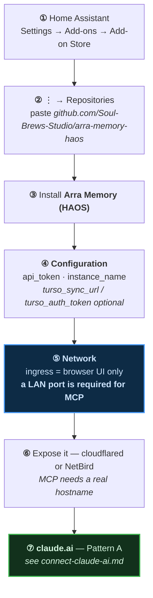
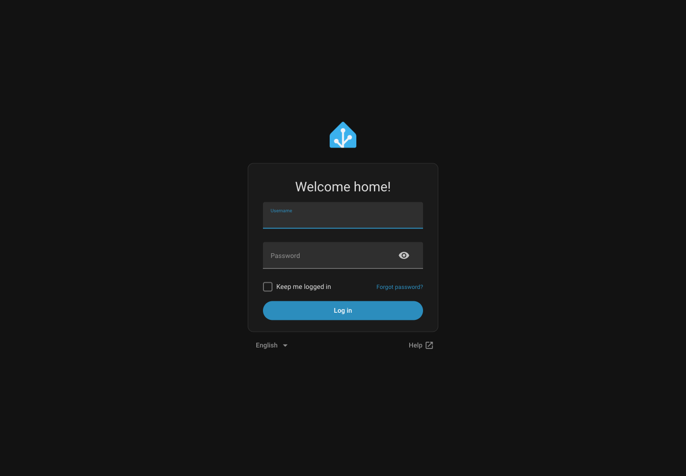
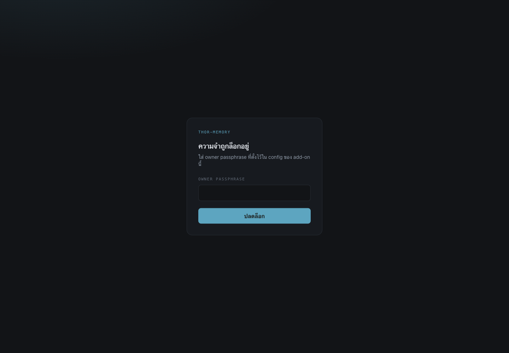
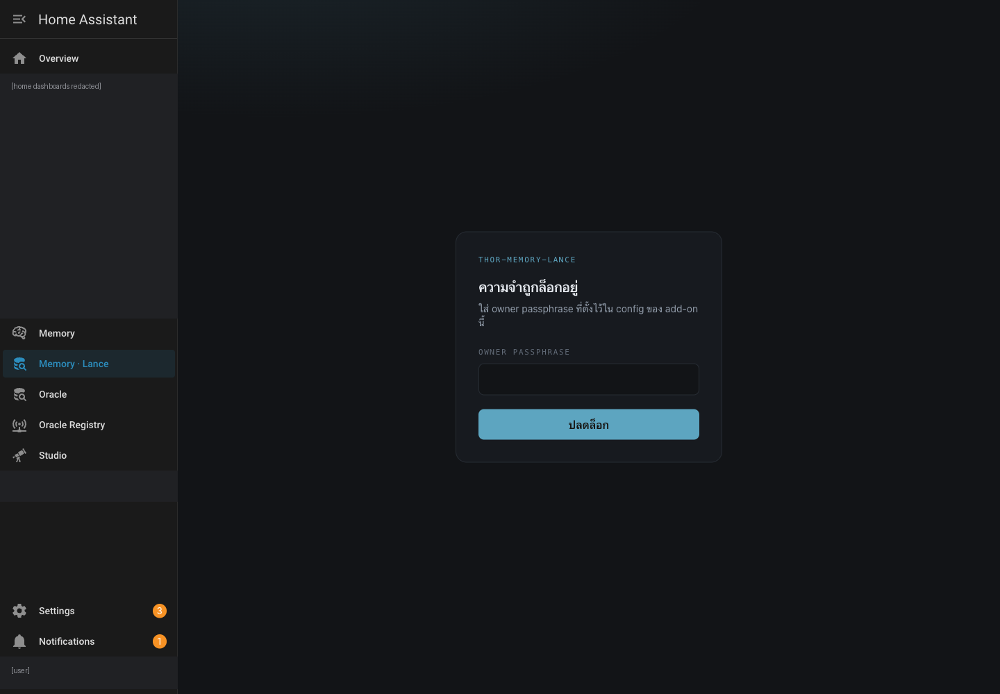

# thor-memory — Home Assistant add-on & claude.ai

[ภาษาไทย](../../th/tutorials/thor-memory/) · [← Memory on claude.ai](../) · [Connector flow](../connect-claude-ai.html) · [arra-memory-lab](../one-click-install/) · [digger-node](../digger-node/)

The **19-tool original**. Everything the Cloudflare memory servers do, plus ten more
tools they never got — and no Deploy button, because it is not a Worker.

`thor-memory` is not a repo. It is **`Soul-Brews-Studio/arra-memory-haos`** running
under an `instance_name`. The same add-on installed twice with different names gives
you `thor-memory` and `arra-memory`.

---

## Why there is no one-click

| | |
|---|---|
| Runtime | **Bun + s6-overlay** in a container, not workerd |
| Packaging | Home Assistant **add-on**, `slug: arra_memory`, version `0.27.1` |
| Storage | embedded **libSQL** file at `/data/`, optional Turso replica |
| Install | add a **repository URL** to the Supervisor's add-on store |

A Cloudflare deploy button clones a repo into a Worker. This is a container with a
local database file, so that path does not apply.

> [!NOTE]
> Home Assistant *does* have a one-click for add-on stores:
> `https://my.home-assistant.io/redirect/supervisor_add_addon_repository/?repository_url=<url>`
>
> **No repo in this fleet uses it** — including the add-on store serving 22 add-ons.
> Adding that one line to `arra-memory-haos`'s README would make this install a click
> instead of a paste.

---

## Install



> [!NOTE]
> Hostnames are written as `<ha-host>` and `<memory-host>` throughout. Substitute your
> own: `<ha-host>` is where Home Assistant answers, `<memory-host>` is the tunnel or
> LAN address that reaches the add-on's own port. They are **not** the same host and
> that is the whole point of the next section.

### The trap: ingress cannot serve MCP

`config.yaml` says it in its own comment — *"A LAN port in addition to ingress,
because ingress alone cannot serve MCP."*

> [!CAUTION]
> **Home Assistant ingress is a browser-only tunnel.** It is gated on an HA session
> cookie, so an ingress URL answers `200` with the **Home Assistant frontend HTML**
> for *any* path under it — including `/mcp`. It looks alive and is not an MCP
> endpoint.
>
> ```
> <ha-host>/<hash>_arra_memory/mcp   → 200  <title>Home Assistant</title>
> <memory-host>/mcp                  → 401  ← the real door
> ```
>
> claude.ai cannot connect through the ingress path. Expose the LAN port through a
> tunnel and give claude.ai *that* hostname.
>
> **Precisely:** ingress works fine for a *browser that has a Home Assistant session*
> — it proxies straight through to the add-on's own UI. What it cannot serve is a
> client with no HA cookie, which is every MCP client. The `200` you get without a
> session is HA's login page, not the add-on.

The proof is the page title. Both URLs answer `200`; only one is the add-on:

Requesting the **ingress** `/mcp` path in a browser lands here — Home Assistant's own
login, served as HTML:



An MCP client asking that URL for `tools/list` receives this page. Not an error, not
JSON — a login form with `200 OK`. That is the whole failure mode: it looks reachable
and is not an endpoint.

| URL | `<title>` |
|---|---|
| `<ha-host>/<hash>_arra_memory/mcp` — the **ingress** path | **Home Assistant** |
| `<memory-host>` — the **tunnel** to the add-on's LAN port | **thor-memory** |

Two more from `config.yaml`, worth knowing before you file a bug:

- `ingress_panel` is **`false`** on a fresh install in some Supervisor versions — if
  the sidebar icon never appears, that flag is why, and it is per-install state you
  set with `POST /addons/<slug>/options`.
- `ports:` can be set to `null` in the **Network** tab to close the LAN port and keep
  ingress only. Do that and MCP stops working, by design.

---

## The 19 tools

The six core verbs, plus ten this line has and the Cloudflare servers never got, plus
the federation trio.

| Group | Tools |
|---|---|
| Core | `remember` · `recall_memories` · `read_memory` · `revise_memory` · `forget_memory` · `memory_stats` |
| Corpus | `list_workspaces` · `list_agents` · `list_projects` · `list_tags` |
| Search log | `list_search_log` · `forget_search_log` |
| Time / digest | `digest` · `search_memories_between` |
| Tool control | `list_tools` · `toggle_tool` |
| **Federation** | `list_fleet` · `send_to_oracle` · `oracle_replies` |

> [!TIP]
> The federation trio is the reason to prefer this over the Worker line: one oracle
> can hand a message to another through the memory server. Nothing on Cloudflare has
> it.

---

## Verify

```bash
U=https://<memory-host>          # the tunnel to the LAN port, NOT the ingress path
curl -s -o /dev/null -w '%{http_code}\n' "$U/"                     # 200
curl -s -o /dev/null -w '%{http_code}\n' -X POST "$U/mcp"          # 401
curl -s "$U/.well-known/oauth-authorization-server" | jq -e .registration_endpoint
```

Measured 2026-09-10 — `/` 200, `POST /mcp` 401, both `.well-known` 200, DCR yes,
scopes `memory:read memory:write`.

---

## Connect

Pattern A — **[connect-claude-ai.md](../connect-claude-ai.html)**.

The passphrase at the consent page is the add-on's **`owner_passphrase`** option —
**not** `api_token`. The two are for different clients, and `config.yaml` says so:

| Option | For |
|---|---|
| **`owner_passphrase`** | the web UI **and approving MCP clients** — this is what claude.ai's consent page wants |
| `api_token` | *"static bearer token for scripts, curl, and MCP clients that read a config file (Claude Code, Codex). **claude.ai connectors CANNOT send a static header and must use the OAuth flow instead — that is why both exist.**"* |

Blank `owner_passphrase` means the add-on **refuses to start**, *"rather than serving
your memories to anyone who finds the URL."*

Its unlock screen, on the real hostname:



> [!WARNING]
> **No `refresh_token`.** `grant_types_supported` is `["authorization_code"]`, so
> claude.ai repeats the whole authorize flow every time the token expires. The
> `arra-memory-lab` lineage on Cloudflare does offer refresh — this, with twice the
> tools, does not.

---

## It goes down, and it is worth knowing why

`thor` is a **KVM guest** with `autostart: disable`. It was dark behind a Cloudflare
`1033` from **2026-09-04 18:27 until a manual `virsh start` on 09-09**, crash-restarting
eight or more times in between. The tunnel and the OAuth metadata came back within
~75 seconds of the guest booting.

If every endpoint above returns `1033`, the add-on is fine — the guest is off.


---

## Verified running, 2026-09-11

The add-on is installed and started on the `thor` box. Its ingress panel is in the
sidebar, and opening it serves **the add-on's own lock screen**, not Home Assistant's:



Two things that screenshot settles:

- **`Memory · Lance` is a live panel.** Supervisor registers an ingress panel when an
  add-on **starts** and removes it when it stops, so a panel is much better evidence
  than any HTTP status.
- **The instance calls itself `THOR-MEMORY-LANCE`** — the `instance_name` option,
  distinct from `thor-memory` running the libSQL original beside it.

### How to check without the Supervisor UI

The usual route — Settings → Add-ons — **does not work on this deployment**. Measured:

| probe | result |
|---|---|
| `/hassio/dashboard` | `404` |
| `/config/addons` | shell renders, **content never populates** (waited 32 s, no error shown) |
| `/api/hassio/addons` | `401` |
| `/api/hassio/<nonsense>` | `401` — so the whole subtree is gated, not one endpoint |
| `/api/` and `/api/config` | `200` — the token is fine |

`hassio` **is** in `components` (HA 2026.9.0) and the account **is** `is_admin`. So this
is neither a missing Supervisor nor a permissions problem — the REST proxy is blocked
on this deployment while the frontend still reaches Supervisor by its own channel.


**The frontend's own state answers it instead.** In the browser console on any HA page:

```js
Object.values(document.querySelector('home-assistant').hass.panels)
  .filter(p => /^[0-9a-f]{8}_/.test(p.url_path))
  .map(p => `${p.url_path}  ${p.title}`)
```

```
f2b73050_oracle_registry        Oracle Registry
cd2339cc_arra_memory            Memory
a313c108_arra_studio            Studio
03926c4d_arra_memory_lancedb    Memory · Lance
a313c108_arra_oracle            Oracle
```

Every one of those hashes decodes with
[`haos-ingress-whois`](#) — `cd2339cc` → `arra-memory-haos`, `03926c4d` → the LanceDB
Python fork, `a313c108` → `arra-oracle-v3-haos`, `f2b73050` → `oracle-registry-haos`.
The running system and the hash table agree.

> [!CAUTION]
> **Two Home Assistant boxes, the same block.** Repeated on a second, independent
> instance signed in as a *different* admin account:
>
> | probe | thor | kvmlab1 |
> |---|---|---|
> | `/api/config` | `200` | `200` |
> | `/api/hassio/addons` | `401` | `401` |
> | `/api/hassio/<nonsense>` | `401` | `401` |
> | Settings → Add-ons UI | blank | blank |
>
> Both are admin, both have `hassio` in `components`, both reach Core fine.
>
> **It is not the tunnel.** Tested with the *same* access token over two independent
> routes — the cloudflared tunnel, and a direct NetBird address bypassing it entirely:
>
> | route | `/api/config` | `/api/hassio/addons` |
> |---|---|---|
> | cloudflared tunnel | `200` | **`401`** |
> | NetBird, direct to the box | `200` | **`401`** |
>
> Identical. The refusal comes from **Home Assistant itself**, not from anything in
> front of it. Given that `/api/hassio/<nonsense>` also returns `401` rather than
> `404`, the likeliest reading is that the Supervisor REST proxy is no longer an
> authenticated REST route on this version (HA **2026.9.0**) and the frontend reaches
> Supervisor by another channel — but that is inference, not measurement.
>
> So the **add-on store walkthrough cannot be captured on either of these boxes**:
> the repositories dialog, the install page and the Configuration/Network tabs all
> live behind that blank panel. The install steps in the diagram remain accurate;
> they are not illustrated, and this is why.

> [!WARNING] What the panel trick can and cannot tell you
> Reading `hass.panels` proves an add-on is **present and started** — Supervisor
> registers the panel on start. It does **not** enumerate installed add-ons.
>
> Only add-ons with `ingress: true` **and** a sidebar panel appear. `kvmlab1` returns
> exactly **one** (`a0d7b954_ssh`, the official Terminal add-on) while
> [[app-urls]] counted 22 add-ons on that box — no contradiction, because most
> add-ons have no UI to put in a sidebar.
>
> **A panel is proof of presence. Absence of a panel is proof of nothing.**

<script src="https://cdn.jsdelivr.net/npm/mermaid@10/dist/mermaid.min.js"></script>
<script>
document.addEventListener("DOMContentLoaded", function () {
  document.querySelectorAll("pre > code.language-mermaid").forEach(function (code) {
    var div = document.createElement("div");
    div.className = "mermaid";
    div.textContent = code.textContent;
    code.parentElement.replaceWith(div);
  });
  mermaid.initialize({ startOnLoad: true, theme: "neutral" });
});
</script>

