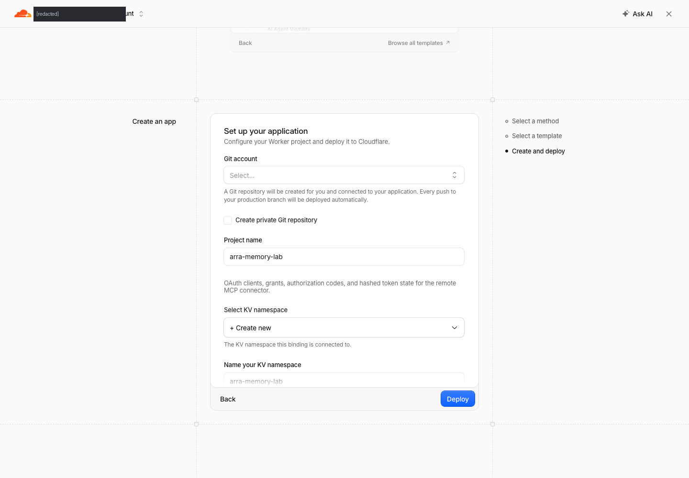
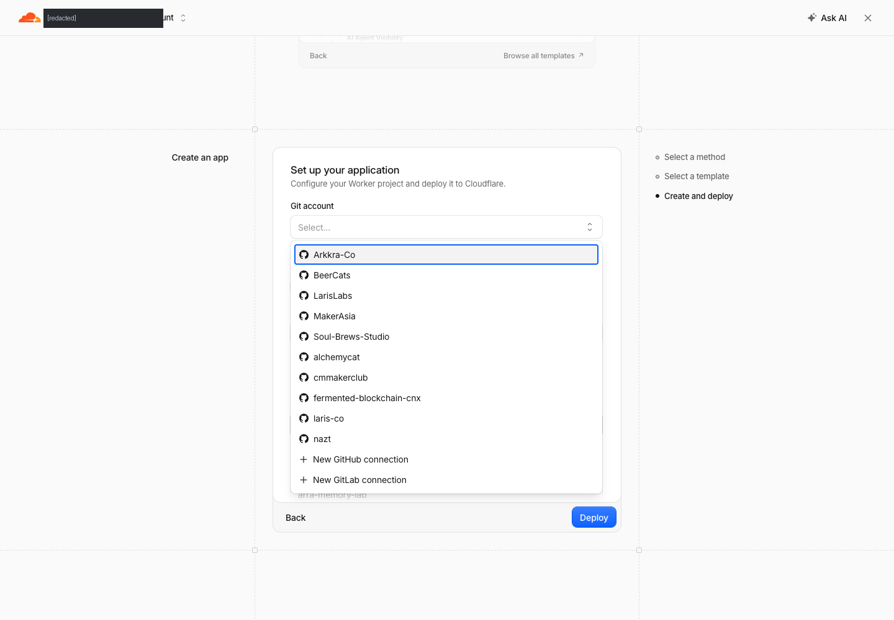
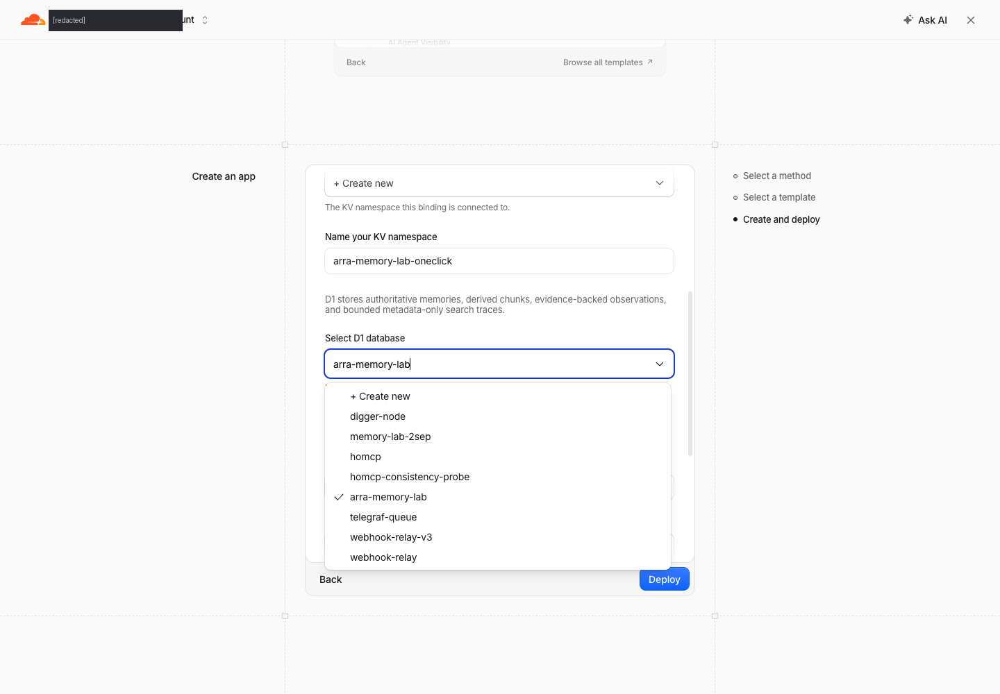
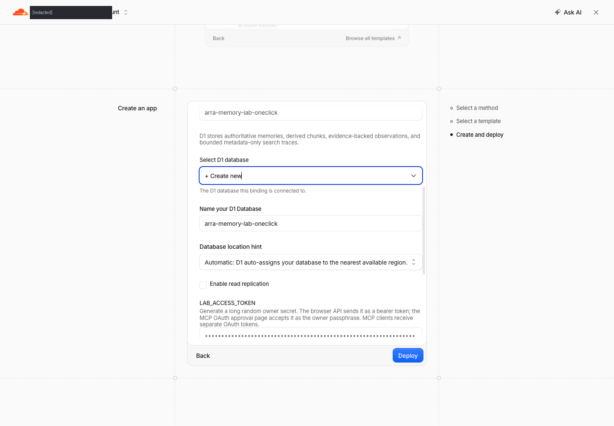
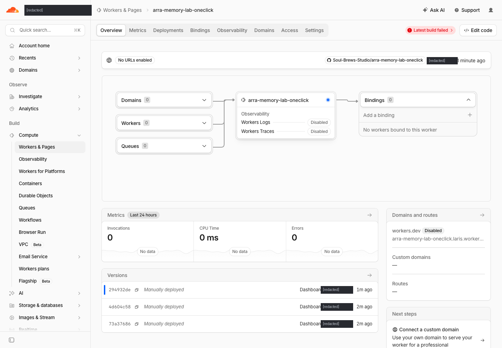
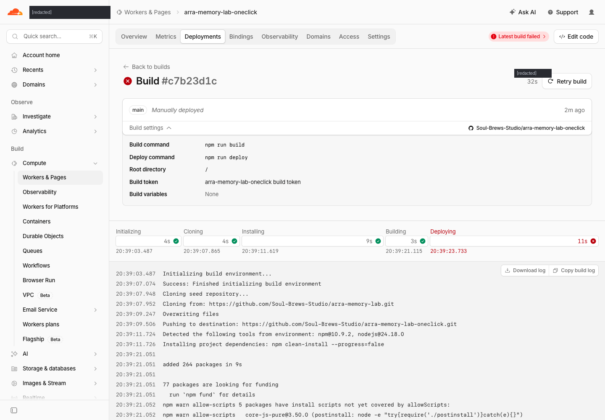

# One-click install — GitHub → Cloudflare → claude.ai

A walkthrough of deploying **arra-memory-lab** with the Deploy to Cloudflare button,
captured step by step on 2026-09-10 against a real account.

It is written from an install that **partly failed**, and the failure is documented
rather than hidden — the button provisions everything correctly and then the deploy
step dies for a reason you cannot guess from the README. [Jump to it](#step-8--the-deploy-fails-and-why).

---

## What the button actually creates

One click provisions **four** things, not one:

| Resource | Name in this walkthrough |
|---|---|
| A new **GitHub repo** (a copy of the source, in your org) | `Soul-Brews-Studio/arra-memory-lab-oneclick` |
| A **Worker** | `arra-memory-lab-oneclick` |
| A **KV namespace** — OAuth clients, grants, codes, hashed tokens | `arra-memory-lab-oneclick` |
| A **D1 database** — memories, chunks, observations, search traces | `arra-memory-lab-oneclick` |

Plus a Workers AI binding for 768-dimensional embeddings.

> [!IMPORTANT]
> The deploy **creates a new repository in your GitHub org**. It does not deploy the
> repo you are reading from. If a repo of that name already exists, pick a different
> project name — that is why everything here is suffixed `-oneclick`.

---

## Step 1 — Start at the repo

Open <https://github.com/Soul-Brews-Studio/arra-memory-lab>.


Scroll to the **Deploy** section. The button's link is worth reading before you click
it — it should name *this* repo:

```
https://deploy.workers.cloudflare.com/?url=https://github.com/Soul-Brews-Studio/arra-memory-lab
```


> [!TIP]
> Check that `?url=` matches the repo you are on. Deploy buttons are copy-pasted
> between projects more than any other line in a README, and a stale one silently
> deploys someone else's application. Several in this fleet do exactly that.

---

## Step 2 — Pick the Cloudflare account

If your login has more than one account, Cloudflare asks first. The deploy does not
continue until you choose.


Pick the account that will own the Worker, the D1 database and the bill.

---

## Step 3 — The setup form

You land on **Create an app → Create and deploy**.



The form asks for, in order:

1. **Git account** — where the new repo will be created
2. **Project name** — also the Worker's name and its `*.workers.dev` hostname
3. **KV namespace** — for OAuth state
4. **D1 database** — for the memories
5. **`LAB_ACCESS_TOKEN`** — the owner secret
6. **`SEMANTIC_MAX_DISTANCE`** — vector search cutoff, default `0.7`

---

## Step 4 — Connect the Git account

Open the **Git account** dropdown. If you have connected GitHub before, your orgs
are listed; otherwise use **+ New GitHub connection** and authorize Cloudflare.



Choose the org the new repo should live in.


---

## Step 5 — Name the project

Set **Project name**. It becomes:

- the Worker name,
- the `*.workers.dev` hostname,
- **and the new GitHub repo's name.**

This walkthrough uses `arra-memory-lab-oneclick`, because `arra-memory-lab` already
existed in the org and in the account's D1 list.

---

## Step 6 — Create a **fresh** D1 database

This is the step most likely to go wrong quietly.

Open **Select D1 database**. The dropdown lists databases that already exist on the
account — and **one of them may already be ticked**:


In the capture above, `arra-memory-lab` is checked. Deploying like that would have
bound the new Worker to the **existing** database and written into live data.

Scroll to the top of the list and pick **+ Create new**:



A **Name your D1 database** field then appears. Give it a name that does not already
exist — the list you just closed is the list to check against.

> [!WARNING]
> "+ Create new" is one option among many in a searchable dropdown, and an existing
> database can be pre-selected. Confirm the tick is on **+ Create new** before you
> deploy. The same applies to the KV namespace above it.

---

## Step 7 — Set the owner token, then deploy

`LAB_ACCESS_TOKEN` ships as the literal placeholder `replace-with-a-long-random-token`.
Replace it. Generate 32 random bytes:

```bash
openssl rand -hex 32
```

The field is a password input, so it renders as dots — safe to screenshot, and safe
to leave on screen. **Store the value somewhere you can find it**: the browser API
takes it as a bearer token, and the MCP OAuth approval page accepts it as the owner
passphrase. It is not recoverable from the dashboard afterwards.

The completed form:



Click **Deploy**.

---

## Step 8 — The deploy fails, and why

Everything provisions. The build succeeds. The **deploy step fails**.



Three symptoms on that page:

- a red **Latest build failed**
- **No URLs enabled** — `workers.dev` is *Disabled*, so the hostname 404s
- **Bindings 0**



The build log shows the build itself was fine:

```
Detected the following tools from environment: npm@10.9.2, nodejs@24.18.0
added 264 packages in 9s
Executing user build command: npm run build
  > vite build
  ✓ 498 modules transformed.
  ✓ built in 357ms
```

Then `npm run deploy` runs. In `package.json`:

```json
"deploy": "npm run check && node scripts/deploy.mjs",
"check":  "npm run version:check && node --test scripts/calver.test.mjs && bun test src/*.test.ts && tsc --noEmit && npm run build"
```

> [!CAUTION]
> **`deploy` gates on `check`, and `check` runs `bun test`. Cloudflare's build image
> has `npm` and `node` — it does not have `bun`.** So the deploy command fails before
> it ever calls `wrangler`, on every one-click install, on a clean account.

The provisioning is not the problem. `wrangler.jsonc` in the generated repo is
correct — the fresh database is bound by id:

```jsonc
"d1_databases": [
  { "binding": "DB",
    "database_name": "arra-memory-lab-oneclick",
    "database_id": "604836b0-…",
    "migrations_dir": "migrations" }
],
"kv_namespaces": [ { "binding": "OAUTH_KV", "id": "acf4bd3a…" } ],
"ai": { "binding": "AI" }
```

### The fix

In the Worker's **Settings → Build**, change the **Deploy command** so it does not
run the test suite:

```
node scripts/deploy.mjs
```

Then **Retry build**. Run the checks in CI, where `bun` exists — not in Cloudflare's
build image.

Afterwards, enable the hostname: **Settings → Domains & Routes → workers.dev →
Enable**. It is disabled by default on a fresh Worker, which is the other half of
the 404.

---

## Step 9 — Verify before wiring anything to it

```bash
U=https://<project-name>.<subdomain>.workers.dev
curl -s -o /dev/null -w '%{http_code}\n' "$U/"
curl -s -o /dev/null -w '%{http_code}\n' "$U/mcp"
curl -s "$U/.well-known/oauth-authorization-server" | jq
```

What good looks like:

| Path | Expected |
|---|---|
| `/` | `200` |
| `/mcp` (GET) | `405` — it wants POST |
| `/mcp` (POST, no token) | `401` |
| `/.well-known/oauth-authorization-server` | `200` |
| `/.well-known/oauth-protected-resource` | `200` |

`401` on `/mcp` is the **correct** answer, not a failure. `404` everywhere means the
deploy did not land or `workers.dev` is still disabled.

The authorization-server document should report PKCE and Dynamic Client
Registration, which is what claude.ai needs:

```json
{
  "code_challenge_methods_supported": ["S256"],
  "grant_types_supported": ["authorization_code", "refresh_token"],
  "registration_endpoint": ".../oauth/register",
  "scopes_supported": ["memory:read", "memory:write"]
}
```

---

## Step 10 — Connect it to claude.ai

> Captured separately — see [arra-memory-lab-cloudflare-claude.md](../arra-memory-lab-cloudflare-claude.md)
> in this repo for the consent-screen walkthrough.

1. In claude.ai, open **Settings → Connectors → Add custom connector**.
2. Give it a name and the MCP URL: `https://<your-worker>/mcp`
3. claude.ai reads `/.well-known/oauth-protected-resource`, discovers the
   authorization server, and registers itself through
   **Dynamic Client Registration** — you never paste a client ID or secret.
4. It sends you to the Worker's approval page. Authorize with the
   **`LAB_ACCESS_TOKEN`** you set in Step 7.
5. Approve the scopes. claude.ai stores the token and the connector goes live.

### Connecting the CLIs

```bash
# Claude Code
claude mcp add --transport http arra-memory-lab https://<your-worker>/mcp
claude mcp login arra-memory-lab

# Codex
codex mcp add arra-memory-lab --transport http https://<your-worker>/mcp
```

Both use the same OAuth flow as claude.ai. The repo also ships
`npm run mcp:connect` (`scripts/connect-mcp.sh`) which wraps this.

---

## Checklist

- [ ] Deploy button's `?url=` names this repo
- [ ] Correct Cloudflare account chosen
- [ ] Git account connected, project name free in that org
- [ ] **D1 set to “+ Create new”**, not a pre-selected existing database
- [ ] KV set to “+ Create new”
- [ ] `LAB_ACCESS_TOKEN` replaced and stored
- [ ] Deploy command does not run `bun` (see Step 8)
- [ ] `workers.dev` enabled under Domains & Routes
- [ ] `/mcp` returns `401`, not `404`
- [ ] Both `.well-known` documents return `200`

---

*Captured with `/browser-tutorial` on 2026-09-10. Screenshots are of a real deploy;
the token field is a password input and was masked at capture time.*
