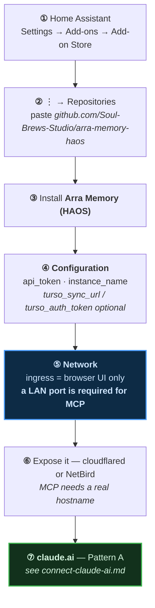

# thor-memory — Home Assistant add-on & claude.ai

[← Memory on claude.ai](../README.md) · [Connector flow](../connect-claude-ai.md) · [arra-memory-lab](../one-click-install/README.md) · [digger-node](../digger-node/README.md)

The **19-tool original**. Everything the Cloudflare memory servers do, plus ten more
tools they never got — and no Deploy button, because it is not a Worker.

`thor-memory` is not a repo. It is **`Soul-Brews-Studio/arra-memory-haos`** running
under an `instance_name`. The same add-on installed twice with different names gives
you `thor-memory` and `arra-memory`.

---

## Why there is no one-click

| | |
|---|---|
| Runtime | **Bun + s6-overlay** in a container, not workerd |
| Packaging | Home Assistant **add-on**, `slug: arra_memory`, version `0.27.1` |
| Storage | embedded **libSQL** file at `/data/`, optional Turso replica |
| Install | add a **repository URL** to the Supervisor's add-on store |

A Cloudflare deploy button clones a repo into a Worker. This is a container with a
local database file, so that path does not apply.

> [!NOTE]
> Home Assistant *does* have a one-click for add-on stores:
> `https://my.home-assistant.io/redirect/supervisor_add_addon_repository/?repository_url=<url>`
>
> **No repo in this fleet uses it** — including the add-on store serving 22 add-ons.
> Adding that one line to `arra-memory-haos`'s README would make this install a click
> instead of a paste.

---

## Install



> [!NOTE]
> Hostnames are written as `<ha-host>` and `<memory-host>` throughout. Substitute your
> own: `<ha-host>` is where Home Assistant answers, `<memory-host>` is the tunnel or
> LAN address that reaches the add-on's own port. They are **not** the same host and
> that is the whole point of the next section.

### The trap: ingress cannot serve MCP

`config.yaml` says it in its own comment — *"A LAN port in addition to ingress,
because ingress alone cannot serve MCP."*

> [!CAUTION]
> **Home Assistant ingress is a browser-only tunnel.** It is gated on an HA session
> cookie, so an ingress URL answers `200` with the **Home Assistant frontend HTML**
> for *any* path under it — including `/mcp`. It looks alive and is not an MCP
> endpoint.
>
> ```
> <ha-host>/<hash>_arra_memory/mcp   → 200  <title>Home Assistant</title>
> <memory-host>/mcp                  → 401  ← the real door
> ```
>
> claude.ai cannot connect through the ingress path. Expose the LAN port through a
> tunnel and give claude.ai *that* hostname.

The proof is the page title. Both URLs answer `200`; only one is the add-on:

Requesting the **ingress** `/mcp` path in a browser lands here — Home Assistant's own
login, served as HTML:


An MCP client asking that URL for `tools/list` receives this page. Not an error, not
JSON — a login form with `200 OK`. That is the whole failure mode: it looks reachable
and is not an endpoint.

| URL | `<title>` |
|---|---|
| `<ha-host>/<hash>_arra_memory/mcp` — the **ingress** path | **Home Assistant** |
| `<memory-host>` — the **tunnel** to the add-on's LAN port | **thor-memory** |

Two more from `config.yaml`, worth knowing before you file a bug:

- `ingress_panel` is **`false`** on a fresh install in some Supervisor versions — if
  the sidebar icon never appears, that flag is why, and it is per-install state you
  set with `POST /addons/<slug>/options`.
- `ports:` can be set to `null` in the **Network** tab to close the LAN port and keep
  ingress only. Do that and MCP stops working, by design.

---

## The 19 tools

The six core verbs, plus ten this line has and the Cloudflare servers never got, plus
the federation trio.

| Group | Tools |
|---|---|
| Core | `remember` · `recall_memories` · `read_memory` · `revise_memory` · `forget_memory` · `memory_stats` |
| Corpus | `list_workspaces` · `list_agents` · `list_projects` · `list_tags` |
| Search log | `list_search_log` · `forget_search_log` |
| Time / digest | `digest` · `search_memories_between` |
| Tool control | `list_tools` · `toggle_tool` |
| **Federation** | `list_fleet` · `send_to_oracle` · `oracle_replies` |

> [!TIP]
> The federation trio is the reason to prefer this over the Worker line: one oracle
> can hand a message to another through the memory server. Nothing on Cloudflare has
> it.

---

## Verify

```bash
U=https://<memory-host>          # the tunnel to the LAN port, NOT the ingress path
curl -s -o /dev/null -w '%{http_code}\n' "$U/"                     # 200
curl -s -o /dev/null -w '%{http_code}\n' -X POST "$U/mcp"          # 401
curl -s "$U/.well-known/oauth-authorization-server" | jq -e .registration_endpoint
```

Measured 2026-09-10 — `/` 200, `POST /mcp` 401, both `.well-known` 200, DCR yes,
scopes `memory:read memory:write`.

---

## Connect

Pattern A — **[connect-claude-ai.md](../connect-claude-ai.md)**.

The passphrase at the consent page is the add-on's **`owner_passphrase`** option —
**not** `api_token`. The two are for different clients, and `config.yaml` says so:

| Option | For |
|---|---|
| **`owner_passphrase`** | the web UI **and approving MCP clients** — this is what claude.ai's consent page wants |
| `api_token` | *"static bearer token for scripts, curl, and MCP clients that read a config file (Claude Code, Codex). **claude.ai connectors CANNOT send a static header and must use the OAuth flow instead — that is why both exist.**"* |

Blank `owner_passphrase` means the add-on **refuses to start**, *"rather than serving
your memories to anyone who finds the URL."*

Its unlock screen, on the real hostname:


> [!WARNING]
> **No `refresh_token`.** `grant_types_supported` is `["authorization_code"]`, so
> claude.ai repeats the whole authorize flow every time the token expires. The
> `arra-memory-lab` lineage on Cloudflare does offer refresh — this, with twice the
> tools, does not.

---

## It goes down, and it is worth knowing why

`thor` is a **KVM guest** with `autostart: disable`. It was dark behind a Cloudflare
`1033` from **2026-09-04 18:27 until a manual `virsh start` on 09-09**, crash-restarting
eight or more times in between. The tunnel and the OAuth metadata came back within
~75 seconds of the guest booting.

If every endpoint above returns `1033`, the add-on is fine — the guest is off.
